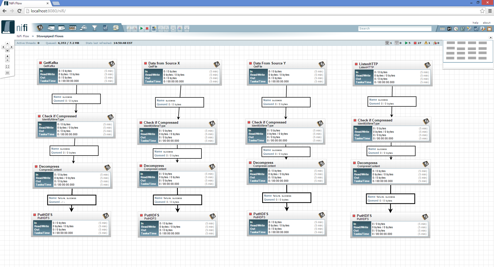

# 7장 카프카를 활용한 데이터 파이프라인 구축

## 카프카를 활용한 데이터 흐름도
- 프로듀서: 메시지를 생산한 후 메시지를 카프카로 전송
- 카프카: 프로듀서가 생산한 메시지를 저장하는 중간 큐 역할
- 컨슈머: 카프카에 저장된 메시지를 가져오는역할 + 다른 어플리케이션으로 메시지를 전송하는 역할

데이터 처리에 대한 기업 내 요구사항이 많아지면서 수집-저장-분석의 일련의 과정을 관리하는 솔루션들 출시
- 나이파이: 데이터 흐름을 정의하고 정의된 흐름대로 자동으로 실행

## 데이터 스트리밍 어플리케이션

### 1.Apache Nifi, KSQL
- 가장 간단한 것은 여러 채널에서 들어오는 메세지들을 조합하는 것
- 여러 메세지를 합치거나 아주 간단한 수준의 변환을 하는 프로세싱을 수행하는 것으로 가장 단순한 작업이지만 또한 가장 막강한 작업

Apache Nifi: WebUI를 통해 간단하게 메세지를 병합하거나 발췌하여 스트리밍으로 던질 수 있도록 되어 있음
KSQL: 의 경우에는 SQL 인터페이스를 제공하여 Push Query 형태로 Query Prompt를 종료하지 않고 지속적으로 들어오는 메세지에 대해 간략한 변환이나 Join 쿼리 결과를 메세지 큐에 전달하는 것이 가능

### 2. Kafka Streams AWS의 Kinesis
- 어느 정도의 코드 작성이나 프로그래밍에 대한 이해는 필요하지만, 상대적으로 변환이나 데이터 프로세싱의 복잡성은 좀 덜한 경우에 활용이 적합
- 스트리밍 파이프라인을 구성했는데 일부의 데이터 프로세싱이 필요하다고 판단될 때 활용하는 기술
-  기본적으로 인덱싱 등이 되지 않은 스트리밍 데이터를 기반으로 연산을 처리하기에 데이터 양이 많거나 조회하는 로직이 복잡하다면 성능상에 이슈가 발생

### 3. Apache Flink, Spark
- 복잡한 데이터 프로세싱이 수반되는 경우
- 많이 활용되는 것이 Apache Flink이며, 그 이상의 프로세싱에 대해서는 Spark을 활용하여서 실시간 파이프라인 프로세싱에 태우는 것이 일반적인 경우

출처: http://cloudinsight.net/data/stream-data-processing-에-대한-이해/