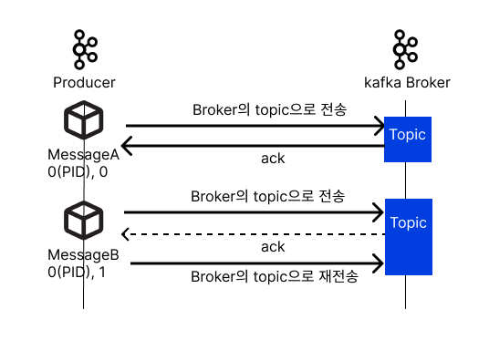
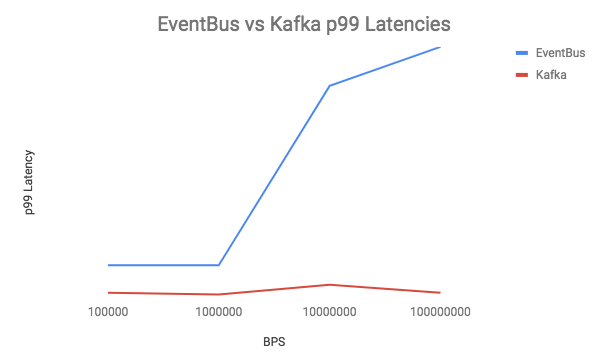
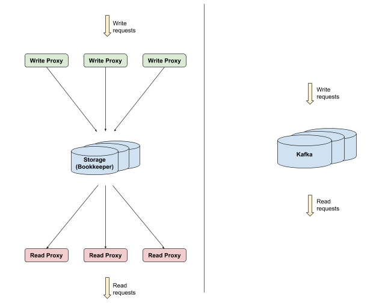
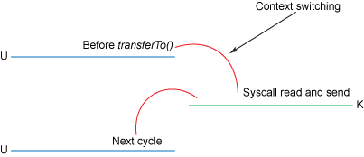
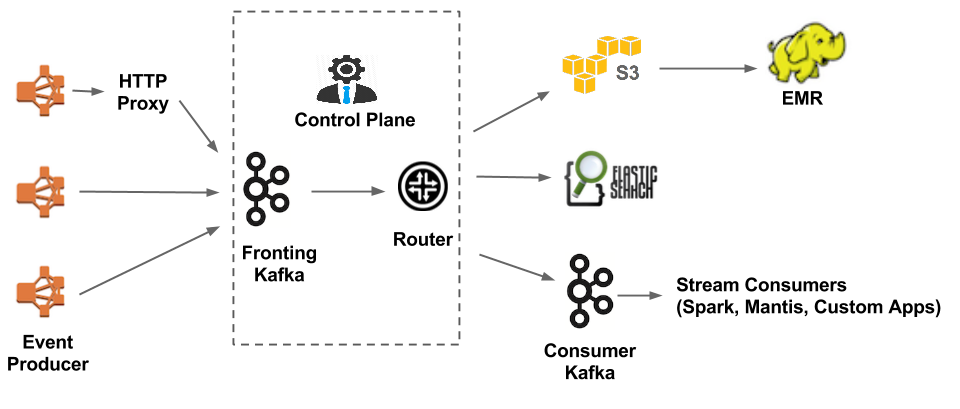
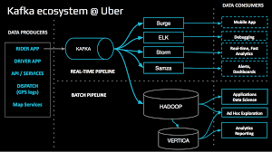

## 1.1 잘란도와 트위터의 카프카 도입 사례

```
초기 Zalando는 RestAPI로 CRUD를 활용하여 DB의 상태를 변경시키고
변경 이벤트가 필요한 곳으로 outbound 이벤트를 전달하는 구조로 시작했다.
하지만 이 역시 고려해야 될 상황이 많았는데...
```

### ❎ 오차는 줄일 수 있어도 동기화 방식에서의 한계점 존재
- 다수의 클라이언트와 다양한 네트워크 환경 내에서의 지연 발생
- REST API 기반 통신을 한다고 하더라도 동일한 데이터를 동시에 수정할 때 각각의 데이터에 대한 순서보장과
  전송 시에 순서를 보장하기 힘듬
- 데이터 사용자들의 요구사항이 각각 다 다르다면 outbound 이벤트를 전달하는 부분에서 각각의 요구사항에 맞는 구현이 필요
- 빠른 전송과 대량의 배치전송에 있어서 지원이 힘듦.

💡 결국 들어오는 inbound 데이터와 이후 처리되는 outbound 데이터 간 정합성이 Event Driven System에서는 매우 중요하다.

### ✅ 비동기 방식의 대표 스트리밍 플랫폼, 카프카 도입

#### 비동기 방식
Producer 가 데이터를 생산해서 Broker 에게 전달하면 Consumer 는 원하는 topic 에 해당하는 메시지를 pull 해간다.  
Producer 와 Consumer 가 완벽하게 분리된 비동기 방식을 사용함에 따라 병목현상 파악과 지연 문제애 대한 재빠른 대처 가능하게 되었다.
새로운 애플리케이션이 나중에 메시지를 읽어가는 방식도 문제가 되지 않는다.

> 📢 Zalando는 내부 데이터 처리를 간소화 함은 물론 높은 처리량을 바탕으로 데이터 처리의 확장성을 높일 수 있었고 이런 데이터 기반으로 주요 문제 해결하는 목적으로 활용

#### 카프카 장점
1. 빠른 데이터 수집이 가능한 높은 처리량  
Http 기반으로 전달되는 이벤트일지라도 이벤트가 카프카로 처리되는 응답시간은 한 자릿수의 밀리초(ms) 단위이다.
2. 순서 보장  
이벤트 처리 순서가 보장되면서 엔티티 간 유효성 검사, 동시 수정 같은 복잡성이 제거된다.  
3. 적어도 한 번 전송 방식  
분산된 여러 네트워크 환경에서 데이터 처리에 중요한 모범사례는 멱등성(동일한 요청을 한 번 보내는 것과 여러 번 연속으로 보내는 것이 같은 경우)이다.



> 적어도 한 번 전송 방식  
broker는 메시지 프로토콜에서 메시지를 수신받고 메시지를 저장, 변환 등의 서비스를 제공하며 consumer에게 메시지를 전달하는 프로그램 모듈입니다.
단일 local 환경에서는 broker 역할을 하는 kafka가 하나가 될 수 있고
클러스터 환경에서는 다수의 kafka 서버가 각각 broker의 역할을 할 수 있습니다.
producer는 메시지를 broker에게 전송합니다  
broker는 메시지 A를 잘 받고 잘 받았다는 ack를 producer에게 전달합니다.
ack를 받게 되면 producer는 다음 메시지를 전달하고 ack를 받지 못한다면 해당 매시 지를 재전송합니다.
위와 같이 메시지를 소비하는 cousumer에서 중복에 대한 처리를 하고 메시지를 재전송할지라도 메시지에 대한 유실은 없도록 하는 것이 적어도 한 번 전송 방식입니다.


4. 자연스러운 백프레셔 핸들링

- pull 방식  
consumer가 broker로부터 직접 메시지를 pull 하는 방식
- push 방식   
broker가 consumer에게 메시지를 직접 push 해주는 방식  
push 방식은 broker가 보내주는 속도에 의존해야 한다는 한계가 존재


> 💡 카프카는 pull 방식을 채택하여 복잡한 피드백이나 요구사항이 사라져 간단하고 편리하게 클라이언트 구현이 가능하다.


### 5. 파티셔닝
카프카의 파티셔닝 기능을 활용하면 논리적인 topic을 여러 개로 나눌 수 있어, 파티션에 적절한 키를 할당하기 위한 고려사항은 존재하나 각 파티션들은 다른 파티션들과 관계없이 처리할 수 있으므로 효과적인 수평 확장이 가능해졌다.

---

## 1.1.2 카프카로 유턴한 Twitter

전환 목적은 비용 절감과 강력한 커뮤니티 였다.



Twitter 자체적으로 Event Bus와 Kafka 성능 테스트 진행, Kafka는 BPS(Bite Per Second)와 상관없이 Latency가 거의 발생하지 않았다.

### Event Bus 와 Kafka 의 차이


#### Event Bus
- 전달하는 Serving 레이어와 Storage 레이어가 분리되어 있어서 추가적인 홉(네트워크 시간 + JVM 프록시 레이어를 통과하는 시간)이발생
- fsync() 호출 시 write에 대해서 명시적으로 blocking  

#### Kafka
- 스토리지와 request Serving을 모두 처리하는 프로세스가 하나만 존재
- fsync() 호출 시 OS에 의존해 백그라운드로 처리하고 zero-copy 를 사용



> 💡 zero-copy  
confluent에 따르면 Kafka는 분산 커밋 로그를 스토리지 계층으로 사용하며 쓰기는 로그 끝에 추가된다.
읽기는 오프셋부터 순차적으로 수행되며 데이터는 disk Buffer에서 network Buffer로 zero-copy 된다.
zero-copy는 별도의 복사본을 만들지 않고 한 위치에서 다른 위치로 데이터를 이동하는 데이터 전송 하는 방식으로 메모리를 절약하고 성능을 향상할 수 있는데
인덱스 기반 스토리지 시스템에서 데이터는 일반적으로 인덱스에 액세스 하여 데이터의 물리적 위치를 찾은 다음 저장 매체에서 메모리로 데이터를 복사하여 읽다.
RabbitMQ 와 Pulsar 인덱스 기반 스토리지 시스템을 사용하며, 개별 메시지를 승인하는 데 필요한 빠른 액세스를 제공하기 위해 데이터를 트리 구조에 보관한다.
트리 구조가 제공하는 빠른 개별 읽기는 쓰기 오버헤드의 비용으로 발생하며, 이는 로그에 비해 쓰기 처리량 감소, 쓰기 지연 시간 증가 또는 쓰기 증폭 증가로 나타날 수 있다.  
fyi; https://www.confluent.io/kafka-vs-pulsar/
 


## 1.2 국내외 카프카 이용현황

### Neflix


데이터 수집 / 통계 / 처리 / 적재하기 위한 파이프라인을 연결하는 역할로 카프카를 사용한다.
비디오 시청 활동 / 사용 빈도 / 에러로그등 모든 이벤트는 데이터 파이프라인을 통해 흐른다.

- 데이터 버퍼링  
Kafka는 복제된 영구 메시지 대기열 역할을 함 - absorb Temporary outage
- 데이터 라우팅  
s3, Elastic, 보조 kafka 데이터 이동하는 역할을 한다.

### Data Integration - Uber


#### RealTime Kafka Pipe Line
운전자 / 탑승자 앱으로부터 Event Data 수집  
카프카를 통해 다양한 DownStream Consumer 들에게 전달

#### Batch Pipe Line
특정 시간에 대량으로 데이터 전송하여 Data 분석에 활용

