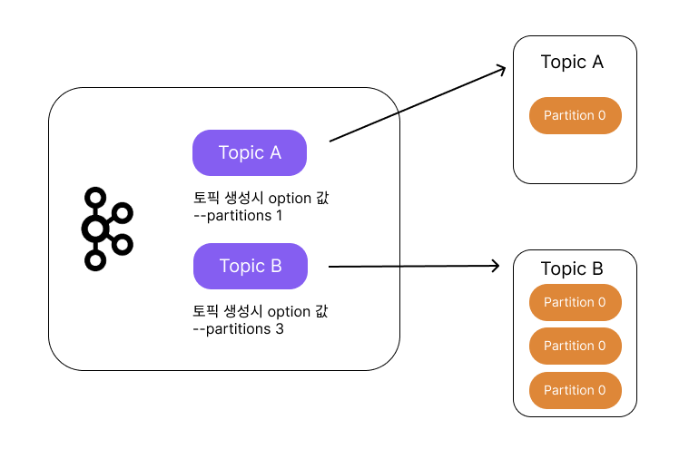
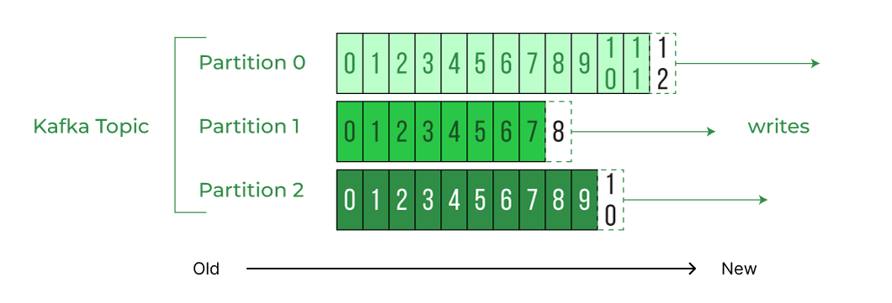
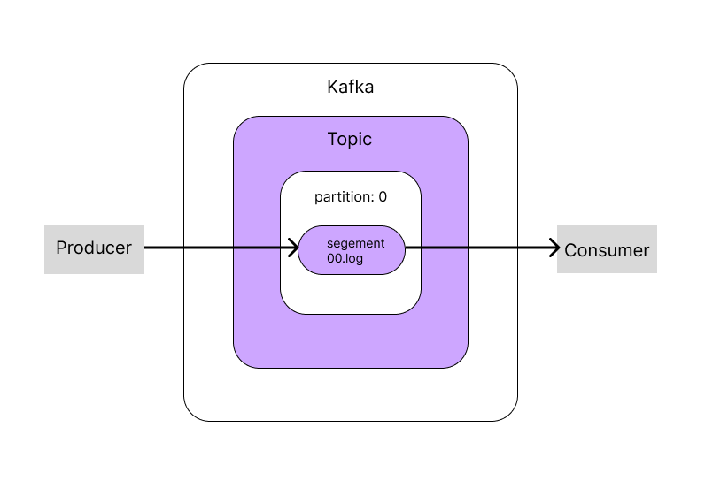
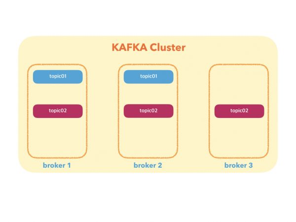

## 3.1 카프카를 구성하는 주요 요소


### 토픽(Topic)
- 카프카는 메시지 피드들을 토픽으로 구분한다. 토픽은 데이터가 저장되는 공간이며, 데이터베이스의 테이블과 유사하다고 생각하면 된다. 각 토픽의 이름은 카프카 내에서 고유하다.

### 파티션(Partition) 
- 병렬 처리가 가능하며 스케일링하여 대규모 메시지 처리를 할 수 있도록 토픽 하나를 여러 개로 나눈 것이 파티션이다.  
- 나눈 파티션 수 만큼 컨슈머를 연결할 수 있다.  
> 🤔 분산처리 시스템으로 잘 알려진 kafka에서 생성한 topic이 클러스터 내에서 하나의 machine, 또는 하나의 node에서만 사용된다면, topic이 배포할 수 있는 cluster내에 작동하는 node의 개수보다 많아질 수 없기 때문에 Kafka를 스케일링하는 것에 대한 근본적인 한계로 작용할 수 있다.  


> 💡파티션 번호는 0번부터 시작한다.  
파티션은 초기 생성후 그 이상으로 늘릴 수는 있지만 반대로 한번 늘린 파티션은 줄일 수 없다.

### 세그먼트(Segment / Log Segment)
- Producer에 의해서 브로커로 전송된 메시지는 토픽의 파티션에 저장되며, 각 메시지들은 세그먼트라는 로그 파일의 형태로 브로커의 로컬 디스크에 저장된다.  
- 각 partition 마다 n개의 segment들이 존재한다.

### 세그먼트 관리 방법
- 하나의 로그 세그먼트 크기가 너무 커지면 파일 관리가 어렵기 때문에 최대 크기는 1GB 기본값으로 설정되어있다.
#### 1GB보다 크기가 커진다면?
- Rolling 전략을 사용한다.
ex) 하나의 로그 세그먼트에 계속 메시지를 덧붙이다가 1GB에 도달하면 close한뒤 새로운 로그 세그먼트를 생성하는 방식
- 1GB 크기의 로그 세그먼트 파일이 무한히 늘어날 경우를 대비해 관리 계획을 수립해야 한다.  
- 관리 계획은 크게 로그 세그먼트 삭제와 컴팩션으로 구분할 수 있다.

#### 로그 컴팩션
- 로그를 삭제하지 않고 컴팩션하여 보관할 수 있다.
- 카프카에서 로그 세그먼트를 컴팩션하면 메시지의 키값을 기준으로 마지막 데이터만 보관하게 된다.

#### 로그 컴팩션의 실사용 사례, __consumer_offset
- 카프카 내부 토픽으로 컨슈머 그롭 정보를 저장하는 토픽이댜.


로그컴팩션은 위와 같이 과거 정보는 중요하지 않고 가장 마지막 값이 필요한 경우에 사용한다.
> 💡 value는 필수 값이지만 key는 필수 값이 아니다. 따라서 로그 컴팩션 기능을 사용하고자 한다면 카프카로 메시지를 전송할 때 필수값으로 전송해야 한다.

#### 로그 컴팩션의 장점은 무엇일까?  
- 빠른 장애 복구아다. 
- 전체 로그를 복구하지 않고 메시지의 키를 기준으로 최신의 상태만 복구한다.
- 로그 컴팩션이 실행되는 동안 브로커의 과도한 입출력 부하가 발생할 수 있으니 유의해야 하며 반드시 브로커의 리소스 모니터링도 병행해야 한다.

#### 오프셋(Offset)
- 파티션에 메시지가 저장되는 위치이다.
- 순차적으로 증가하는 숫자 형태이다.  
- consumer에서는 마지막으로 읽은 위치를 알 수 도 있다.



### 프로듀서(Producer)
- 카프카로 메시지를 보내는 역할을 하는 클라이언트

### 컨슈머(Consumer)
- 카프카에서 메시지를 꺼내가는(읽어오는, 컨슘하는) 역할을 하는 클라이언트
> 💡 여러 파티션을 가진 토픽에 대해서 컨슈머를 병렬 처리하고 싶다면 컨슈머를 파티션 보다 적은 개수로 생성해야 한다.

| 경우                      | 설명                                                  |
|---------------------------|-------------------------------------------------------|
| 파티션 2개 & 컨슈머 1개   | 컨슈머는 2개의 파티션에서 데이터를 가져간다.           |
| 파티션 2개 & 컨슈머 2개   | 컨슈머가 각각의 파티션을 할당받아서 데이터를 가져간다. |
| 파티션 2개 & 컨슈머 3개   | 컨슈머 2개만 각각의 파티션을 할당받아서 데이터를 가져오고, 나머지 컨슈머는 동작하지 않는다.

### 컨슈머 그룹(Consumer Group)
- 컨슈머 그룹 ⊃ 컨슈머
- 컨슈머 그룹은 각 파티션의 리더에게 카프카 토픽에 저장된 메시지를 가져오기 위한 요청을 보낸다.
- 컨슈머 그룹에 속한 컨슈머는 토픽의 파티션과 일대일 매핑되는 게 일반적이다.
- 서로 다른 컨슈머 그룹에 속한 컨슈머들은 서로 영향을 미치지 않는다. 이는 컨슈머 오프셋에 관한 정보를 저장해두는 __consumer_offset 토픽이 컨슈머 그룹별/토픽별로 오프셋을 나누어 저장하기 때문이다. 따라서 서로 다른 여러 개의 컨슈머 그룹이 동일한 토픽의 데이터를 가져갈 수 있게 된다
- 그룹 아이디(group id)라고도 부른다.

#### 카프카 컨슈머 그룹 리밸런싱은 언제 일어날까?
1. 컨슈머의 생성 / 삭제  
컨슈머가 생성/삭제 되는 가장 일반적인 상황은 배포 할 때 이다. 배포 과정에서 기존 어플리케이션이 종료되고, 새 어플리케이션이 다시 동작하게 되는데, 이때 리밸런싱이 최소 두 번 일어나게 됩니다.  
2. 시간안에 Poll 요청 실패  
컨슈머는 “max.poll.records” 설정의 개수만큼 메세지를 처리한 뒤 Poll 요청을 보내게 된다. 하지만, 메세지들의 처리 시간이 늦어져서 “max.poll.interval.ms” 설정 시간을 넘기게 된다면 컨슈머에 문제가 있다고 판단하여 리밸런싱이 일어난다.

> max.poll.records 기본값은 500개, max.poll.interval.ms 기본값은 5분으로 컨슈밍하는 로직 테스트 시에 이 시간을 넘지 않는지 확인해야 한다.  
fyi; https://docs.confluent.io/platform/current/installation/configuration/consumer-configs.html#max-poll-interval-ms

3. 컨슈머 문제 발생  
컨슈머가 일정 시간 동안 하트비트를 보내지 못하면, 세션이 종료되고 컨슈머 그룹에서 제외됩니다. 이때 리밸런싱이 진행된다.

### kafka 브로커, topic, partition, segment 구조


1. Producer는 kafka의 A라는 Topic으로 메시지를 전달합니다.
2. A Topic은 partition이 하나여서 0이며 Producer로부터 받은 메시지를 Partition의 Segment log파일에 저장합니다
3. Broker의 Segment log file에 저장된 메시지는 Consumer가 읽어 갈 수 있습니다.
4. Consumer는 A Topic을 컨슘 해서 해당 토픽 내 파티션 0의 segment log file에서 메시지를 가져옵니다.

### 3.1.1 리플레케이션

리플리케이션이란 메시지들을 여러 개로 복제해서 카프카 클러스터 내 브로커들에 분산시키는 동작이다.  
데이터 파이프라인에 메인 허브 역할을 하는 카프카 클러스터가 정상적으로 동작하지 못한다거나 연결된 데이터 파이프라인에 영향을 미친다면 심각한 문제가 생길 수 있기 때문에 안정적인 서비스를 제공하기 위해 구상되었다.  


- partition 이 replication 되는 것이다.
- Replication factor 수가 커질수록 안정성은 높으나 broker의 resource를 많이 사용하게 된다.
- replication-factor 숫자만큼 broker가 필요하다.
ex)replication-factor 3인 경우 broker는 3개가 필요

> 💡replication.factor 의 기본값은 3 이다.  
The default replication factors for automatically created topics.  
Default: 3  
Editable: No  
Kafka REST API and Terraform Provider Support: No  
fyi; https://docs.confluent.io/cloud/current/client-apps/topics/manage.html

## 3.2 카프카의 핵심 개념

### 3.2.1 분산 시스템
- 파티션을 통한 분산처리로 짧은 시간 내에 엄청난 양의 데이터를 컨슈머로 전송 가능 (High throughput message capacity)
- 높은 성능
- 서버에 장애 대응에 탁월 (Fault tolerant)
- 시스템 확장 용이 (Scalability), 이미 사용하고 있는 브로커가 있다고 해도 신규 추가 용이
### 3.2.2 페이지 캐시
- 높은 처리량 가능 (High throughput message capacity)
- OS의 페이지 캐시를 활용하는 방식 > 디스크 I/O에 대한 접근 ↓ > 고성능
### 3.2.3 배치 전송 처리
- 프로듀서/컨슈머와 통신할 때 배치 전송을 이용하여 네트워크 오버헤드 줄임
- 빠르고 효율적으로 처리
### 3.2.4 압축 전송
- 메시지 전송시 압축 전송 사용하면 네트워크 대역폭이나 회선 비용 등 절감 가능
### 3.2.5 토픽, 파티션, 오프셋
- 토픽: 카프카가 데이터를 저장하는 곳
  파티션: 병렬 처리를 위해 토픽에서 나눈 단위
  오프셋: 파티션의 메시지가 저장되는 위치, 순차적으로 증가하는 숫자 형태(일종의 인덱스)
- 오프셋을 통해 메시지의 순서를 보장하는 등 효율적인 처리 가능
### 3.2.6 고가용성 보장
- 리플리케이션을 통한 고가용성 보장
### 3.2.7 주키퍼의 의존성
- 브로커의 노드/토픽/컨트롤러 관리
- cf. 추후 카프카에서 주키퍼 의존성은 제거될 전망
### 3.2.8 Undeleted log
- 다른 플랫폼과 달리 컨슈머가 데이터를 가져가더라도 데이터가 사라지지 않음.
  따라서, 컨슈머의 그룹 아이디만 다르다면 동일한 데이터도 다르게 처리할 수 있음.

### 카프카 동기와 비동기의 속도 차이
결과부터 얘기 하자면
1만개 처리시 속도차이는 100배 넘게 차이가 났다. (9987519583 / 074682958 = 113.73)

```
---------------------------------------------
ns         %     Task name
---------------------------------------------
074682958  001%  synchronous
9987519583  099%  asynchronous
```

### 카프카 클라이언트들은 어떻게 되어있을까?
기본적으로 KafkaProducer, KafkaTemplate, MessageChannel 등은 모두 비동기로 되어있다.
