## 4.1 카프카 리플리케이션

### Leader(리더) & Follower(팔로워)

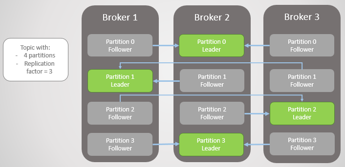
- 각각의 파티션의 Leader만 읽기가 쓰고 가능하다.
- Follower들은 Leader가 이슈가 있을 경우를 대비해 언제든지 새로운 Leader가 될 준비를 한다.
- 지속적으로 새로운 메시지를 확인하고 새로운 메시지가 있으면 Leader로부터 메시지를 복제한다.

### ISR(InSyncReplica)
- 논리적인 그룹으로 Leader와 Follower는 묶여있으며 ISR 그룹에 속하지 못한 Follower는 새로운 Leader가 될 수 있는 자격이 없다.  

> 🤔 ISR로 따로 그룹화 한 이유가 무엇일까?  
Follower 역시도 불완전한 상태로 존재할 수 있고 불완전한 Follower가 새로운 Leader가 된다면 데이터의 정합성이나 메시지의 손실과 같은 치명적인 문제가 발생할 수 있기 때문이다.
Leader는 만약 특정 Follower가 특정 주기의 시간만큼 복제요청을 진행하지 않는다면 Replication 동작에 문제가 발생했다고 판단 ISR 그룹에서 추방하며 해당 Follower는 Leader가 될 자격을 박탈당한다.
역으로 다시 보면 Topic의 상태가 의심될 때 Topic ISR 상태를 점검해 봄으로써 Topic의 상태가 양호한 지 불량한 지에 대해서 확인할 수 있다.

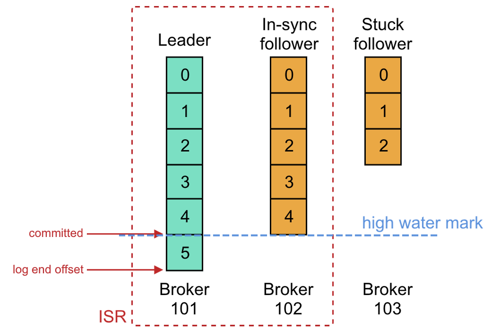

#### high water mark
- ISR내 모든 팔로워의 복제가 완료되면, 리더는 내부적으로 커밋되었다는 표시를 남기기 위해 사용한다.

#### log-end-offset
- 해당 토픽 파티션에 저장된 데이터의 끝을 나타내며(브로커가 관리함), 파티션에 쓰고 클러스터에 커밋된 마지막 메시지의 오프셋이다.
- LAG가 컨슈머 Current-Offset과 브로커의 Log-End-Offset 간의 차이로 만들어진다.

### 만약 커밋되기 전 메시지를 Consumer가 읽을 수 있다고 가정한다면?

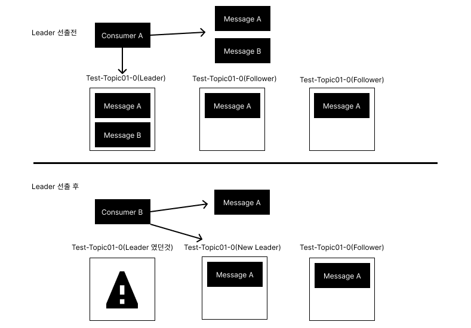

Consumer A와 B는 동일한 Topic Partition을 읽었지만 Consumer A는 Message A와 Message B를 읽어왔고 Consumer B는 Message A만 가져왔다.  
커밋되지 않은 메시지를 Consumer가 읽어 갈 수 있는 경우 동일한 Topic에 Partition에서 Consume 했었음에도 메시지가 일치하지 않는 현상이 발생할 수 있다.

> 💡 메시지의 일관성을 유지하기 위해서 커밋된 메시지만 Consumer가 읽어갈 수 있다.

### 그렇다면 커밋된 위치를 어떻게 알 수 있을까?
- 모든 broker는 재시작 시 커밋된 메시지를 유지하기 위해 로컬디스크에 replication-offset-checkpoint라는 파일에 마지막 커밋 offset 위치를 저장한다.
- replication 된 다른 broker들에서도 동일한 명령어를 이용해 확인 가능하며 모두 동일한 offset 번호를 나타냄을 알 수 있다.
- 특정 topic에 partition에 복제가 되지 않거나 문제가 있다고 판단되는 경우 replication-offset-checkpoint라는 파일의 내용을 확인하고 replication 되고 있는 다른 broker들과 비교해 보면 어떤 broker, topic, partition에 문제가 있는지 파악할 수 있다.

## kafka는 Leader와 Follower간 통신 최적화를 어떻게 구현해 두었을까?

- ack 통신을 하는 단계를 제거
- Follower들이 pull 하는 방식

### 리더와 팔로워 사이의 ACK 통신을 제거하면서도 복제 신뢰도를 유지할 수 있는 원리, 하이워터마크(high water mark)
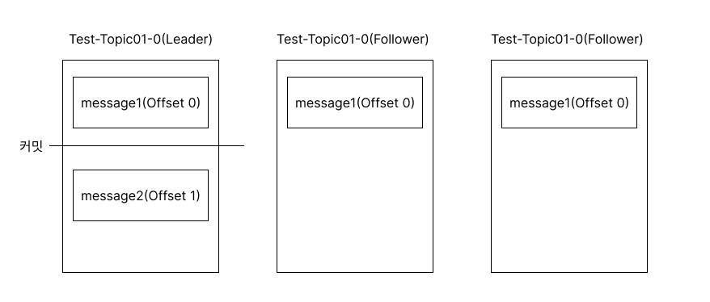

1. Leader는 1번 Offset 위치에 두 번째 새로운 메시지인 message2를 Producer로부터 받은 뒤 저장한다.
2. 0번 메시지에 대해 replication을 마친 Follower들은 Leader에게 1번 Offset에 대한 Replication을 요청한다.
3. 요청을 받은 Leader는 0번 Offset에 대한 Repliaction 동작이 성공했음을 인지하고 high water mark를 증가시킨다.

만약 follower가 Replication을 성공하지 못했다면 이후 1번 Offset에 대한 요청이 아닌 0번 Offset에 대한 Replication요청을 보내게 된다.
Leader는 Replication요청의 Offset을 보고 follower들이 어느 위치까지 Replication을 성공했는지 인지할 수 있다.

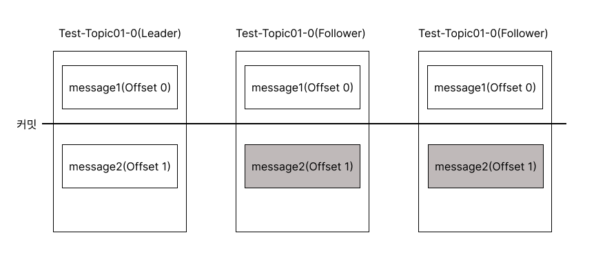

1. Follower들로부터 1번 Offset 메시지에 대한 Replication 요청을 받은 Leader는 응답에 0번 Offset 메시지가 커밋되었다는 내용도 함께 전달한다.
2. Leader에 응답을 받은 모든 Follower는 0번 Offset 메시지가 커밋되었다는 사실을 알고 Leader와 동일하게 커밋을 표시하고, 1번 Offset에 있던 메시지를 Replication 힌다.

이과정을 반복하면서 Leader와 Follower 간 메시지의 최신상태를 유지한다.

## Kafka 장애 상황시 파티션들을 복구 할 때 메세지의 일관성을 유지하기 위한 동작, 리더에포크(LeaderEpoch)
- 컨트롤러에 의해 관리되는 32bit 숫자로 표현되며, 이 값은 Partition의 현재 상태를 판단하는데 사용

### Leader-Epoch를 활용하지 않은 상태에서의 Kafka 브로커 복구는 Message 손실될 가능성이 있다

1. Leader는 Message-B를 Producer로부터 받은 뒤 1번 Offset에 저장
2. Follower는 Message-B에 대해 Leader에게 가져오기 요청을 보내고 Leader의 응답으로부터 High-Water-Mark의 변화를 감지하고 High-Water-Mark를 1로 상향조절
3. Follower는 1번 Offset의 message-B 메시지를 Replication
4. Follower는 2번 Offset 대한 요청을 보내고 Leader는 High-Water-Mark를 2로 상향조절
5. Follower가 Message-B를 Replication 하긴 했지만 High-Water-Mark를 올리라는 Leader의 응답을 받지 않은 이 시점에 Follower가 다운

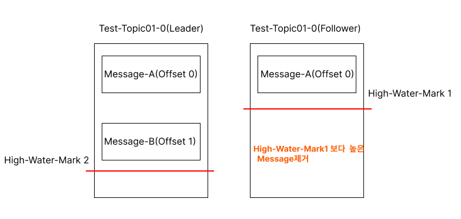

#### Follower가 장애에서 복구가 되면 kafka는 내부적으로 메시지 복구 동작을 진행

1. Follower는 자기가 갖고 있는 메시지 중에 자신의 High-Water-Mark보다 높은 메시지는 신뢰할 수 없다고 판단하며 삭제
2. Follower는 Offset 1의 새로운 메시지에 대해 가져오기 요청
3. 하지만 이 순간에 Leader가 다운

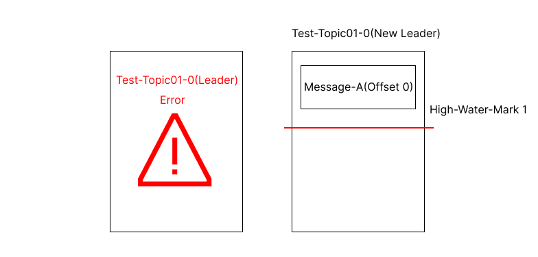

Leader Error 발생 이후 Follower가 기존 Leader의 Offset 1에 있던 Message-B가 없이 승격되었기 때문에 새로운 Leader는 Message-B를 갖고 있지 않게 된다.

### Leader-Epoch를 활용해서 다시 kafka 브로커를 복구

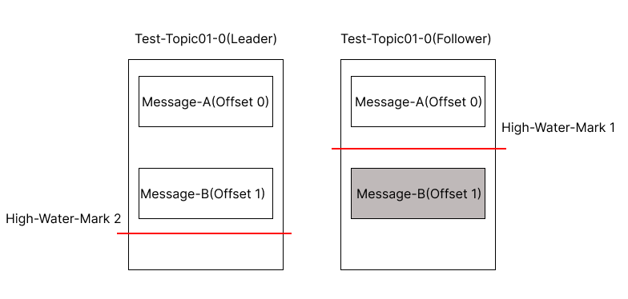

1. Follower가 메시지 복구동작을 하면서 Leader-Epoch 요청
2. Leader는 Leader-Epoch에 대한 응답으로 Offset1의 Message-B 까지라고 Follower에게 응답
3. Follower는 High-Water-Mark 보다 높은 Offset 1의 Message-B를 삭제하지 않고 High-Water-Mark를 상향조절

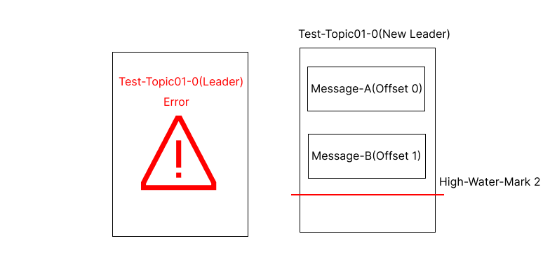

Leader가 Down이 되고 Follower가 새로운 Leader로 승격되어도 이전 Follower의 복구과정에서 Leader-Epoch를 통해 High-Water-Mark를 올리고 Message를 보존했기 때문에 Message 손실이 발생하지 않는다.

### Leader-Epoch를 활용하지 않은 상태에서 Leader와 Follower가 동시에 다운되는 경우에는 동일한 High-Water-Mark를 나타내고 있지만 서로의 메시지가 상이할 수 있다

Leader만 Offset1에 Message-B를 저장했고 Follower는 Offset1 Message-B를 아직 Replication을 완료하지 못한 상태에서 Leader와 Follower둘다 장애가 발생해서 Down 됐다고 가정해보자.

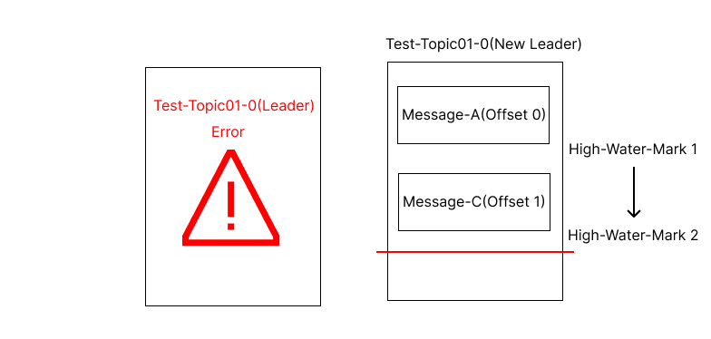

1. Follower가 먼저 복구가 되었고 Partition에 Leader가 존재하지 않기 때문에 새로운 Leader로 승격
2. 새로운 Leader는 Producer로부터 Message-C를 받고 Offset1에 저장한 뒤 High-Water-Mark를 상향 조정
3. 추후 기존 Leader였던 브로커가 복구

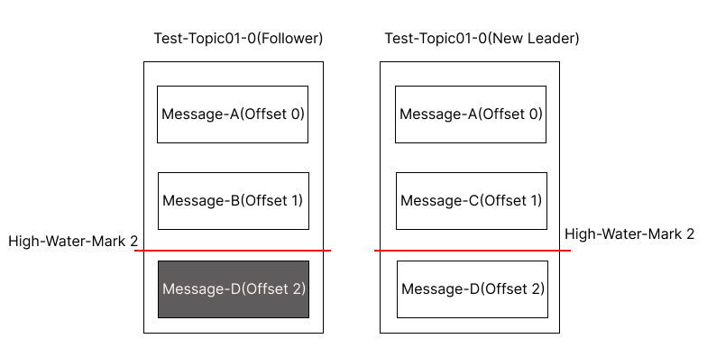

1. 기존에 Leader 였던 브로커는 Topic에 0번 Partition에 이미 Leader가 있으므로 복구된 브로커는 Follower
2. Follower는 Leader와 High-Water-Mark를 비교를 하고 비교를 해보니 일치하므로 브로커는 메시지를 삭제하지 않음
3. Leader는 Message-D를 받고 Offset 2에 위치시키고 Follower는 Replication을 할 준비

### Leader-Epoch를 활용해서 다시 복구해 보자

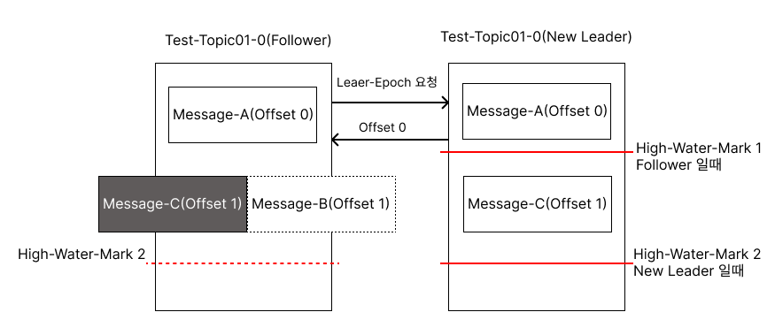

1. 기존 Leader였던 브로커가 장애에서 복구되고 이미 Leader가 있기 때문에 Follower
2. Follower는 Leader에게 Leader-Epoch 요청을 보내고 Leader는 Offset 0까지 유효하다고 응답
3. Follower는 유효하지 않은 Offset 1번에 있는 Message-B를 삭제
4. Follower는 Offset 1번에 있는 Message-C를 Replication 할 준비 시작

이와 같은 과정을 통해서 메시지가 달라지는 것을 막을 수 있다.

### Leader는 어떻게 Offset 0번까지 유효한지 알 수 있었을까?
Leader-Epoch 요청과 응답에는 Leader-Epoch 번호와 Commit 된 Offset 번호를 활용한다.

## Controller
- 카프카 클러스터 중 하나의 브로커가 컨트롤러 역할
- 파티션의 ISR 리스트 중에서 리더를 선출
- 브로커의 실패를 예의주시하고 브로커의 실패가 감지되면 ISR 리스트 중 하나를 새로운 파티션 리더로 선출
- 새로운 리더의 정보를 주키퍼에 기록하고 변경된 정보를 모든 브로커에게 전달
