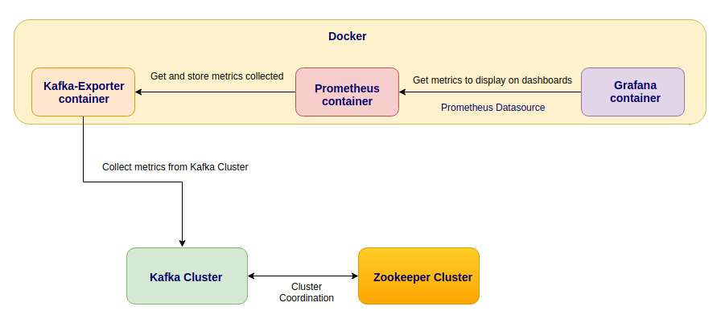
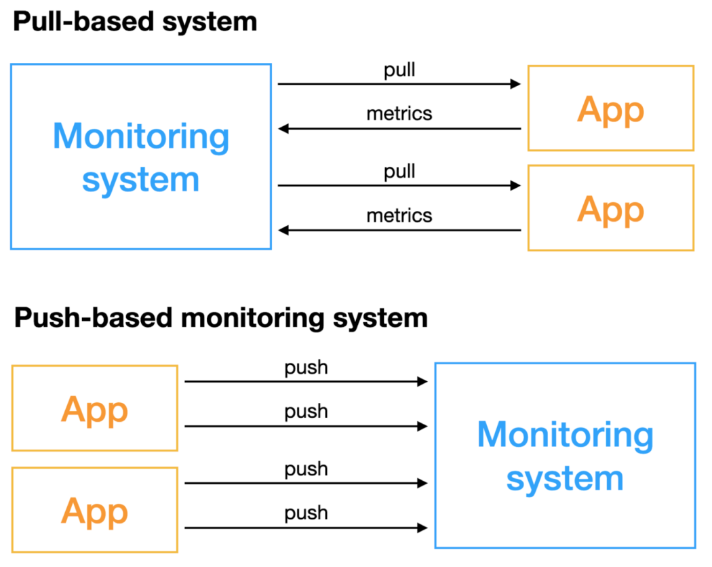
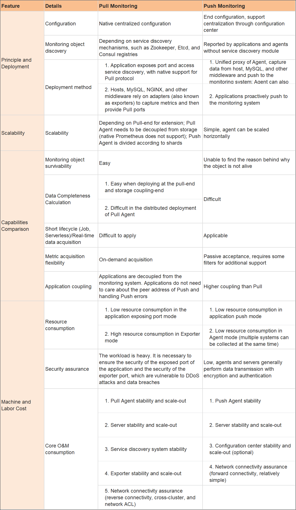

## 7.1 안정적인 운영을 위한 주키퍼와 카프카 구성

### 주키퍼란
- 주키퍼는 분산 시스템에서 사용되는 서비스로, 데이터의 일관성과 동기화를 관리한다.
- 주키퍼는 각 노드(서버)들 간의 데이터를 동기화하고, 리더 선출, 장애 감지, 클러스터 멤버십 관리 등의 작업을 수행한다.

#### kRaft 가 도입되면서 주키퍼 의존성이 제거되었다고 하는데...
- 카프카가 주키퍼로부터 독립을 하며 의존성을 제거하려고 하고 있지만 여전히 주키퍼와 카프카를 조합해 사용하는 경우가 많다.
- AWS MSK 최신버전인 3.6.0 도 현재까지 주피커를 사용하고 있다.
    > Apache Kafka version 3.6.0 (with production-ready tiered storage)  
For information about Apache Kafka version 3.6.0 (with production-ready tiered storage), see its release notes on the Apache Kafka downloads site.  
Amazon MSK will continue to use and manage Zookeeper for quorum management in this release for stability.  
fyi; [AWS MSK 공식 문서](https://docs.aws.amazon.com/msk/latest/developerguide/supported-kafka-versions.html)

#### 주키퍼 서버의 적절한 수량은?
- 쿼럼(과반수) 구성을 기반으로 동작하여 주키퍼 수량을 반드시 홀수로 구성해야 한다.
- 카프카의 사용량이 높은 서비스라면 5대로 구성하는 것을 권장한다.

#### 주키퍼 하드웨어의 적절한 스펙은?
- 높은 하드웨어 리소스가 필요하지 않는다.
- 물리적인 메모리 크기는 4 ~ 8 GB, 힙 메모리 크기 1~2GB, 디스크는 240G 또는 470G 을 권장한다.
- 쓰기 성능이 좋은 SSD 를 권장한다.

#### 주키퍼 서버 배치는 어떻게 하면 좋을까?
- 클라우드 환경에 EC2 인스턴스를 가능한 한 2개 또는 3개의 가용 영역에 분산해 구성을 추천한다.
    > 가용 영역은 논리적으로 격리된 AWS 리전의 섹션입니다. 각 AWS 리전에는 독립적으로 운영되도록 설계된 여러 개의 가용 영역이 있습니다. 가용 영역은 낙뢰, 토네이도, 지진 등 발생 가능한 문제로 인한 연쇄적 영향으로부터 보호하기 위해 물리적으로 유의미한 거리를 두고 설치됩니다.  
fyi; [AWS 가용역역 공식 문서](https://aws.amazon.com/ko/builders-library/static-stability-using-availability-zones/)
  
#### 가용 영역 선택시 보통 a, c 를 선택하는데 이유가 뭘까?
- 원래 기존의 a, b만 있었지만 이후에 c, d 영역이 추가되게 되었다. 그래서 물리적으로 보자면 a,b가 하나로 되어있고 c,d가 하나로 이루어져 있다는 것을 알 수 있다. 
- 그래서 a,b 영역의 물리 하드웨어가 문제가 발생했을 때 서버 전체의 문제가 발생하는 상황이 생기게 된다. 
- 그런 이유로 a,c 를 가용영역으로 선택한다.

## 7.2 모니터링 시스템 구성

### 대표적인 방법
- 애플리케이션 로그 분석
- JMX를 이용해 브로커들의 메트릭 정보를 확인

### 애플리케이션으로서 카프카의 로그 관리와 분석
- 카프카 애플리케이션에서 발생하는 모든 로그를 로컬 디스크에 기록
- 기본적으로 자바 기반의 로깅 유틸리티인 log4j를 이용
- 로그에서 많은 양의 데이터가 나올 수 있기 때문에 로그 레벨에서 변경하기 전에 여유 디스크 공간이 충분한지 확인이 필요

### JMX를 이용한 카프카 메트릭 모니터링
- JMX는 자바로 만든 애플리케이션의 모니터링을 위한 도구를 제공하는 자바 API로서, MBean(Managed Bean)이라는 객체로 표현한다.

- Kafka-Exporter와 JMX Export는 카프카 클러스터로부터 브로커 metrics를 수집한다.
- 프로메테우스는 이러한 metrics를 수집해 시계열 데이터베이스에 저장한다.
- 그라파나는 프로메테우스와 연결되어 대시보드를 제공한다.

#### Metric 수집 방식: Pull vs Push
- 프로메테우스, 데이터독은 Pull 모델의 데이터 수집 방식을 사용한다.

- pull 기반 모니터링 시스템은 능동적으로 지표를 획득하는 모니터링 시스템으로, 모니터링이 필요한 오브젝트에 원격으로 접근할 수 있어야 한다.
- push 기반 모니터링 시스템은 모니터링이 필요한 오브젝트가 적극적으로 지표를 푸시한다.

