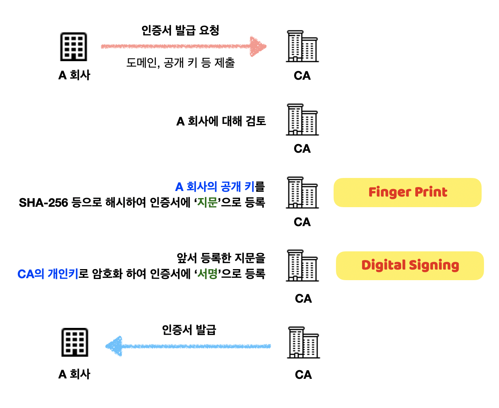
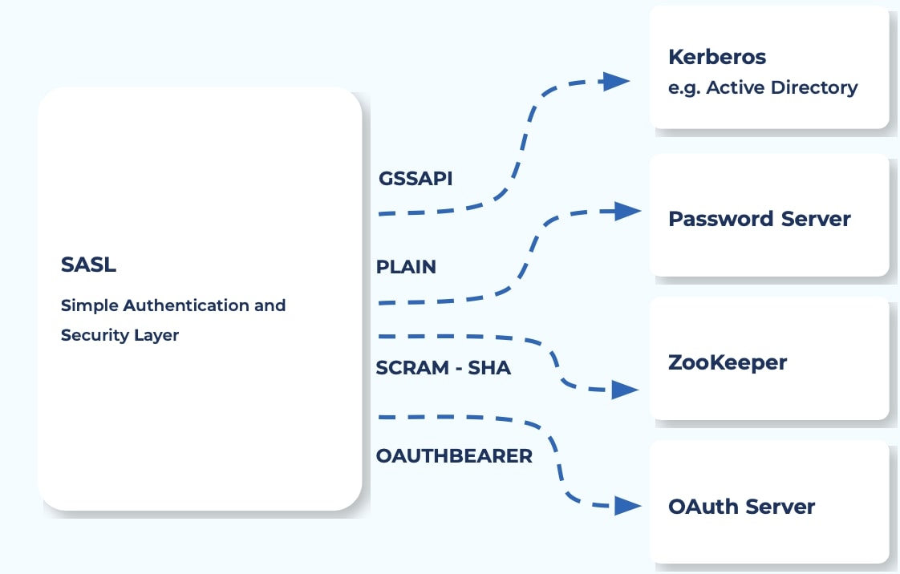
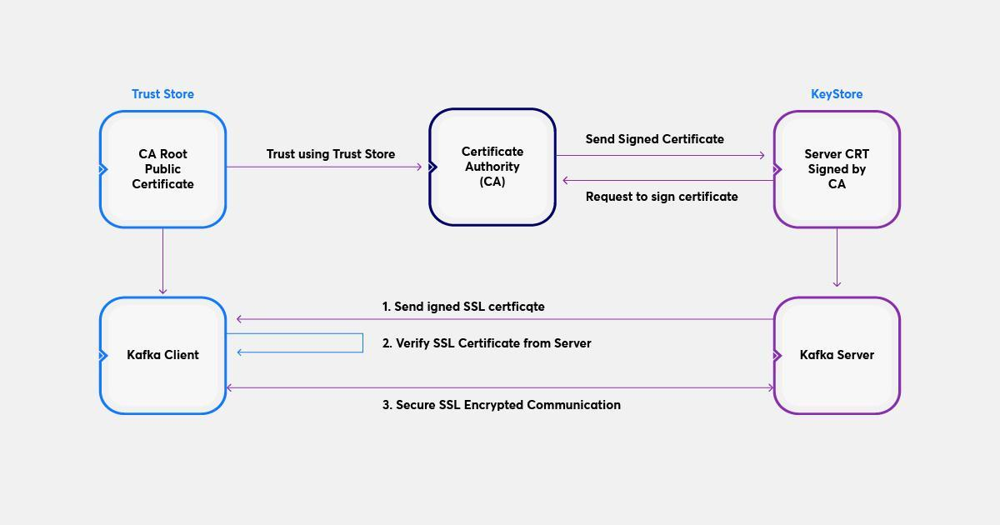

# 9.1 카프카 보안의 세 가지 요소
- 암호화  
악의적인 목적을 가진 사용자가 중간에서 패킷을 가로채더라도 암호화를 설정해두어 데이터를 읽을 수 없게 해야한다. 웹에 비유하면, 웹 페이지에 접근할 때 http가 아닌 https로 접근하는 것

- 인증  
카프카 클라이언트들이 카프카로 접근할 때 안전하다고 확인된 클라이언트만 접근할 수 있도록 설정하는 부분이다. 웹에 비유하자면, 아이디/비밀번호를 입력해 로그인에 성공한 사용자만 웹 페이지에 접근할 수 있는 것

- 권한  
권한을 설정한다는 것은 인증을 받은 A라는 클라이언트가 B라는 토픽으로만 메시지를 보내고 가져갈 수 있게 허락한다는 의미이다. 웹에 비유하면, 일반 사용자는 모두에게 공개된 웹 페이지에만 접근할 수 있고, 관리자는 비공개된 웹 페이지까지 접근할 수 있도록 설정하는 것

## 9.1.1 암호화(SSL)
보안 소켓 레이어(Secure Socket Layer, SSL) : 서버 - 서버 / 서버 - 클라이언트 사이에서 통신 보안을 적용하기 위한 표준 암호 규약
웹페이지에 https와 마찬가지로 카프카에서도 클라이언트와의 암호화 통신을 위해 SSL을 사용한다.

### SSL 동작방식
SSL 의 핵심은 암호화 입니다. 보안과 성능상의 이유로 두 가지 암호화 기법을 혼용해서 사용하고 있습니다.
- 대칭키  
암호화를 할 때 사용하는 일종의 비밀번호를 키라고 합니다. 이 키를 활용해 복호화를 진행한다.
- 공개키  
암호를 주고 받는 사람들 사이에 대칭키를 전달하는 것은 어렵고 유출시 복호화가 가능하기 때문에 공개키 방식이 등장했다.

공개키 방식은 두 개의 키를 가지며, A키를 암호화하면 B키로 복호화할 수 있고, B키로 암호화하면 A키로 복호화할 수 있는 방식이다. 이런 방식을 활용해서 비공개키는 자신만 가지고, 공개키를 타인에게 제공한다. 공개키를 활용해 암호화된 정보는 비공개키로만 복호화 할 수 있다.

> TLS와 SSL의 차이점은 무엇일까?
TLS는 Netscape가 개발한 SSL(Secure Sockets Layer)이라고 불리는 이전의 암호화 프로토콜에서 발전한 것이다. TLS 버전 1.0은 SSL 버전 3.1로서 개발을 시작했지만 Netscape와 더 이상 연관이 없음을 명시하기 위해 발표 전에 프로토콜의 이름이 변경되었다. 이러한 역사 때문에 가끔 서로 바꿔서 사용된다.

## 9.1.2 인증(SASL)
SASL(Simple Authentication and Security Layer) : 인터넷 프로토콜에서 인증과 데이터 보안을 위한 프레임워크로서 카프카에서도 사용된다.

### SASL 매커니즘
- SASL/GSSAPI : GSSAPI는 커버로스 인증 방식으로 많이 사용되는 인증 방식 중 하나이며 회사 내부에 별도의 커버로스 서버가 있는 환경이라면 커버로스 인증 방식을 사용하는 것이 좋다. 렐름(REALM)이라는 설정이 필요하다. 되도록 하나의 렐름으로 모든 애플리케이션을 적용하는 것을 추천
- SASL/PLAIN : PlAIN은 아이디와 비밀번호를 텍스트 형태로 사용하는 방법으로 운영 환경보다는 개발 환경에서 테스트 등의 목적으로 활용한다.
SASL/SCRAM-SHA256, SASL/SCRAM-SHA-512 : 본래의 암호에 해시된 내용을 추가하여 저장한다는 의미인 솔티드 챌린지 응답 인증 매커니즘(Salted Challenge Response Authentication Mechanism)의 약어로 인증 정보를 주키퍼에 저장해 사용하는 방식으로서, 별도의 커버로스 서버가 구성되어 있지 않은 환경에서 카프카의 인증을 구성해야 할 때 가장 좋은 방식이다.
- SASL/OAUTHBEARER : OAUTH 방식은 카프카에서 제공하는 기능이 매우 한정적이라 개발 환경 정도에만 적용 가능한 수준이다.

## 9.1.3 권한(ACL)
### 모든 사용자에게 동일한 권한을 부여하는 경우
-> 손쉽게 자신이 원하는 데이터를 가져갈 수 있으므로 불필요한 커뮤니케이션 비용이 들지 않는다.
-> 프로듀서엣 실수 또는 커뮤니케이션 오류 등으로 다른 토픽에 전송하면 컨슈머가 토픽의 내용을 읽다가 파싱 에러가 발생하면서 예기치 않게 종료되거나 데이터 정합성 오류가 생기는 등 여러 문제가 발생할 수 있다.

### ACL(Access Control List, 접근 제어 리스트)
- 규칙 기반의 리스트를 만들어 접근 제어를 하는 것이다.
- CLI로 ACL을 추가하거나 삭제할 수 있으며 모든 ACL 규칙은 주키퍼에 저장된다.
- 토픽, 그룹, 클러스터, 트랜잭셔널 ID, 위임 토큰등의 리소스 타입별로 구체적인 설정이 가능하다.

> 그렇다면 카프카의 어떤 리소스까지 권한 관리가 가능할까?
토픽 (Topic)
컨슈머 그룹 (Group)
클러스터 (Cluster)
트랜젝션 ID (TransactionalId)
Delegation Token

> 다음 작업에 대한 권한 관리가 가능하다.
읽기 (Read)
쓰기 (Write)
생성 (Create)
삭제 (Delete)
수정 (Alter)
상세 (Describe)
ClusterAction
DescribeConfigs
AlterConfigs
IdempotentWrite
All

출처: https://always-kimkim.tistory.com/entry/kafka101-security [언제나 김김:티스토리]

# 9.2 SSL을 이용한 카프카 암호화
키스토어(KeyStore)라 불리는 인터페이스를 통해 퍼블릭 키, 프라이빗 키, 인증서를 추상화해 제공한다.

## 설정 과정
트러스트스토어 생성 -> 키스토어 생성 -> CSR 생성 및 서명 -> 키스토어에 인증서 추가 -> 브로커 Config 설정 (server.properties) -> SSL 통신 테스트

## 용어 설명
- 키스토어 : 일반적으로 서버 측면에서 프라이빗 키와 인증서를 저장, 자격 증명을 제공한다.
- 트러스트스토어 : 클라이언트 측면에서 서버가 제공하는 인증서를 검증하기 위한 퍼블릭 키와 서버와 SSL 연결에서 유효성을 검사하는 서명된 인증서를 저장

# 9.3 커버로스(SASL)를 이용한 카프카 인증
## 커버로스
티켓을 기반으로 하는 컴퓨터 네트워크 인증 프로토콜, 사용자의 신원을 식별하기 위한 용도로 사용, 싱글 사인온(Single Sign-On, SSO)을 지원

1. 카프카 클라이언트의 인증 확인 절차 및 티켓 발급
2. 클라이언트는 티켓으로 서버에 인증
