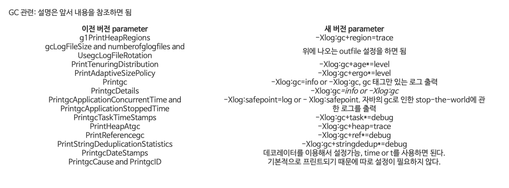

# 8. GC 로깅, 모니터링, 튜닝, 툴

### 8.1 GC 로깅 개요
GC 로그는 시스템이 내려간 원인을 차즌 '콜드케이스' 분석을 할 때 매우 유용
중요한 애플리케이션인 경우 아래 두가지를 설정
- GC 로그를 생성
- 애플리케이션 출력과는 별도로 특정 파일에 GC 로그를 보관
GC 로깅은 사실 오버헤드가 거의 없는 것이나 다름없어서 켜두자

#### 8.1.1 GC 로깅 켜기
```
-Xloggc:gc.log -XX:+PrintGCDetails -XX:+PrintTenuringDistribution
-XX:+PrintGCTimeStamps -XX:+PrintGCDateStamps
```

- -Xloggc:gc.log: 로깅할 파일 지정. 경로로도 지정가능
- -XX:+PrintGCDetails: GC 이벤트 세부 정보를 로깅
- -XX:+PrintTenuringDistribution: 툴링에 꼭 필요한, 부가적인 GC 이벤트 세부정보를 추가
- -XX:+PrintGCTimeStamps: GC 이벤트 발생 시간을 (VM 시작 이후 경과한 시간을 초 단위로) 출력
- -XX:+PrintGCDateStamps: GC 이벤트 발생 시간을 (벽시계 시간 기준으로 출력)

```
이것은 (단순하게 혹은 상세하게) GC 로그에 시간과 날짜 정보를 추가하는게 가능하다. -XX:+PrintGCTimeStamps 에서 timestamp 은 JVM이 시작된 이후에 초단위로 흐른 실제시간을 반영하도록 매 라인마다 추가된다. 예를들어

0,185: [GC 66048K->53077K(251392K), 0,0977580 secs]
0,323: [GC 119125K->114661K(317440K), 0,1448850 secs]
0,603: [GC 246757K->243133K(375296K), 0,2860800 secs]

그리고 -XX:+PrintGCDateStamps 를 지정하면 로그가 쓰여질때에 각 시작 라인이 절대 날짜와 시간을가지고 시작된다.

2014-01-03T12:08:38.102-0100: [GC 66048K->53077K(251392K), 0,0959470 secs]
2014-01-03T12:08:38.239-0100: [GC 119125K->114661K(317440K), 0,1421720 secs]
2014-01-03T12:08:38.513-0100: [GC 246757K->243133K(375296K), 0,2761000 secs]
두가지 출력이 좋아보이면, 두 플래그 조합이 가능하다. 나는 항상 두가지 플래그를 지정하도록 권하는데, 그러한 정보는 다른 소스들로부터 데이터를 가지는 GC 로그 데이터를 연관시키기위해 매우 유용하다

https://linux.systemv.pe.kr/2015/06/유용한-jvm-플래그들-part-8-gc-logging/
```

이거 ...다 쓸모없음
여기서 나오는 옵션들은 전부 자바 8 기준.

위에처럼 쓰다가 아래처럼 바꿈
```
Xlog:gc*,gc+ergo*=trace,gc+age=trace,gc+heap=debug,safepoint:file=gc.log:time,uptime,level,tags:filecount=10,filesize=200m
```

https://realzero0.github.io/study/2020/12/01/Java_11_Log_Option.html

필수 플래그 이외에도 로그 로테이션 관련 플래그가 있다.
UseGCLogFileRotation: 로그 로테이션 기능을 킨다
NumberOfGCLogFiles=n : 보관가능한 최대 로그 파일 개수 설정
GCLogFIleSIze=n: 로테이션 직전 각 파일의 최대 크기 설정

```
gc.log.0 — oldest GC Log content
gc.log.1
gc.log.2
gc.log.3
gc.log.4
```

#### 8.1.2 GC 로그 vs JMX
VisualGC는 JVM 힙 상태를 실시간 표시.
JMX(java mgmt extensions) 인터페이스를 통해 JVM 데이터를 수집.
JMX는 GC에 영향을 줌

- GC 로그 데이터는 실제로 가비지 수집 이벤트가 발생해서 쌓이지만 JMX는 데이터를 샘플링해서 얻음
- GC 로그 데이터는 캡처 영향도가 거의 없지만 JMX는 비용이 듬
- GC로그 데이터보다 JMX에서의 성능 데이터 종류가 더 부족

#### 8.1.3 JMX 의 단점
JMX를 이용해서 어플리케이션 객체들을 모니터링하는데, 런타임을 샘플링해서 현재 상태를 업데이트 받음.
클라이언트는 데이터를 계속 넘겨받기위해 런타임 JMX 를 폴링
GC 전후의 메모리 상태를 알 수 없어서 GC 데이터를 정확하게 분석할수없음
메모리 프레셔(할당률)은 데이터를 수집하는 방식때문에 불가(왜..?)
JMX Connector는 RMI 이용하므로 RMI 문제에 취약
- JMX, RMI를 사용하면 일단 방화벽에 포트도 열어야하고, 접속하고나서 정리작업은 finalize에 의존. 그래서 Gc로 회수되어야 하는데, 수명주기 특성상 풀Gc 전에는 수집되지 않고 남아있음. 그래서 1시간에 한번씩 풀gc 발생

#### 8.1.4 GC 로그 데이터의 장점
최신 가비지 수집은 수많은 부품이 조립된 복잡한 구현체
수집기의 성능도 예측하기가 어려움
컴포넌트들이 서로 맞물려 작동하면서 최종적 동작, 성능이 귀결됨(발현적)

Gc로그는 원래 JVM 디버깅 용도로 추가했지만 나중가서 보니 런타임에서 무슨 일이 발생했는지 정확히 파악하는데 유용하다는 사실을 깨달음
GC로그에 쌓인 데이터는 특정 GC이벤트와 연관지을 수 있어서 의미있는 분석 작업 수행 가능

### 8.2 로그 파싱 툴
GC로그 메시지는 정해진 포맷이 따로 없음. 로그에 무슨 메시지가 남을지는 릴리즈마다 포맷이 조금씩 다르다
GC로그 플래그가 하나둘 추가되면서 로그도 복잡해짐
GC설정을 변경해서 포맷이 달라지면 GC 로그 파서를 쓰는 시스템에서 로깅이 끊어지는 사태가 벌어짐

#### 8.2.1 센섬
자동 분석 기능
- 정확한 할당률
- 조기 승격
- 공격적인 할당
- 유저 이탈
- 메모리 누수 감지
- 힙 크기 조정 및 용량 계획
- VM에 대한 os 간섭
- 크기를 잘못 잡은 메모리 풀

### 8.2.2 GCViewer
분석기능은 없고 특정 gc 핫스팟 로그 포맷만 파싱할 수 있음

## 8.3 GC 기본 튜닝
1. gc가 성능 문제를 일으키는 근원이라고 확인하거나 그렇지 않다고 배제하는건 저렴함
2. UAT에서 GC 플래그를 키는 건 저렴함
3. 메모리 프로파일러 실행 프로파일러를 설정하는건 저렴하지 않음
번역.. 무슨말이야

엔지니어는 튜닝을 수행하면서 다음 네 가지 주요 인자를 면밀히 관찰/측정 해야 함
- 할당
- 중단 민감도
- 처리율 추이
- 객체 수명
할당이 제일 중요함

Xms: 힙 메모리의 최소 크기
Xmx: 힙 메모리의 최대 크기
XX:MaxPermSize: 펌젠 메모리의 최대 크기(레거시 자바 7 이전)
XX:MaxMetaspaceSize: 메타 스페이스 메모리의 최대 크기(자바 8 이후)

InitialRAMPercentage, MaxRAMPercentage 도 활용해보자~
찾아보니 낮은 버전에선 잘 동작 안하고 자바 17부터 좋다던데..


튜닝시 GC 플래그 주의사항
- 한번에 한 플래그씩 추가
- 각 플래그가 무슨 작용을 하는지 숙지
- 부수 효과를 일으키는 플래그 조합도 있음을 명심

성능 문제를 일으키는 원인이 GC인지 아닌지 판단
- vmstat 툴로 머신 지표를 체크
- cpu 사용률이 100%에 가까운가?
- 대부분의 시간이 유저 공간에서 소비되는가?(gc는 유저공간에서 일어나기 때문일까)
- gc로그가 쌓이고있다면 현재 Gc가 실행중이라는것

gc가 문제일 경우는 할당과 중단 시간 양상을 파악한 다음, gc를 튜닝하고 필요 시 메모리 프로파일러를 활용

### 8.3.1 할당이란
할당률 분석은 gc를 튜닝하면 성능이 개선될지 여부를 판단하는데 꼭 필요
할당률의 수치가 1GB/s 이상으로 일정시간 지속한다면 gc만으로는 해결할 수 없는 성능 문제가 터진것.
이 경우는 성능 향상하려면 핵심부의 할당 로직을 제거하는 리팩토링을 통해 메모리 효율을 개선해야함
- 툴로 보자


1. 불필요한 객체를 생성하는 부위를 찾아 제거
- 과도한 박싱, 쓸데없이 객체를 생성(json 직렬화, 역직렬화용 자동 생성코드, Orm)
- 도메인 객체가 메모리를 많이 차지하는 경우(char[], byte[], double[], map entry, object[], 내부 자료구조 oop)
객체 할당 로직
- 일단 스레드로컬할당기법에 따라 스레드마다 할당된 TLAB공간에 할당
- 없으면 VM에게 새 TLAB 공간을 달라고 요청한다음 재시도
- 객체가 너무 뚱뚱해서 TLAB 빈 공간에 안들어가면 에덴에 직접 객체 할당 시도
- 실패하면 영 Gc를 수행
- 그래도 없으면 테뉴어드에 직접 할당(조기승격)

PretenureSizeThreshold: 지정된 크기 이상의 객체가 생성될때 Old 영역에서 처음부터 생성되게 하는 옵션
MinTLABSize

할당률이 폭주하면 영Gc가 자주일어나다가 조기승격됨
jvm은 이런 일이 없도록 많은 서바이버 데이터를 담을 서바이버 공간을 동적 조정

조기승격 문제에는 MaxTenuringThreshold 스위치가 요긴하게 쓰임. 테뉴어드 영역으로 승격되기 전까지 객체가 통과해야 할 gc수집횟수. 기본값은 4이고 1~15 중 정할 수 있음
- 이 값을 높일 수록 진짜 장수한 객체를 더 많이 복사
- 한계치가 너무 낮으면 단명객체가 승격되어서 테뉴어드에 메모리압을 가중시킨다.(풀gc 많아짐)

### 8.3.2 중단 시간이란?
- 대부분의 애플리케이션에서 100ms의 중단시간은 무시할만 하다. (타임아웃~)
- 인간의 눈은 초당 5회밖에처리못한다...는데 인간이 3000만명이면..?
- 중단 민감도를 애플리케이션 힙 크기와 연관지어서 어떤 수집기가 가장 적합한지 가늠 가능
- 음.. 메모리만 많으면 g1말고 cms 쓰면 더 빠른건가..?
- (향후 g1이 수집기로 굳혀지면 더 많은 유스케이스를 커버할 수 있을거다 라고하네...cms 유스케이스까지 처리할정도로 확장될 수도 있지만 가능성은 크지 않아보인다 하네...이미 g1은 이제 흘러가는 gc인데 이제 zgc)

### 8.3.3 수집기 스레드와 gc 루트
gc 루트 탐색 시간은 다음 요인의 영향을 받음
- 애플리케이션 스레드 개수
- 코드 캐시에 쌓인 컴파일드 코드량
- 힙크기
마킹단계에서 엄청 큰 Object[]를 발견하면 탐색은 단일스레드로 수행되기 때문에 이 스레드의 탐색시간이 전체 마킹 시간을 결정지음
어플리케이션 스레드가 너무 많아도 스택 프레임을 더 많이 탐색해야 하고 세이프포인트에 도달하는 시간도 길어짐
- (마킹단계 싱글스레드 아직도인지 알아보기)

스택, 힙 탐색은 병렬화가 잘됨.
parallel, cms는 카드테이블, g1은 rset으로 다른 메모리 풀에서 넘어온 루트를 추적

## 8.4 Parallel GC 튜닝
- 단순한 수집기라 튜닝이 쉬움
- 풀 STW
- GC 처리율이 높고 계산 비용이 싸다
- 부분 수집이 일어날 가능성은 없다
- 중단 시간은 힙 크기에 비례하여 늘어난다

힙이 4GB미만일경우에는 효과적
newRatio, survivorRatio 그치만 건들지 말자..

## 8.5 CMS 튜닝
튜닝이 까다로움
복잡성과 트레이드 오프가 있음
- CMS처럼 중단 수집기가 짧은 수집기는 정말로 STW중단시간을 단축시켜야하는 유스케이스에 한해 사용해야함(아 어느시절에 살고계신거예요)
- cms 플래그 가짓수는 자바8기준 100여개로 안티패턴에 빠질 수 있음
CMS 수집이 일어나면 코어 절반은 GC에 할당되므로 어플리케이션 처리율은 반토막난다.
CMS수집이 일어나자마자 곧바로 새 CMS 수집이 시작되는 백투백은 이제 동시수집기가 얼마 못가 고장나서 메모리 할당 속도가 회수속도를 능가하면서 CMF가 일어날거라는
복습
```
Concurrent Mode Failure(CMF) 가 발생할 수 있다. Concurrent Mode Failure는 Old영역에 더 이상 메모리를 할당할 공간이 없을 때 발생하는데 메모리 단편화로 인해 Old 영역의 빈 공간이 충분히 존재함에도 불구하고 크기가 큰 객체를 할당할 수 없는 경우가 생길 수 있다. CMF가 발생하면 강제적으로 Compaction을 수행하므로 'Stop The World' 시간이 다른 GC보다 길어질 가능성이 있다.
```

동시 gc 스레드 개수는 ConGCThreads =n 으로 조절함
디폴트 설정에서 애플리케이션이 충분히 신속하게 메모리를 회수하지 못하는데 줄이면 더 악화됨

CMS에서 초기마킹, 리마킹에서 STW 발생
초기마킹: GC 루트가 직접 가리키는 내부 노드를 마킹
리마킹: 카드 테이블을 이용해 조정 작업이 필요한 객체식별

애플리케이션은 CMS가 발생할 때 2번 멈추는데 저지연 애플리케이션에서는 영향을 미칠 수 있음
아래 두 플래그를 적용하면 도움이 됨
CMSInitiatingOccupancyFraction = n: 언제 수집을 시작할지 설정. 기본값은 75로 힙이 75% 찼을때 수행
UseCMSInitiatingOccupancyOnly: 초기 점유 공간을 동적으로 조정하는걸 끔.

할당률이 심하게 튀는거라면 여유공간을 늘리고(매개변수 값을 줄이고) 저걸 끄면 도움이 됨. GC를 자주 일으키더라도 CMF를 줄이는

### 8.5.1 단편화로 인한 CMF
CMS가 관리하는 프리리스트때문에 발생(여유공간을 링크드리스트로가지고있다가 주는)
PrintFlsStatistics=1를 설정하면 로그에 정보가 보임
덩치큰걸 테뉴어드로 옮기려다가 청크가 바닥나면 CMF -> parallel로 풀 stw
로그파싱해서 CMF에 임박했다는걸 자동 감지

## 8.6 g1 튜닝
엔드 유저가 최대 힙크기와 최대 gc중단 시간을 간단히 설정하며 나머지는 수집기가 알아서 처리하겟다는것이 최종 목표
실험적인게 많다..라고하네
튜닝해야할경우
UnlockExperimentalVMOptions를 켜서 하자. G1NewSizePercent, G1MAxNewSIzePercent같은걸 할때 필

g1은 계속 발전해서 지금 다를가능성이큼 ㄹㅇ.

cms는 압착을 하지 않으니 갈수록 단편화되고 결국 CMF가 발생
g1은 할당률에 뒤쳐지지 않는 한 계속 조금씩 압착하므로 CMF가 일어날 가능성은 전혀 없음

할당률이 너무 높이 단명객체가 계속 생기면 다음을 고려
1. 영세대롤 크게 설정
2. 테뉴어드 한계치를 최대 15로 늘려잡는다
3. 애플리케이션 수용가능한 최장 중단 목표를 정한다.

이렇게하면 단명객체가 승격될 가능성도 줄어들고 올드 세대압도 낮아짐


## 8.7 jHiccup
JVM이 연속적으로 실행되지 못한 지점을 보여줌

