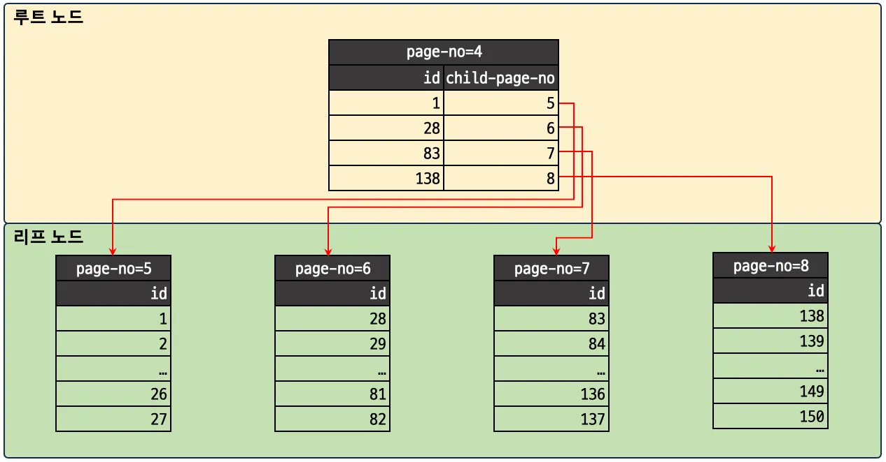

## 5.1.2 트랜잭션 주의사항

- 프로그램 코드에서 트랜잭션 범위를 최소화해야한다.
- OSIV 가 켜진 상태에서 DB 쿼리와 외부 IO 가 발생하는 로직을 함께 사용하다, 외부 IO 로직에서 지연이 발생하여 커넥션 풀이 부족했던 장애 발생함.

## 5.2 MySQL 엔진의 잠금

### 5.2.1 글로벌 락
- MySQL 서버 전체에 걸리는 락
- DDL과 같은 메타 작업이나 전체 백업을 위한 읽기 일관성 확보에 사용
- 이 락이 걸리면 모든 세션의 DML(INSERT/UPDATE/DELETE)도 막힘

> ❌ Online DDL은 Global Lock을 잡지 않는다.
대신에, Metadata Lock (MDL)과 인덱스 관련 락만 잡는다.
따라서 일반 DDL보다 서비스 중단이 거의 없거나 매우 짧다.

#### 일반 DDL (COPY 알고리즘)
1. 새로운 테이블 생성 (ALTER용 구조)
2. 기존 테이블 데이터를 새 테이블로 복사
3. 인덱스 재작성
4. 새 테이블로 교체
5. 원래 테이블 삭제

#### Online DDL (INPLACE 알고리즘)
1. 기존 테이블 그대로 유지
2. 백그라운드 스레드에서 변경 작업 (인덱스 추가 등)
3. 메타데이터만 교체하거나 인덱스를 점진적으로 갱신

#### 그럼 왜 모든 DDL이 Online으로 안 되는가?
- 일부 DDL은 구조 자체가 테이블 전체를 새로 만들지 않고는 불가능
  - 예: TEXT 타입으로 변경, FOREIGN KEY 추가 등
  - Online DDL은 제한된 컬럼/인덱스 작업만 가능

### 5.1.2 테이블 락
- 명시적으로 걸 경우에는 InnoDB 테이블도 테이블 락이 걸림

### 5.2.3 네임드 락
- GET_LOCK() 함수를 이용한 논리적(사용자 정의) 락
- 테이블이나 레코드와는 무관하게, 애플리케이션 단 동기화용으로 사용됨.

#### 네임드 락을 분산락처럼 사용할 수 있는가?
- 가능은 하다 (기본적인 락 메커니즘 제공)
  -  GET_LOCK(name, timeout)은 특정 이름에 대해 세션 기반 락을 획득하므로, 여러 노드(웹 서버)가 같은 MySQL DB를 바라본다면, 동시 접근 제어가 가능하다.
- 하지만 신뢰성에 한계가 있다
  1. 세션 기반 → 세션 끊기면 자동으로 락 해제됨
  2. 복구 대비 (fencing token, watchdog, lease 등의 기능이 없음)
  3. 락 해제 책임이 명확하지 않음

### 5.2.4 메타데이터 락
- DDL(DROP/ALTER 등)과 DML(SELECT/UPDATE 등) 간 충돌 방지를 위해 자동 설정되는 락
- InnoDB는 DML 수행 시 자동으로 MDL을 획득하여 테이블 정의를 고정

#### 5.3.1.1 레코드락
- 반드시 인덱스를 통해 접근할 때만 레코드 락이 걸림
- SELECT ... FOR UPDATE 또는 UPDATE, DELETE 수행 시 사용
- 인덱스를 타지 않으면, InnoDB는 전체 테이블을 락으로 감싸는 테이블 스캔을 함 → 비효율

#### 5.3.1.2 갭락
- 인덱스 상에서 존재하지 않는 레코드 사이의 공간(갭)에 락을 거는 것

##### Supremum Lock 이란?
- Supremum Lock은 B+Tree 인덱스의 마지막 가상 레코드 뒤에 걸리는 갭 락
- 각 리프 노드는 정렬된 레코드들이 저장되어 있고, 마지막에는 “가상의 끝(supremum)” 레코드가 존재


fyi; https://medium.com/daangn/mysql-gap-lock-%EB%91%90%EB%B2%88%EC%A7%B8-%EC%9D%B4%EC%95%BC%EA%B8%B0-49727c005084

> By default, InnoDB operates in REPEATABLE-READ transaction isolation level. In this case, InnoDB uses next-key locks for searches and index scans, which prevents phantom rows

#### 5.3.1.3 넥스트 키 락
- 레코드 락 + 갭 락 = 넥스트 키 락
- 현재 레코드 + 바로 앞 공간(갭) 모두에 락을 거는 방식
- 넥스트 키 락은 인덱스 구조를 따라 leaf node 간 연결에 걸리는 구조

#### 5.3.1.4 자동 증가 락
- AUTO_INCREMENT 컬럼이 있는 테이블에서 INSERT 시 걸리는 락

##### 내부 동작 흐름 (interleaved 모드 기준, innodb_autoinc_lock_mode = 2)
[1] 스레드가 AUTO_INCREMENT가 필요한 INSERT 요청  
↓  
[2] InnoDB는 해당 테이블의 "AUTO-INC latch"를 획득 (뮤텍스 락)  
↓  
[3] 현재 메모리에 올라와 있는 next value 확인  
↓  
[4] 현재 값에서 필요한 개수만큼 증가시켜서 할당 (예: 1001 ~ 1005)  
↓  
[5] latch 해제  

#####  InnoDB의 AUTO_INCREMENT 뮤텍스는 어떤 종류인가?
```angular2html
mutex_enter(&table->autoinc_mutex);
next_value = table->autoinc_counter;
table->autoinc_counter += num_rows;
mutex_exit(&table->autoinc_mutex);
```
- InnoDB는 내부적으로 **mutex latch**를 사용해 AUTO_INCREMENT 카운터를 보호

##### 그럼 CPU 캐시나 false sharing 문제는 없나?
1. 락 보호 대상 자체를 작게 유지
  - 다른 공유 자원들과 인접하지 않게 메모리 패딩(padding) 함
  - CPU cache line 간 충돌 (false sharing) 회피
2. 긴 락 없이 빠른 연산으로 회피
  - num_rows만큼 “미리” 값을 할당하고 끝냄
3. CPU 간 cache coherency는 하드웨어가 처리

> binlog_format = STATEMENT은 결과의 결정성(값이 항상 같음)이 보장되어야 하는데,
innodb_autoinc_lock_mode = 2는 값 할당이 병렬이기 때문에
→ 값이 마스터와 슬레이브 간 달라질 수 있음
→ mode=1에서는 INSERT SELECT, REPLACE, LOAD DATA 등 복잡한 INSERT가 들어오면, 쿼리 실행 순서 = AUTO_INCREMENT 값 할당 순서이므로 마스터와 슬레이브의 실행 결과가 일치
