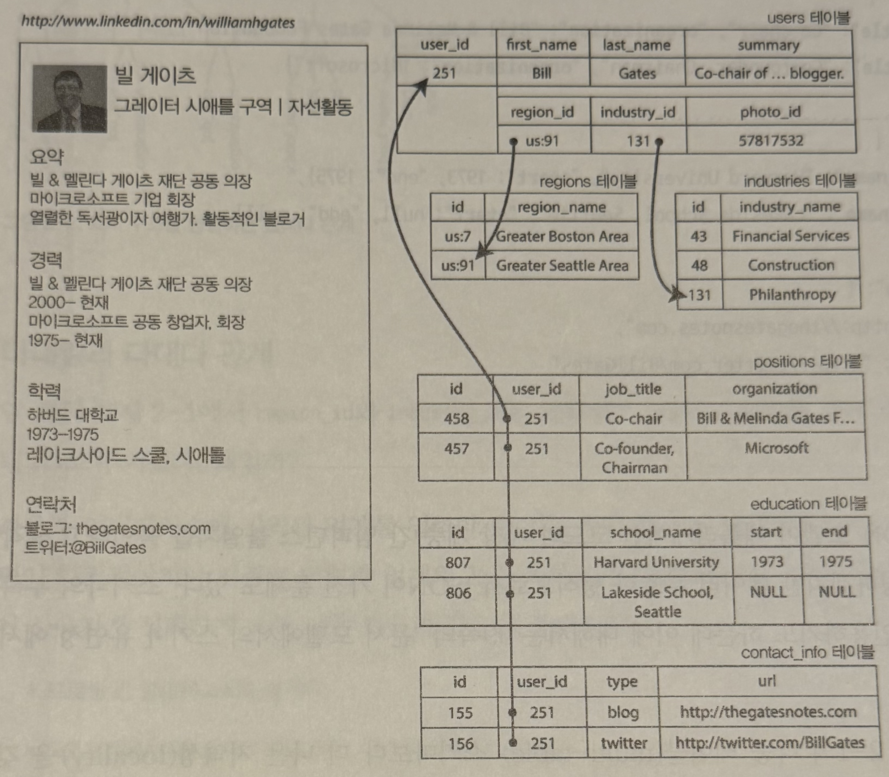
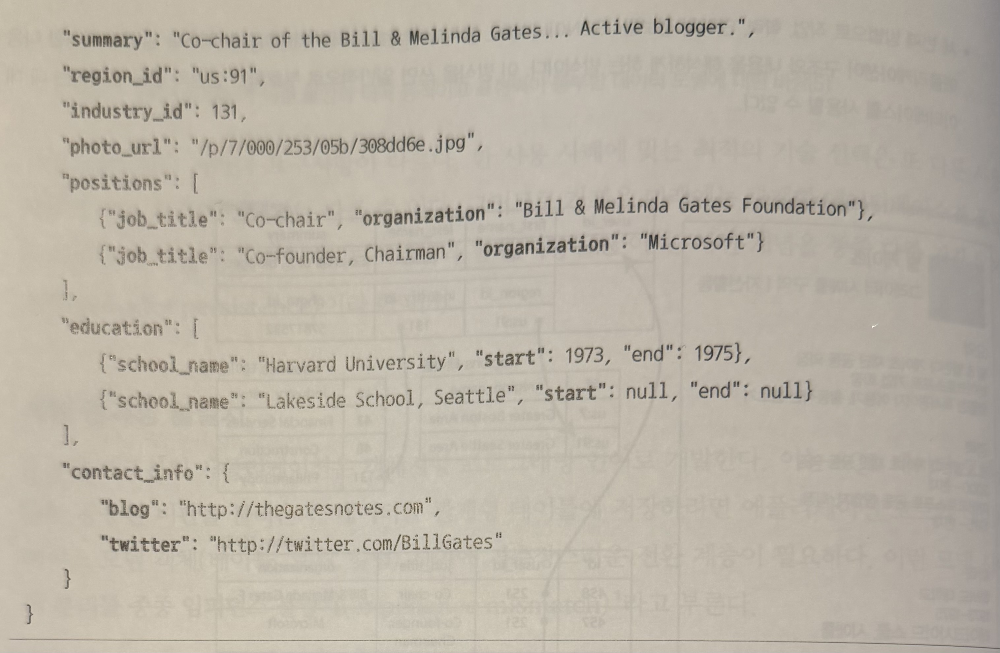
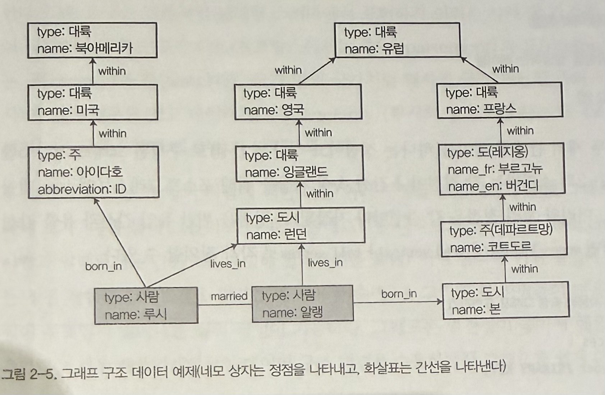
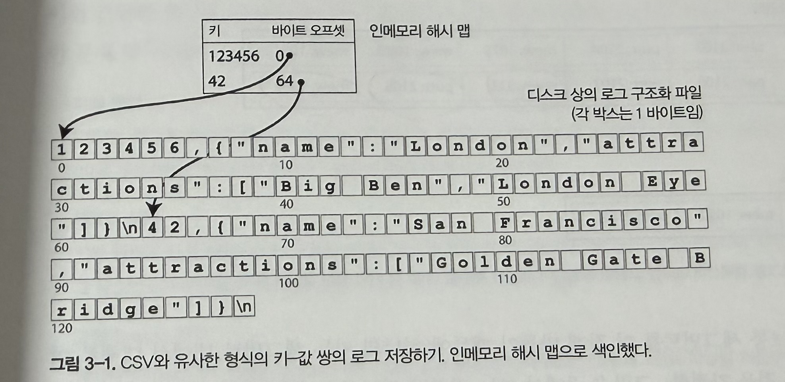
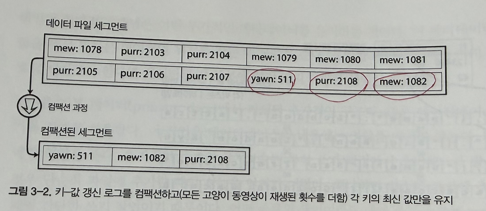
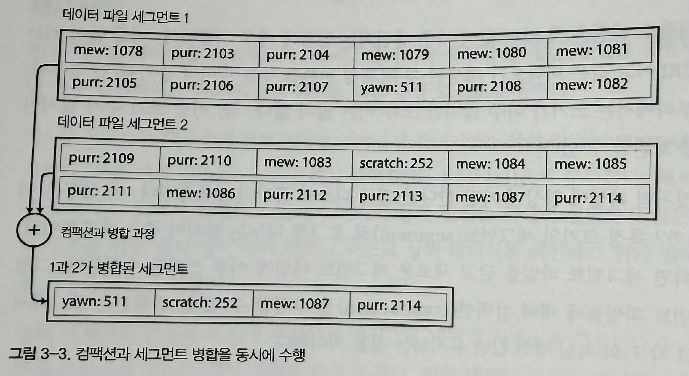
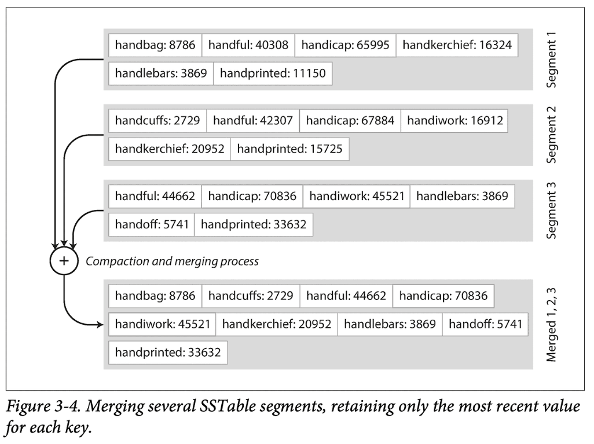
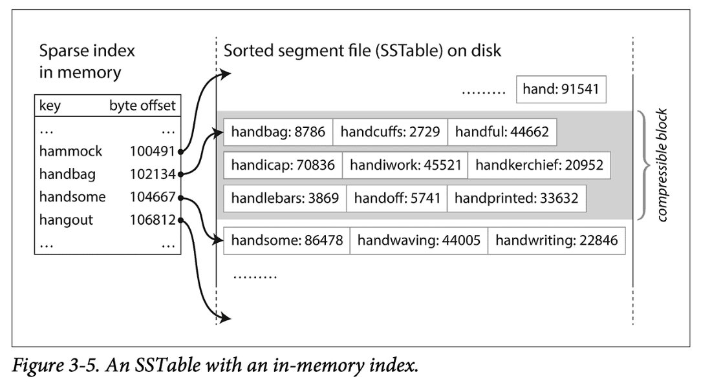

# 1. 관계형 모델과 문서 모델

### 관계형 모델

오늘날 가장 잘 알려진 데이터 모델. 데이터는 관계(relation)로 구성되고, 각 관계는 순서 없는 튜플(tuple) 모음이다.

### 관계형 모델의 의문

> 효율적으로 구현할 수 있을까?

→ RDBMS의 등장, 우위 장악

### 관계형 모델의 목표

정리된 인터페이스 뒤로 **구현 세부 사항을 숨기는 것**


### NoSQL의 등장

대규모 데이터셋, 매우 높은 쓰기 처리량 달성을 위해 채택.
관계형 모델에서 지원하지 않는 특수 질의 동작이 필요한 경우 사용


## 임피던스 불일치 (Impedance Mismatch)

객체지향 모델과 관계형 모델의 **패러다임 불일치**로 인해 발생하는 현상.

- 이를 해결하기 위해 **ORM(객체 관계형 매핑)** 프레임워크가 등장
- 하지만 두 모델 간의 차이를 완벽하게 좁힐 수는 없음


- 링크드인 프로필을 관계형 스키마로 표현



- 링크드인 프로필을 JSON 문서로 표현 


### 문서모델의 장점

JSON 모델 사용 시 더 나은 지역성(locality) 달성 가능 → 단 한 번의 질의로 모든 관련 정보 조회. 프로필처럼 One-to-many 관계는 트리 구조와 같아서 문서 모델이 자연스럽다


=> 데이터 항목 간의 관계 유형에 따라 선택


---


# 2. 저장소 지역성 (Storage Locality)

문서는 보통 JSON, XML 등 하나의 연속적인 문자열로 저장된다.

- **장점**: 한 번에 문서 전체가 필요한 경우, 저장소 지역성 덕분에 성능 이점이 있다
- **단점**: 문서의 일부만 필요해도 전체를 로드해야 하고, 갱신 시 문서 전체를 다시 써야 할 수 있다

→ 문서를 되도록 **작게 유지**하고, 크기가 증가하는 쓰기를 피하는 것이 권장됨

>  지역성은 문서 모델에만 국한되지 않는다.
> 구글의 Spanner, 오라클의 다중 테이블 색인 클러스터 테이블, 카산드라와 HBase의 칼럼 패밀리 개념에서도 지역성을 활용한다.

---
# 3. 쓰기 스키마 vs 읽기 스키마

### 쓰기 스키마 (Schema-on-Write)

- 데이터 저장 시점에 구조를 확정하여 일관성과 쿼리 성능을 중시하는 방식(RDBMS)
- **관계형 데이터베이스**의 전통적 접근 방식
- 스키마가 **명시적**이고, DB가 쓰여진 모든 데이터가 스키마를 따르는지 보장
- 정적 타입 언어(Java, C#)의 **컴파일 타임 타입 체크**와 유사

### 읽기 스키마 (Schema-on-Read)

- 데이터 저장 후 읽을 때 구조를 적용하는 유연한 방식(NoSQL/Data Lake)
- **문서 데이터베이스**의 접근 방식
- 데이터 구조가 **암묵적**이고, 데이터를 **읽을 때만 해석**
- 동적 타입 언어(JavaScript, Python)의 **런타임 타입 체크**와 유사

### 예시: 이름 필드를 분리하고 싶을 때

`name`에 "류연경"을 통째로 저장했는데, `first_name`과 `last_name`으로 분리하고 싶다면?

**읽기 스키마** — DB는 안 건드리고, 애플리케이션에서 읽을 때 처리

```javascript
if (user && user.name && !user.first_name) {
    // 이전에 쓴 문서는 first_name이 없음
    user.first_name = user.name.split(" ")[0];
}
```

**쓰기 스키마** — 마이그레이션으로 DB 구조 자체를 변경

```sql
ALTER TABLE users ADD COLUMN first_name text;
UPDATE users SET first_name = split_part(name, ' ', 1);  -- PostgreSQL
UPDATE users SET first_name = substring_index(name, ' ', 1);  -- MySQL
```

-> 스키마 변경은 느리고, 중단시간을 요구하기 때문에 평판이 나쁘다
### ALTER TABLE의 현실적 문제

MySQL은 `ALTER TABLE` 시 **테이블 전체를 복사**하기 때문에 대규모 테이블에서는 수 분~수 시간이 걸릴 수 있다. 대부분의 다른 관계형 DB는 밀리초 안에 수행한다.

`UPDATE`로 기존 데이터를 전부 바꾸는 것도 느리기 때문에, 새 컬럼을 **NULL 기본값**으로만 추가하고 실제 값은 **읽을 때 채우는** 방식을 쓰기도 한다.

→ 이는 사실상 관계형 DB에서도 **읽기 스키마**처럼 동작하는 것

### 정리

- 컬렉션의 항목이 **모두 동일한 구조** → **쓰기 스키마** 유리
- 여러 이유로 **구조가 다른 데이터**가 섞여 있을 때 → **읽기 스키마**가 자연스러움
  - 다양한 유형의 오브젝트가 있고, 유형별로 테이블을 만드는 게 비현실적일 때
  - 외부 시스템에서 오는 데이터라 구조를 통제할 수 없을 때

---
# 4. 그래프형 데이터 모델

- 일대다 관계거나, 레코드 간 관계가 없다면 -> 문서 모델 적합
- 다대다 관계가 일반적이라면 -> 그래프형 모델 적합 

### 핵심 개념: 정점(Vertex)과 간선(Edge)

- **정점(Vertex)** = 엔티티 (사람, 회사, 도시 등)
- **간선(Edge)** = 관계 (근무, 거주, 소속 등)




### 그래프 모델의 특징

- 정점끼리 **아무 제약 없이** 연결 가능 (사람→도시, 도시→나라, 사람→사람)
- 하나의 그래프에 **완전히 다른 종류의 데이터**를 함께 저장 가능
- 관계를 따라가는 **탐색이 매우 빠름**
- 관계형 DB에서 JOIN을 여러 번 해야 하는 것을, 그래프에서는 간선 따라가기로 해결

### 4-1. 속성 그래프 모델

정점과 간선 모두 속성(key-value)을 가진다.

- **정점**: 고유 식별자, 유출/유입 간선 집합, 속성 컬렉션
- **간선**: 고유 식별자, 시작/끝 정점, 관계를 설명하는 레이블, 속성 컬렉션


```sql
CREATE TABLE vertices (
    vertex_id  INTEGER PRIMARY KEY,
    properties JSON
);

CREATE TABLE edges (
    edge_id     INTEGER PRIMARY KEY,
    tail_vertex INTEGER REFERENCES vertices(vertex_id),  -- 출발 정점
    head_vertex INTEGER REFERENCES vertices(vertex_id),  -- 도착 정점
    label       TEXT,         -- 관계 이름 (근무, 거주 등)
    properties  JSON
);
```

- **정점**: 고유 식별자 + 속성(key-value)
- **간선**: 출발 정점(`tail`) → 도착 정점(`head`) + 관계 레이블 + 속성

### 속성 그래프의 핵심 특징

1. 정점끼리 **아무 제약 없이** 간선으로 연결 가능
2. 어떤 정점이든 **유입/유출 간선**을 효율적으로 탐색 가능
3. 다른 레이블을 사용해 하나의 그래프에 **다양한 종류의 관계** 저장 가능

---

## Cypher 질의 언어

Cypher는 속성 그래프를 위한 **선언형 질의 언어**다 (Neo4j에서 사용).

### 데이터 삽입

```cypher
CREATE
  (류연경:Person {name: "류연경"}),
  (서울:City {name: "서울"}),
  (서울특별시:State {name: "서울특별시"}),
  (대한민국:Country {name: "대한민국"}),
  (류연경)-[:거주]->(서울),
  (서울)-[:소속]->(서울특별시),
  (서울특별시)-[:소속]->(대한민국)
```

- `(이름:타입 {속성})` → 정점 생성
- `(A)-[:관계]->(B)` → 간선 생성, **화살표가 관계 방향**

### 데이터 조회

```cypher
MATCH (person)-[:거주]->(city)-[:소속*]->(country {name: "대한민국"})
RETURN person.name
```

| 구문 | 의미 |
|------|------|
| `(person)` | 아무 정점에서 시작 |
| `-[:거주]->` | "거주" 간선을 따라감 |
| `(city)` | 도시 정점에 도달 |
| `-[:소속*]->` | "소속" 간선을 **몇 번이든 재귀적으로** 따라감 |
| `(country {name: "대한민국"})` | 대한민국에 도달하면 매칭 |
| `RETURN person.name` | 해당 사람의 이름 반환 |

> `[:소속*]`의 `*`이 핵심이다. 서울→서울특별시→대한민국(2단계)이든 서울→대한민국(1단계)이든 **깊이에 상관없이 자동 탐색**한다.
> SQL로 같은 작업을 하려면 `WITH RECURSIVE`로 복잡한 재귀 쿼리를 작성해야 한다.

---

## SQL의 그래프 질의

관계형 DB에서도 그래프 질의가 가능하지만, 매우 복잡하다.

### Cypher (2줄이면 끝)

```cypher
MATCH (person)-[:거주]->(city)-[:소속*]->(country {name: "대한민국"})
RETURN person.name
```

### 같은 작업을 SQL로 하면

```sql
WITH RECURSIVE in_korea(vertex_id) AS (
    -- 1단계: "대한민국" 정점 찾기
    SELECT vertex_id 
    FROM vertices 
    WHERE properties->>'name' = '대한민국'
    
  UNION
    
    -- 재귀: "소속" 간선을 거꾸로 따라가기
    SELECT edges.tail_vertex
    FROM edges
    JOIN in_korea ON edges.head_vertex = in_korea.vertex_id
    WHERE edges.label = '소속'
)

-- 위에서 찾은 지역에 "거주"하는 사람 찾기
SELECT v.properties->>'name'
FROM vertices v
JOIN edges ON edges.tail_vertex = v.vertex_id
JOIN in_korea ON edges.head_vertex = in_korea.vertex_id
WHERE edges.label = '거주';
```

### 동작 과정

1. `대한민국` 정점을 찾는다
2. `대한민국`으로 "소속" 간선이 들어오는 것을 찾는다 → `{서울, 서울특별시, ...}`
3. 다시 그 정점들로 "소속" 간선이 들어오는 것을 찾는다 → `{부산, 서울, ...}`
4. 더 이상 없으면 멈춘다
5. 이 지역들에 "거주"하는 사람을 찾는다

> 관계형 DB에서도 그래프 질의가 **가능은 하지만**, 코드량과 복잡도가 크게 증가한다.
> 데이터 간의 관계 탐색이 핵심이라면 **처음부터 그래프 DB를 쓰는 것이 낫다**.

---

## 트리플 저장소와 SPARQL

### 트리플 저장소 (Triple Store)

모든 정보를 **(주어, 술어, 목적어)** 세 부분으로 표현한다. 속성 그래프 모델과 거의 동등하지만, 속성과 관계를 구분하지 않고 **동일한 형식**으로 저장한다.

```
(류연경, 이름, "류연경")      → 목적어가 값이면 속성
(류연경, 거주, 서울)          → 목적어가 정점이면 관계
(서울, 소속, 서울특별시)
(서울특별시, 소속, 대한민국)
(대한민국, 타입, 나라)
```

### SPARQL 질의 언어

SPARQL(스파클)은 트리플 저장소를 위한 **선언형 질의 언어**다. Cypher보다 먼저 만들어졌으며, Cypher가 SPARQL에서 패턴 매칭 문법을 빌려왔다.

```sparql
PREFIX : <urn:example:>

SELECT ?personName WHERE {
    ?person :이름 ?personName.
    ?person :거주 / :소속* / :이름 "대한민국".
}
```

### Cypher vs SPARQL 비교

| Cypher | SPARQL | 의미 |
|--------|--------|------|
| `(person)` | `?person` | 변수 (`?`로 시작) |
| `-[:거주]->` | `:거주 /` | 간선 따라가기 (`/`로 연결) |
| `-[:소속*]->` | `:소속*` | 재귀 탐색 (`*` 동일) |
| `{name: "대한민국"}` | `:이름 "대한민국"` | 속성 매칭 |

---

## 시맨틱 웹과 RDF

### 시맨틱 웹 (Semantic Web)

웹은 원래 사람이 읽기 위해 만들어졌지만, 시맨틱 웹은 **컴퓨터도 데이터의 의미를 이해할 수 있게 하자**는 아이디어다. 웹사이트들이 일관된 형식으로 데이터를 게시하면, 컴퓨터가 자동으로 데이터를 연결하고 활용할 수 있다.

→ 현실에서는 과대평가되어 크게 성공하지 못했지만, 그 과정에서 나온 **트리플 저장소, RDF, SPARQL** 같은 기술은 시맨틱 웹이 아니더라도 유용하게 쓰이고 있다.

### RDF (Resource Description Framework)

시맨틱 웹에서 데이터를 표현하기 위해 만든 형식. 트리플 저장소의 데이터 형식이 바로 RDF다.

Turtle이라는 간결한 형식으로 표현하면:

```
@prefix : urn:example:.
:류연경  :이름  "류연경";
:거주  :서울.
:서울    :소속  :서울특별시.
```

결국 **트리플(주어, 술어, 목적어)을 표현하는 표준 포맷**이다.

### 시맨틱 웹 관련 개념 정리

| 개념 | 역할 |
|------|------|
| **시맨틱 웹** | 컴퓨터가 데이터의 의미를 이해하자는 비전 |
| **RDF** | 그 비전을 위한 데이터 표현 형식 (트리플) |
| **SPARQL** | RDF 데이터를 질의하는 언어 |

---

## 데이터로그 (Datalog)

트리플 저장소와 비슷하지만, `(주어, 술어, 목적어)` 대신 `술어(주어, 목적어)` 형태로 표현한다.

---


# 5. 로그 구조 계열 vs 페이지 지향 계열 (3장)

### 가장 간단한 데이터베이스
- db_set: 호출시 마다 파일 끝에 추가하므로 예전 버전 덮어 쓰지 않음
- db_get: 데이터베이스에 레코드가 많으면 성능이 좋지 않다.

-> 특정 키의 값을 효율적으로 찾기 위한 다른 데이터 구조 필요 : **색인**

## 개요

DB는 **저장(쓰기)** 과 **검색(읽기)** 두 가지를 수행한다. 이를 효율적으로 하기 위해 **색인(Index)** 이 필요하다.

> 색인의 트레이드오프: 읽기는 빨라지지만, 쓸 때마다 색인도 갱신해야 하므로 **쓰기는 느려진다**.

저장소 엔진은 크게 두 계열로 나뉜다.

| | 로그 구조 계열 | 페이지 지향 계열 |
|---|---|---|
| **대표** | LSM 트리 | B 트리 |
| **쓰기 방식** | 파일 끝에 추가 (append-only) | 기존 데이터를 덮어쓰기 |
| **단위** | 가변 크기 세그먼트 | 고정 크기 페이지 (4KB) |
| **사용처** | Cassandra, LevelDB, RocksDB | MySQL, PostgreSQL, MSSQL |

---

## 5-1. 해시 색인

가장 단순한 색인. **키 → 디스크 위치(바이트 오프셋)** 를 메모리의 해시맵에 저장한다.

### 기본 개념

키-값 데이터를 **append-only 로그 파일**에 저장하고, **키 → 바이트 오프셋** 매핑을 메모리의 해시맵에 유지하는 방식이다.

### 동작 과정

**쓰기**: 파일 맨 끝에 데이터를 추가하고, 해시맵의 오프셋을 갱신한다.  
**읽기**: 해시맵에서 오프셋 조회 → 디스크에서 해당 위치로 바로 이동 → 한 번의 디스크 접근으로 값을 읽음



### 세그먼트 분할

파일이 특정 크기에 도달하면 새로운 세그먼트 파일로 분할한다.

- 쓰기는 항상 **최신 세그먼트**에만 수행
- 읽기는 **최신 세그먼트 → 이전 세그먼트** 순으로 탐색
- 각 세그먼트는 자체 해시맵을 가짐

### 컴팩션과 세그먼트 병합

같은 키가 여러 번 기록되면 **최신 값만 남기고 제거(컴팩션)** 한 뒤, 여러 세그먼트를 **하나로 병합**한다. 백그라운드에서 수행되므로 읽기/쓰기 요청은 정상 처리된다.

### 왜 수정하지 않고 끝에 추가만 하는가?

- **순차 쓰기**가 랜덤 쓰기보다 훨씬 빠름 (특히 HDD)
- **고장 복구**가 쉬움: 파일이 중간에 깨져도 이전 데이터가 그대로 남아있음
- **동시성 제어**가 단순: 하나의 쓰기 스레드가 끝에 추가하기만 하면 됨

### 해시 색인의 한계

- 모든 키가 **메모리에** 있어야 함 → 키가 매우 많으면 메모리 부족
- **범위 질의 불가능**: "mew~purr 사이의 모든 키" 같은 조회가 안 됨 (해시맵은 정확한 키 하나만 조회 가능)
- 해시 충돌 관리 필요

→ 이 한계를 해결한 것이 **SS테이블과 LSM 트리**





## 5-2. SS테이블 (Sorted String Table)

해시 색인과 달리 **키를 정렬하여** 세그먼트에 저장하는 방식이다.




### 정렬의 장점

**1. 병합이 효율적**

- 두 SS테이블을 합칠 때, 머지소트처럼 앞에서부터 비교하면 된다. 같은 키가 있으면 최신 세그먼트의 값을 사용한다.

**2. 메모리 절약 (희소 색인)**

- 모든 키를 메모리에 넣을 필요 없이 **일부 키만 색인**하면 된다. 정렬되어 있으므로 두 키 사이의 구간만 스캔하면 원하는 키를 찾을 수 있다.

**3. 범위 질의 가능**

- 정렬되어 있으므로 "apple부터 dog까지 전부" 같은 범위 검색이 가능하다. 해시 색인은 이것이 불가능했다.

### 쓰기: 멤테이블 (Memtable)

디스크에 정렬하며 쓰는 것은 어렵지만, 메모리에서는 쉽다. **멤테이블**이라는 인메모리 트리 구조(레드-블랙 트리, AVL 트리 등)를 사용하여 정렬 상태를 유지한다.

1. 쓰기 요청이 들어오면 멤테이블에 **정렬된 위치에 삽입**
2. 멤테이블이 수 MB 이상 커지면 → **SS테이블 파일로 디스크에 기록** (이미 정렬되어 있으므로 그대로 쓰면 됨)
3. 디스크에 쓰는 동안 새 쓰기는 **새로운 멤테이블**에 기록

### 읽기 순서
```
1단계: 멤테이블 (메모리, 가장 최신)
↓ 없으면
2단계: 최신 SS테이블 (디스크)
↓ 없으면
3단계: 두 번째 최신 SS테이블
↓ 없으면
4단계: 계속 이전 세그먼트로...
```

존재하지 않는 키를 찾으면 모든 세그먼트를 확인해야 하므로 느리다. → **블룸 필터**로 해결 (해당 키가 확실히 없음을 빠르게 판단)



### 고장 대비: WAL (Write-Ahead Log)

멤테이블은 메모리에만 있으므로 DB 고장 시 데이터가 유실된다. 이를 방지하기 위해:

1. 쓰기 요청 → **WAL에 먼저 기록** (디스크, 복구용)
2. 그 다음 멤테이블에 추가
3. 고장 시 → WAL을 읽어서 멤테이블 복구

---

## 5-3. LSM 트리 (Log-Structured Merge-Tree)

멤테이블 → SS테이블 → 컴팩션 & 병합의 **전체 과정을 합친 것**이 LSM 트리다.

### 전체 흐름

```
쓰기 요청
↓
WAL에 기록 (디스크, 복구용)
↓
멤테이블에 추가 (메모리, 정렬 유지)
↓ 임계값 초과 (수 MB)
SS테이블로 디스크에 기록
↓ 백그라운드
컴팩션 & 병합 (오래된 세그먼트 정리)
```

### 컴팩션 전략

| 전략 | 방식 | 특징 |
|------|------|------|
| **크기 계층 (Size-Tiered)** | 작은 세그먼트끼리 병합 → 점점 큰 세그먼트 생성 | 단순함 |
| **레벨 (Leveled)** | 오래된 데이터를 다음 레벨로 이동, 레벨별로 관리 | 디스크 공간 효율적 |

### LSM 트리의 장단점

**장점:**
- 쓰기가 순차적(append)이라 **쓰기 처리량이 높음**
- B트리보다 **압축률이 좋아** 디스크 공간 효율적
- 주기적으로 SS테이블을 다시 기록하므로 **파편화가 적음**

**단점:**
- 컴팩션이 진행 중인 **읽기/쓰기 성능에 영향**을 줄 수 있음
- 존재하지 않는 키 조회 시 모든 세그먼트를 확인해야 함 → **블룸 필터**로 해결

>  블룸 필터: "이 키가 확실히 존재하지 않음"을 빠르게 알려주는 자료구조. 불필요한 디스크 읽기를 절약한다.