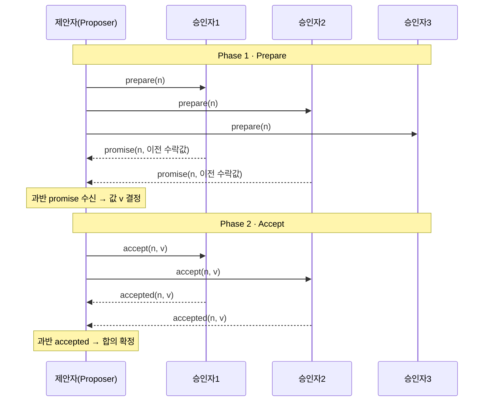
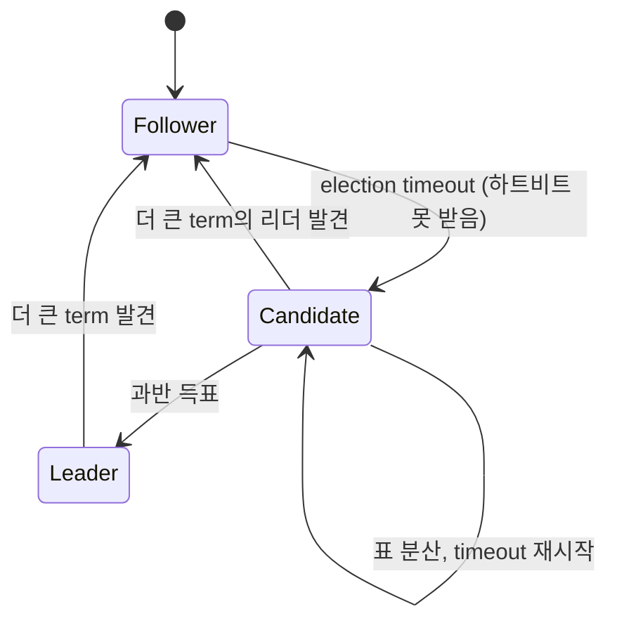
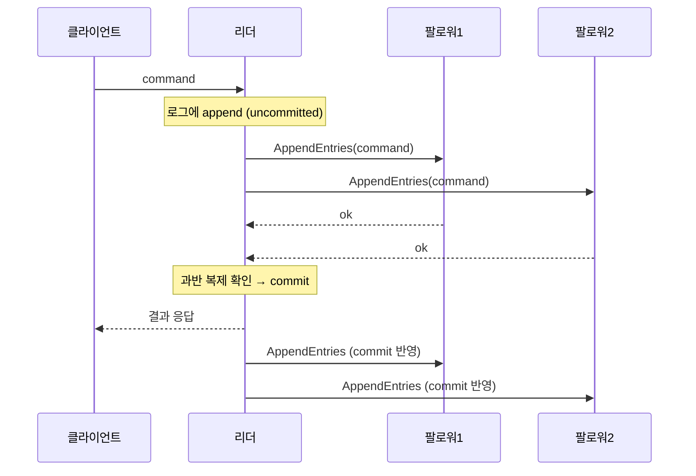
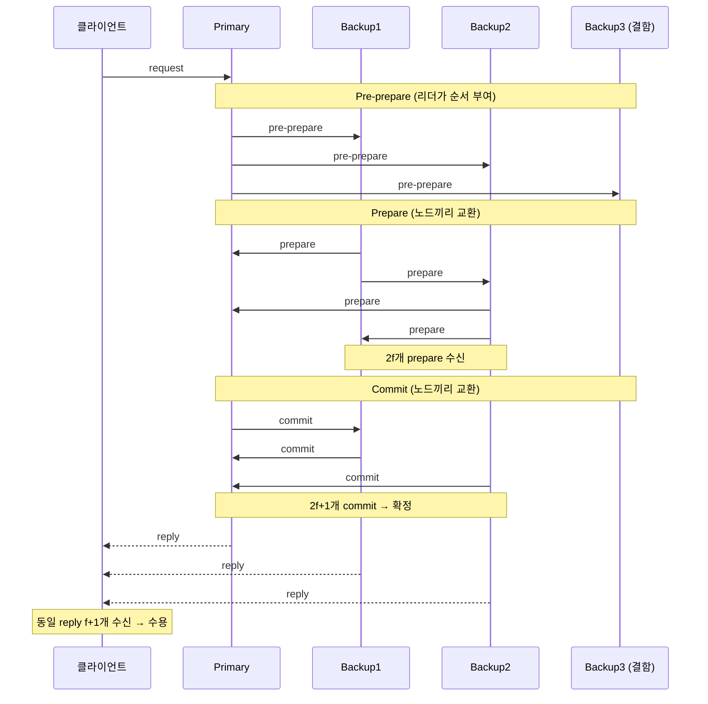

## 합의 알고리즘 심화 (9장 키워드 탐구)

- 9장 후반에서 합의(consensus)를 다뤘지만, 정작 Paxos·Raft가 "안에서 어떻게 도는지"는 이름만 스치고 지나갔다. 이번엔 그 안을 연다.
- week10에서 정리한 추상 개념들 — 에포크 번호, 정족수 겹침, 전체 순서 브로드캐스트 — 이 실제 알고리즘에서 각각 어디에 대응하는지 매핑하는 게 이 글의 목표.
- 세 가지를 본다. Paxos(원조), Raft(이해 가능하게 다시 쓴 것), PBFT(악의적 노드까지 견디는 것).

## Paxos

- 분산 시스템에서 하나의 값에 대해 여러 노드가 합의하도록 고안된 원조 프로토콜. 네트워크 지연·메시지 손실·노드 장애 속에서도 일관성을 보장한다.
- Leslie Lamport가 제안. 논문 "The Part-Time Parliament"(1998), 쉬운 버전 "Paxos Made Simple"(2001).

### 세 가지 역할
- 제안자(Proposer) : 값을 제안하고 합의를 주도한다.
- 승인자(Acceptor) : 제안에 투표한다.
- 학습자(Learner) : 합의된 최종 값을 학습한다.

### 두 단계로 도는 원리
- Prepare 단계 : 제안자가 고유한 제안 번호를 만들어 승인자에게 prepare를 보낸다. 승인자는 이전에 약속한 번호보다 큰 요청만 받고, 이미 수락한 값이 있으면 그 정보를 제안자에게 회신한다.
- Accept 단계 : 제안자가 Prepare 결과를 바탕으로 최종 값을 정해 accept를 보낸다. 과반수 승인자가 수락하면 합의 확정.

### 주요 특징
- 내결함성 : 일부 노드가 죽어도 (과반만 살면) 합의를 끌어낸다.
- 동시성 제어 : 고유한 제안 번호 + Prepare 단계 조율로 충돌을 최소화한다.
- 안정성 : 한 번 합의된 값은 안 바뀐다.
- 단점 : 이론은 견고한데 실제 구현이 악명 높게 복잡하다. → 이 복잡함이 Raft가 태어난 이유다. 그리고 악의적 참가자가 있는 환경에는 부적절하다(비잔틴 결함 미가정).

> [!tip] 왜 Paxos는 어렵기로 유명한가
> Lamport가 원논문을 고대 그리스 의회 비유로 써서, 정작 알고리즘이 안 읽힌다는 전설이 있다. 더 근본적으로는 "값 하나를 정하는 Basic Paxos"와 "연속된 값을 정하는 Multi-Paxos" 사이 간극이 크고, 실무에 필요한 건 Multi-Paxos인데 원논문이 이걸 흐릿하게 남겨서다. → Raft는 처음부터 "로그(연속된 값)"를 1급 개념으로 놓고 시작한다.

## Raft

- Paxos의 복잡성을 걷어내고 이해 가능하도록(understandable) 다시 설계한 합의 알고리즘. 복제된 로그(replicated log)를 관리하며, 일부 서버가 죽어도 기능을 유지한다.
- Diego Ongaro·John Ousterhout, 2014. 논문 제목부터가 "In Search of an Understandable Consensus Algorithm".
- 핵심 요소 : 강력한 리더(strong leader), 리더 선출, 로그 복제, 안정성(safety), 멤버십 변경, 로그 압축.

### 세 가지 서버 상태
- 팔로워(Follower) : 리더/후보자의 요청에 응답만 하는 수동 상태.
- 후보자(Candidate) : 리더 하트비트를 못 받아 선출을 시작한 상태.
- 리더(Leader) : 클라이언트 요청을 처리하고, 로그를 복제하고, 하트비트로 리더십을 유지하는 상태.

### 리더 선출
- 팔로워가 election timeout 안에 하트비트를 못 받으면 후보자로 전환.
- 후보자는 term(임기)을 +1 하고, 자기에게 투표한 뒤 다른 서버에 RequestVote RPC를 보낸다.
- 과반 득표한 후보자가 리더가 된다.
- Randomized election timeout으로 표 분산(동시 후보 난립)을 막고 선출 속도를 높인다.
- 정족수(Quorum) : 선출과 합의 확정에 필요한 최소 과반.

### 로그 복제
- 리더만 클라이언트 커맨드를 자기 로그에 추가하고, AppendEntries RPC로 팔로워에게 복제한다.
- 로그 항목은 index(순서)와 term(임기)을 갖는다. committed된 항목은 모든 상태 머신에 안전하게 반영된다.
- 로그 일치 속성(Log Matching) : 두 로그가 같은 index·term을 가지면 그 index까지 모든 항목이 동일하다. AppendEntries의 일관성 체크가 이를 보장.
- 불일치 복구 : 리더가 팔로워별 nextIndex를 관리하다가, 안 맞으면 nextIndex를 하나씩 줄이며 일치 지점을 찾아 덮어쓴다.

### 안정성 (election restriction)
- 리더는 반드시 이전 term에서 커밋된 모든 로그 항목을 갖고 있어야 한다.
- 이를 위해 RequestVote는 자기보다 로그가 더 최신인 후보에게만 투표한다. → 낡은 로그를 가진 노드는 리더가 될 수 없다.

### 활용
- 쿠버네티스의 etcd가 클러스터 상태를 일관되게 관리하려고 Raft를 쓴다. (week10에서 본 그 etcd)
- 장점 : Paxos보다 이해·구현이 쉽고, 강력한 리더로 로그 관리를 단순화.
- 단점 : Paxos만큼 이론적으로 일반적이진 않지만, 실용적으로 훨씬 널리 쓰인다.

> [!tip] week10 추상 개념 → Raft 실제 구현 매핑
> 9장에서 배운 개념이 Raft에서 이렇게 실체화된다. 발표는 이 매핑을 축으로 잡으면 깔끔하다.
>
> | 9장 후반 개념            | Raft에서의 구현                     |
> | ------------------- | ------------------------------ |
> | 에포크(epoch) 번호       | term(임기)                       |
> | 정족수 겹침으로 낡은 리더 차단   | election restriction (최신 로그만 당선) |
> | 전체 순서 브로드캐스트        | 로그 복제 (index 순서대로 커밋)          |
> | 약한 리더 + 두 라운드 투표    | RequestVote → AppendEntries    |

## PBFT (Practical Byzantine Fault Tolerance)

- 비잔틴 장군 문제(Byzantine Generals Problem)를 실용적으로 푼 합의 알고리즘. 비동기 네트워크에서도 합의가 가능하다.
- Paxos·Raft가 "노드는 죽을 뿐 거짓말은 안 한다"고 가정한 반면, PBFT는 악의적으로 거짓말하는 노드까지 견딘다. → week10에서 "합의 알고리즘은 비잔틴 결함을 가정하지 않는다"고 했던 그 빈칸을 채우는 자리.

### 작동 방식
- Primary(리더)와 Backup 노드로 구성. View라는 라운드마다 Primary가 정해진다.
- Primary가 클라이언트 요청을 받으면 Backup들에게 Pre-prepare를 보낸다.
- Backup들은 메시지를 검증하고 서로에게 Prepare를 보낸다.
- Prepare를 2f개(f = 결함 노드 최대 수) 받으면 Commit 단계로 넘어가 서로에게 Commit을 보낸다.
- Commit을 2f+1개 받으면 합의 확정. → 전체 3f+1개 노드 중 f개의 악의적 노드를 허용한다.
- View 변경 프로토콜 : Primary가 죽거나 의심되면 새 Primary를 뽑아 일관성을 유지.

### 장단점
- 장점 : 블록체인식 분기가 안 생겨 파이널리티(finality)를 확보한다. PoW/PoS보다 훨씬 고속. 악의적 참가자 내성이 강하다.
- 단점 : 매 단계 모든 참가자와 통신해야 해서, 노드 수가 늘면 통신량이 O(n²)로 폭증하고 처리량이 떨어진다. → 수십 개 노드가 사실상 한계.

> [!tip] 왜 3f+1인가
> 비잔틴 환경에서 f개의 거짓말쟁이를 견디려면 노드가 최소 3f+1개 필요하다. 직관 : 응답 없는 노드 f개(죽었는지 느린 건지 구분 불가) + 거짓말하는 노드 f개를 빼고도, 정직한 다수가 남으려면 그렇다. 일반 합의(Paxos/Raft)가 2f+1(과반)이면 충분한 것과 대비된다. → 거짓말을 견디는 비용이 정족수를 한 단계 키운다.

## 보충 — 발표에서 한 걸음 더

### Paxos의 라이브락 (dueling proposers)
- 두 제안자가 번갈아 더 큰 번호로 prepare를 던지면, 서로 상대의 accept를 무효화시켜 영원히 합의가 안 될 수 있다. 이걸 라이브락(livelock)이라 한다.
- safety(잘못된 합의)는 안 깨지지만 liveness(끝남)가 위태롭다. → 해결은 리더 하나를 뽑아 그 리더만 제안하게 하는 것. 이게 Multi-Paxos의 핵심이자, Raft가 강력한 리더를 처음부터 못박은 이유다.
- week10의 FLP 불가능성과 연결된다. 완전 비동기에선 종료 보장이 불가능하니, 실무는 타임아웃·랜덤화로 우회한다. Raft의 randomized election timeout이 정확히 그 우회책.

### Raft의 미묘한 커밋 규칙 (previous-term entries)
- 리더는 자기 term에서 만든 항목이 과반 복제되면 커밋한다. 그런데 이전 term의 항목은 "과반 복제됐다"는 사실만으로 커밋하면 안 된다.
- 이유 : 이전 term 항목이 과반에 퍼져 있어도, 아직 다른 리더에 의해 덮어쓰일 여지가 있다(논문 Figure 8). → 그래서 리더는 자기 term의 새 항목을 하나 커밋하면서, 그에 딸려 이전 항목들을 간접적으로 함께 커밋한다.
- 발표에서 이 한 가지를 짚으면 "제대로 팠다"는 인상을 준다.

### 왜 하필 과반(majority)인가 — 정족수 교집합
- 두 과반 집합은 반드시 최소 하나의 노드를 공유한다. EX. 5개 중 3개끼리는 무조건 겹친다. → 물러난 리더의 정족수와 새 리더의 정족수가 겹쳐서, 이미 확정된 값이 유실되지 않는다. (week10의 "정족수 겹침"이 이 얘기)
- 그래서 노드는 홀수가 효율적이다. 5개는 2개 장애를 견디는데, 6개도 과반이 4라 여전히 2개까지만 견딘다. → 6개는 5개보다 나을 게 없다.

### 읽기에도 합의가 필요하다 (linearizable read)
- 리더가 "내가 최신"이라 믿고 그냥 읽어주면, 사실은 이미 파티션돼 물러난 낡은 리더일 수 있다 → 오래된 값 읽기(stale read).
- 해결 : ReadIndex(읽기 전에 과반 하트비트로 아직 리더인지 확인) 또는 leader lease(임차권). etcd·Consul이 쓰는 실전 최적화다.

### PBFT 이후 — 현대 BFT
- PBFT는 O(n²) 통신이 병목이라 소규모에 갇힌다. 이후 Tendermint, HotStuff(2019)가 통신을 O(n)으로 낮추고 리더 교체를 단순화했다. → 오늘날 허가형 블록체인의 합의 기반.
- 결국 crash 내결함(Raft)과 비잔틴 내결함(BFT)의 경계가, 블록체인에서 다시 실무 이슈로 떠오른 셈이다.

## 실무 사용처와 알고리즘 지형도

### Raft를 쓰는 프로덕트
- 코디네이션 / KV 스토어 : etcd(쿠버네티스의 상태 저장소), Consul(서비스 디스커버리·KV), ClickHouse Keeper(ZooKeeper 대체)
- 데이터베이스 : CockroachDB·TiKV/TiDB·YugabyteDB(전부 range마다 Raft를 돌리는 multi-raft), Apache Kudu(태블릿 복제), Dgraph, ScyllaDB(토폴로지·스키마 변경)
- 메시징 / 스트리밍 : Kafka(KRaft 모드로 ZooKeeper 제거), RabbitMQ(Quorum Queues), NATS JetStream
- 인프라 : HashiCorp 스택 — Nomad, Vault(raft storage), Consul
- 라이브러리(직접 구현 대신 가져다 씀) : hashicorp/raft·etcd/raft(Go), Apache Ratis(Java, Ozone/Alluxio), NuRaft·braft(C++), openraft(Rust)

> [!tip] "Raft 기반"과 "Raft-inspired"는 구분하자
> 몇몇은 순정 Raft가 아니라 아이디어만 빌린 자체 프로토콜이다. 발표에서 뭉뚱그리면 틀린 말이 된다.
> - MongoDB : replica set 선출 프로토콜(pv1)이 Raft에서 영감. 순정 Raft 아님.
> - Elasticsearch : 클러스터 조정(7.0의 Zen2)이 Raft 아이디어 기반 자체 구현.
> - Redis : 메인 복제는 Raft 아님. Sentinel 선출이 Raft-like, RedisRaft 모듈은 별개.
> - Kafka KRaft : Raft에서 영감받은 변형(순정 Raft 논문 그대로는 아님).

### Raft 말고 다른 합의 알고리즘
- week11의 축(crash 내결함 vs 비잔틴 내결함)으로 나누면 지형이 깔끔하다.

crash 내결함 (노드가 죽기만 함, Raft와 같은 계열)
- Paxos 계열 : Basic/Multi-Paxos + 변종 다수. EX. EPaxos(리더 없는 leaderless), Fast Paxos·Flexible Paxos·Mencius(지연·정족수 최적화)
- Viewstamped Replication(VR) : Oki·Liskov 1988. Raft와 매우 유사한데 오히려 먼저 나왔다.
- Zab : ZooKeeper의 프로토콜 (week10에서 본 것)
- ParallelRaft : Alibaba PolarFS. 순서 제약을 풀어 병렬성을 높인 Raft 변형

비잔틴 내결함 (거짓말하는 노드까지, PBFT 계열)
- PBFT → Tendermint(BFT+블록체인, Cosmos) → HotStuff(2019, 통신 O(n)로 낮춤, Meta의 Diem 채택)
- IBFT(허가형 이더리움 Quorum), SBFT·Zyzzyva(성능 변종)

블록체인식 / 확률적 합의 (패러다임 자체가 다름)
- Nakamoto 합의(PoW, 비트코인) : 확정이 아니라 확률적 파이널리티
- PoS 계열(이더리움 Casper 등), Avalanche(랜덤 샘플링 기반 metastable)

합의를 아예 피하는 접근 (참고)
- CRDT : 조율 없이 수렴. week10 마지막의 인과성·결국 일관성 방향
- Chain Replication : 강한 일관성을 체인 구조로

> [!tip] 지형도 한 줄 요약
> 실무 백엔드(DB·KV·메시징)는 Raft와 Multi-Paxos가 양대 산맥이고, 이해·구현 용이성 덕에 신규 프로젝트 기본값은 Raft로 굳었다. → 반면 신뢰 없는 참가자를 가정하는 블록체인은 BFT 계열(Tendermint·HotStuff)이나 Nakamoto로 완전히 갈라진다.

## 정리

- Paxos : 합의의 원조. 이론은 튼튼하나 구현이 난해. 오늘날엔 직접 쓰기보다 "이해의 기준점".
- Raft : 같은 문제를 이해 가능하게 재설계. 강력한 리더 + 복제 로그. etcd·Consul 등 실무의 사실상 표준.
- PBFT : 악의적 노드까지 견디는 비잔틴 내결함성. 대신 통신량 O(n²)로 소규모에서만.
- 셋의 갈림 : 무엇을 견디느냐다. Paxos·Raft는 "죽는 노드", PBFT는 "거짓말하는 노드". 그만큼 PBFT가 정족수(2f+1 → 3f+1)와 통신 비용을 더 치른다.

> [!tip] 세 알고리즘 한눈에
> | | Paxos | Raft | PBFT |
> | --- | --- | --- | --- |
> | 견디는 결함 | 노드 중단(crash) | 노드 중단(crash) | 비잔틴(거짓말 포함) |
> | 필요 노드 | 2f+1 | 2f+1 | 3f+1 |
> | 리더 | 약한 리더 | 강력한 리더 | Primary(View로 교체) |
> | 통신량 | 준수 | 준수 | O(n²), 노드 수에 취약 |
> | 대표 사용처 | Chubby, Spanner | etcd, Consul, TiKV | 허가형 블록체인 |
