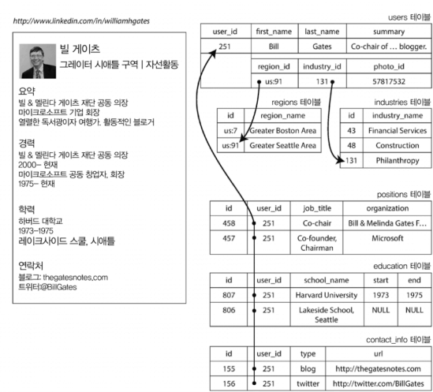
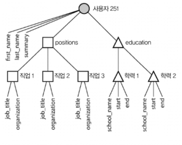
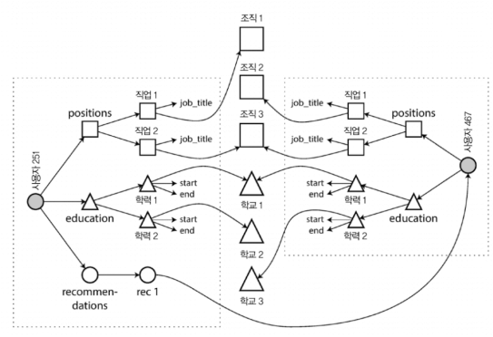
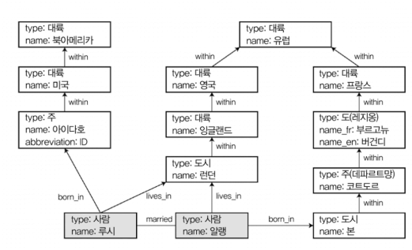
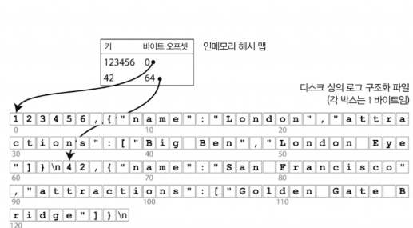
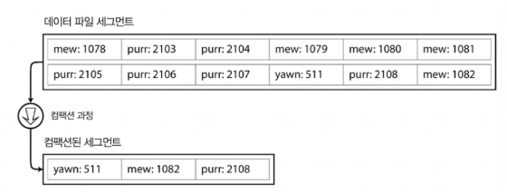
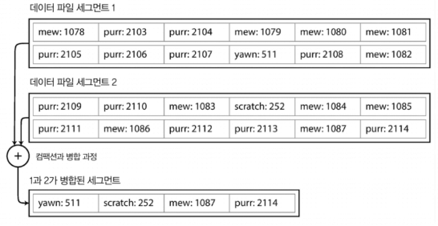
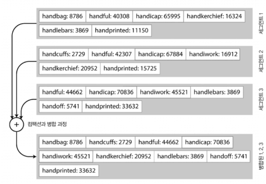
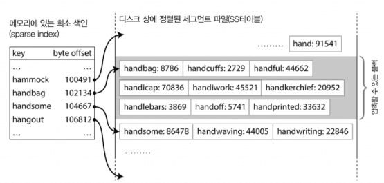

# Week1. 2장 후반 + 3장 앞부분

> 2장: 그래프형 모델, 임피던스 불일치, 저장소 지역성, 쓰기 스키마·읽기 스키마 / 3장: 로그 구조 계열 vs 페이지 지향 계열, 해시 색인, 컴팩션과 세그먼트 병합, SS테이블, LSM 트리

---

## 2장: 데이터 모델과 질의 언어

### 임피던스 불일치 (Impedance Mismatch)

임피던스 불일치가 뭐냐면, 우리가 코드에서 쓰는 객체(Java의 클래스, Python의 딕셔너리 등)랑 관계형 DB의 테이블 구조가 서로 안 맞는 문제다.

예를 들어 링크드인 프로필 하나만 생각해보자. 코드에서는 `User` 객체 하나에 이름, 경력, 학력, 연락처가 다 들어있는데, 관계형 DB에 넣으려면? users, positions, education, contact_info 등 **여러 테이블로 쪼개야** 한다. 책에서는 이걸 "shredding(찢기)"이라고 표현하는데, 정말 찢는 느낌이 맞다.



그래서 ORM(Hibernate, JPA 같은 것)이 나왔지만, 솔직히 완벽하게 해결해주지는 못한다. 복잡한 관계가 들어가면 결국 SQL을 직접 짜게 되는 경우가 많으니까.

반면 JSON 문서 모델은 이력서 같은 **일대다(one-to-many) 트리 구조**를 하나의 문서로 그냥 통째로 넣을 수 있다. 이게 문서 DB(MongoDB 같은)가 인기 있는 이유 중 하나다. 코드에서 쓰는 객체 구조랑 거의 1:1로 대응되니까 훨씬 직관적이다.



#### 다대일과 다대다 — 여기서 갈린다

근데 문서 모델이 항상 좋은 건 아니다. **다대일(Many-to-One)** 이나 **다대다(Many-to-Many)** 관계가 들어가면 얘기가 달라진다.

예를 들어 지역 정보를 "그레이터 시애틀 구역"이라는 텍스트로 그냥 저장하면? 같은 지역인데 어떤 사람은 "시애틀", 어떤 사람은 "Greater Seattle Area"로 적을 수 있다. 그래서 ID로 저장하고 별도 테이블에서 관리하는 게 **정규화**인데, 이러면 결국 조인이 필요하다.

문서 DB는 조인을 잘 지원 안 하거나, 지원하더라도 관계형 DB만큼 효율적이지 않다. 다대다 관계가 많아질수록 문서 모델은 점점 불편해지고, 결국 애플리케이션 코드에서 직접 조인을 흉내내야 하는 상황이 온다.



> 재밌는 건, 이 문제가 새로운 게 아니라는 거다. 1970년대의 계층 모델(IMS)이나 네트워크 모델(CODASYL)도 똑같은 문제로 고통받았다. 네트워크 모델은 데이터를 찾으려면 "접근 경로"를 프로그래머가 직접 추적해야 했는데, 이게 n차원 데이터 공간을 헤매는 느낌이었다고 한다. 결국 관계형 모델이 이걸 단순하게 만들어서 승리했다.

#### 그래서 뭘 써야 하나?

| 상황 | 추천 모델 |
|------|---------|
| 데이터가 문서(트리) 구조이고 일대다 관계가 주 | **문서 모델** |
| 엔티티 간 연결이 많고 다대다 관계가 복잡 | **관계형** 또는 **그래프 모델** |
| 중첩이 깊지 않고 조인이 거의 필요 없는 경우 | 문서 모델로도 충분 |

한 가지 주의할 점은, 문서 모델에서 중첩된 항목을 직접 참조할 수 없다는 것이다. "사용자 251의 직위 목록 중 두 번째 항목"처럼 경로로 접근해야 하는데, 이게 옛날 계층 모델의 접근 경로랑 비슷하다.

---

### 쓰기 스키마(Schema-on-Write) vs 읽기 스키마(Schema-on-Read)

이거 꽤 중요한 개념인데, 쉽게 말하면 **"데이터 구조를 언제 검사하느냐"** 의 차이다.

Java나 C++에서 **컴파일 타임에 타입을 체크하는 것**이 쓰기 스키마, JavaScript나 Python처럼 **런타임에 타입을 체크하는 것**이 읽기 스키마라고 비유하면 이해가 빠르다.

| 쓰기 스키마 (Schema-on-Write) | 읽기 스키마 (Schema-on-Read) |
|---|---|
| 관계형 DB 방식 | 문서 DB, JSON 방식 |
| 데이터를 **쓸 때** 스키마에 맞는지 검증 | 데이터를 **읽을 때** 코드에서 해석 |
| 스키마에 안 맞으면 DB가 거부 | 일단 다 넣고, 읽을 때 알아서 처리 |
| `ALTER TABLE`로 변경 (무거울 수 있음) | 애플리케이션 코드에서 `if/else`로 분기 |

읽기 스키마가 유리한 경우는?
- 컬렉션 안의 데이터가 **다 같은 구조가 아닌 경우** — 여러 유형의 객체가 섞여있거나, 외부 시스템에서 가져오는 데이터라 구조를 내가 통제할 수 없을 때
- 스키마 변경이 잦은 경우 — MySQL은 `ALTER TABLE` 할 때 **전체 테이블을 통째로 복사**하기 때문에 큰 테이블이면 수 분~수 시간 동안 중단이 발생할 수 있다. 이건 좀 치명적이다.

근데 반대로, 모든 레코드가 같은 구조를 가지고 있다면? 그때는 스키마가 문서화와 구조를 강제하는 유용한 메커니즘이 된다. 상황에 따라 다르다.

---

### 저장소 지역성 (Storage Locality)

문서 DB의 숨겨진 장점 중 하나다. 문서는 보통 JSON/XML로 인코딩된 **하나의 연속된 문자열**로 디스크에 저장된다.

이게 왜 중요하냐면, 관계형 DB에서 링크드인 프로필 하나를 보여주려면 users 테이블, positions 테이블, education 테이블... 이렇게 **여러 테이블을 조인**해야 한다. 테이블마다 디스크의 다른 위치에 저장되어 있으니 **디스크 탐색이 여러 번** 발생한다.

문서 DB는? 한 문서가 통째로 한 곳에 있으니 **한 번의 디스크 접근**으로 전부 가져올 수 있다. 이게 바로 저장소 지역성의 이점이다.

**하지만 함정이 있다:**
- 문서의 **작은 부분만 필요해도 전체를 로드**해야 한다. 불필요한 데이터까지 읽는 낭비가 발생.
- 문서를 수정하면 보통 **전체 문서를 다시 써야** 한다. 문서 크기가 변하지 않는 수정만 제자리에서(in-place) 처리할 수 있다.
- 그래서 문서는 **되도록 작게 유지**하는 게 좋고, 문서 크기를 늘리는 쓰기를 피하라고 권장한다.

결국 지역성이 진짜 도움이 되는 건, **문서의 대부분을 한꺼번에 필요로 하는 경우**에 한정된다.

---

### 질의 언어: 선언형 vs 명령형

이것도 재밌는 비교인데, SQL은 **선언형**이고 일반 프로그래밍 언어는 **명령형**이다.

| 명령형 | 선언형 (SQL) |
|---|---|
| "상어를 찾으려면, 배열을 처음부터 끝까지 돌면서 family가 Sharks인 놈을 골라라" | "family가 Sharks인 것을 가져와" |
| **어떻게** 할지 단계별로 지시 | **무엇을** 원하는지만 말함 |
| 순서 바꾸면 결과 달라질 수 있음 | DB 옵티마이저가 알아서 최적화 |
| 병렬화하려면 직접 해야 함 | DB가 알아서 병렬 처리 가능 |

선언형의 핵심 장점은 **DB가 알아서 최적화할 여지를 준다**는 거다. "어떻게 찾아라"고 세세하게 지시하면 DB가 더 좋은 방법을 알아도 그대로 해야 하지만, "이런 조건의 데이터를 줘"라고만 하면 DB가 내부적으로 가장 효율적인 방법을 선택할 수 있다.

**MapReduce**는 좀 특이한데, 선언형도 명령형도 아닌 중간 정도의 위치다. map과 reduce 함수를 직접 작성해야 하지만, **순수 함수(pure function)** 여야 해서 부수 효과가 없어야 한다. 이런 제약 덕분에 DB가 임의 순서로 함수를 실행할 수 있고 장애 시 재실행도 가능하다. 근데 결국 쓰기 불편해서 몽고DB 2.2에서는 선언형인 **집계 파이프라인(aggregation pipeline)** 을 추가했다.

---

### 그래프형 데이터 모델

다대다 관계가 점점 복잡해지면? 관계형 모델로도 처리할 수 있지만 점점 어색해진다. 이때 자연스러운 게 **그래프 모델**이다.

그래프는 결국 **정점(vertex)** 과 **간선(edge)** 두 가지로 이루어져 있다. 소셜 네트워크에서 사람이 정점, 친구 관계가 간선인 것처럼. 근데 그래프의 강점은 **서로 다른 유형의 데이터를 하나의 그래프에 자연스럽게 섞을 수 있다**는 것이다. 사람, 장소, 이벤트, 체크인 등을 전부 정점으로 넣고 관계를 간선으로 연결하면 된다.



#### 트리플 저장소와 SPARQL

트리플 저장소는 그래프 모델을 표현하는 또 다른 방식인데, 모든 정보를 **(주어, 서술어, 목적어)** 이 세 가지로만 표현한다. 속성 그래프랑 거의 동등한 표현력을 가지고 있는데, 표현 방식이 좀 다르다.

```turtle
@prefix : <urn:example:>.
_:lucy   a        :Person.       ← "루시는 Person이다"
_:lucy   :name    "Lucy".        ← "루시의 이름은 Lucy다"
_:lucy   :bornIn  _:idaho.       ← "루시는 idaho에서 태어났다"
```

처음 보면 `a`랑 `:name`이 좀 헷갈리는데:

- **`a`** → 이건 `rdf:type`의 약어로, **"이 노드는 무슨 타입이다"** 를 지정하는 특수 키워드. 오직 타입 지정에만 쓴다.
- **`:name`, `:bornIn`, `:type`, `:within`** → 콜론(`:`)이 붙은 것들은 `@prefix`에서 정의한 네임스페이스의 축약 표기다. 이게 일반적인 서술어(속성이나 관계)이다.

목적어가 뭐냐에 따라 의미가 달라진다:
- `"Lucy"` 같은 **문자열/숫자** → 해당 노드의 **속성**(키-값)
- `_:idaho` 같은 **다른 노드** → **간선**(관계)

세미콜론(`;`)으로 같은 주어에 대해 여러 서술어를 한 줄에 쓸 수도 있다:
```turtle
_:lucy   a :Person;  :name "Lucy";       :bornIn _:idaho.
_:idaho  a :Location; :name "Idaho";     :type "state";  :within _:usa.
```
이렇게 쓰면 주어를 반복 안 해도 되니까 훨씬 깔끔하다.

참고로 **시맨틱 웹**이라는 개념이 있는데, 웹 전체를 하나의 거대한 그래프 DB로 만들자는 야심 찬 프로젝트였다. 근데 2000년대 초반에 과대평가됐고 현실에서는 별로 실현되지 못했다. 그렇지만 트리플 저장소 자체는 시맨틱 웹과 무관하게 애플리케이션 내부 데이터 모델로 쓸 만하다.

---

## 3장: 저장소와 검색 (LSM 트리까지)

---

### 로그 구조 계열 vs 페이지 지향 계열

3장의 핵심 질문은 이거다: **DB가 내부적으로 데이터를 어떻게 저장하고 찾느냐?**

왜 이걸 알아야 하냐면, 저장소 엔진마다 특성이 다르기 때문이다. 쓰기가 많은 서비스에 읽기 최적화된 엔진을 쓰면 성능이 안 나온다. 자신의 **워크로드(workload)** 에 맞는 엔진을 고르려면 내부 동작을 대략이라도 이해해야 한다.

저장소 엔진은 크게 두 계열로 나뉜다:

| 로그 구조(Log-Structured) 계열 | 페이지 지향(Page-Oriented) 계열 |
|---|---|
| 파일 끝에 계속 추가 (순차 쓰기) | 고정 크기 페이지를 읽고/쓰기 |
| SS테이블, LSM 트리 | **B-트리** (3장 후반에서 다룸) |
| **쓰기에 최적화** | **읽기에 최적화** |
| LevelDB, RocksDB, Cassandra, HBase | MySQL(InnoDB), PostgreSQL 등 대부분의 관계형 DB |

이번 정리에서는 **로그 구조 계열**을 집중적으로 다룬다.

---

### 세상에서 가장 단순한 DB

놀랍게도 bash 함수 두 줄로 DB를 만들 수 있다:
- `db_set key value` → 파일 끝에 키-값을 한 줄 추가 (append)
- `db_get key` → 파일을 전부 읽어서 해당 키의 마지막 값을 반환

쓰기는 무조건 파일 끝에 붙이기만 하니까 엄청 빠르다. 근데 문제는 **읽기가 O(n)** 이라는 것. 레코드가 100만 개면 100만 줄을 다 스캔해야 한다. 이건 좀 아니지 않나?

그래서 등장하는 게 **색인(index)** 이다.

> 여기서 중요한 트레이드오프가 나온다. 색인을 만들면 읽기는 빨라지지만, **쓰기할 때마다 색인도 같이 갱신**해야 하니까 쓰기가 느려진다. 그래서 DB는 모든 걸 자동으로 색인하지 않는다. 개발자가 질의 패턴을 보고 필요한 색인을 직접 골라야 하는 이유가 여기에 있다.

---

### 해시 색인 (Hash Index)

가장 단순한 색인 전략이다. 핵심 아이디어는: **인메모리 해시 맵에 키→디스크 오프셋을 저장**하는 것.



동작 방식:
1. 새 키-값이 들어오면 → 파일 끝에 추가하고, 해시 맵에 `{키: 바이트 오프셋}` 저장
2. 읽을 때 → 해시 맵에서 오프셋 찾고, 디스크에서 딱 그 위치만 읽기

이 방식이 바로 **비트캐스크(Bitcask)** 가 쓰는 방식이다 (리악(Riak)의 기본 저장소 엔진). 단순하지만 실제로 꽤 좋은 성능을 보인다. 해시 맵이 전부 메모리에 있으니 읽기는 디스크 탐색 한 번이면 되고, 파일 시스템 캐시에 이미 올라와 있으면 디스크 접근 자체가 필요 없을 수도 있다.

**어떤 경우에 적합할까?** 키의 종류는 많지 않지만 키당 쓰기가 매우 빈번한 경우. 예를 들어 고양이 동영상 URL이 키고, 재생 횟수가 값이라면 — 고유 키 수는 제한적인데 값은 엄청 자주 갱신된다. 이런 워크로드에 딱이다.

**근데 한계가 뚜렷하다:**
- 해시 테이블이 **전부 메모리에 올라가야** 한다. 키가 수십억 개면? 메모리가 부족하다. 디스크에 해시 맵을 올리면 되지 않냐고 할 수 있는데, 디스크 상의 해시 맵은 무작위 I/O가 너무 많이 발생해서 느리다.
- **범위 질의를 못 한다.** kitty00000부터 kitty99999까지의 키를 한번에 스캔하고 싶어도, 해시 맵에서는 각 키를 일일이 찾아야 한다. 정렬이 안 되어 있으니까.

---

### 컴팩션과 세그먼트 병합 (Compaction & Segment Merging)

파일에 계속 추가만 하면 당연히 디스크가 터진다. 이걸 어떻게 해결하냐?

**세그먼트(segment)** 개념을 도입한다. 로그 파일이 특정 크기에 도달하면 새 세그먼트 파일을 시작하고, 오래된 세그먼트들은 **컴팩션**과 **병합**을 한다.

- **컴팩션**: 같은 키가 여러 번 나오면 **최신 값만 남기고** 나머지를 버리는 것
- **세그먼트 병합**: 컴팩션된 여러 세그먼트를 **하나의 새 파일로 합치는** 것





여기서 핵심은 세그먼트 파일이 **한 번 쓰면 절대 수정하지 않는다(immutable)** 는 것이다. 병합 결과는 항상 새 파일로 만들어진다. 덕분에 병합을 **백그라운드 스레드**에서 돌려도 기존 읽기/쓰기에 영향이 없다. 병합이 끝나면 읽기 요청을 새 세그먼트로 전환하고, 이전 세그먼트 파일은 삭제하면 끝.

값을 찾을 때는 **가장 최신 세그먼트의 해시 맵부터 확인**하고, 없으면 그 다음 최신 세그먼트... 이런 식으로 내려간다. 병합으로 세그먼트 수를 적게 유지하니까 확인할 해시 맵도 많지 않다.

#### 구현할 때 신경 쓸 것들

| 항목 | 설명 |
|------|------|
| **파일 형식** | CSV 말고 바이너리 형식을 쓴다. 문자열 길이를 바이트 단위로 인코딩하고 뒤에 원시 문자열을 붙이면 더 빠르고 간단하다. |
| **삭제 처리** | 키를 삭제하면 **톰스톤(tombstone)** 이라는 특수한 삭제 마커를 추가한다. 세그먼트 병합할 때 톰스톤을 만나면 해당 키의 이전 값을 무시한다. |
| **고장 복구** | 서버가 죽으면 인메모리 해시 맵이 날아간다. 세그먼트 파일을 다시 읽어서 복구할 수 있지만 느리다. 비트캐스크는 해시 맵의 **스냅샷을 디스크에 저장**해서 복구 속도를 높인다. |
| **부분 레코드 쓰기** | 쓰기 도중에 죽으면 레코드가 반만 기록될 수 있다. 비트캐스크는 **체크섬**을 넣어서 손상된 부분을 탐지하고 무시한다. |
| **동시성 제어** | 쓰기는 **단일 스레드**로 순차 추가. 세그먼트가 불변이니까 읽기는 **여러 스레드**가 동시에 해도 안전하다. |

#### 근데 왜 덮어쓰기 안 하고 추가만 하는 걸까?

처음에는 비효율적으로 보일 수 있다. 예전 값을 새 값으로 덮어쓰면 되지 않냐고. 근데 추가 전용 설계가 여러 면에서 좋다:

- 순차 쓰기는 **무작위 쓰기보다 훨씬 빠르다**. HDD에서는 헤드를 이동시킬 필요가 없고, SSD에서도 순차 쓰기가 성능상 유리하다.
- 파일이 불변(immutable)이면 **동시성 처리랑 고장 복구가 훨씬 간단**해진다. 값을 덮어쓰는 도중에 죽으면 이전 값이랑 새 값이 반반 섞인 상태가 될 수 있는데, 추가만 하면 그런 걱정이 없다.
- 시간이 지나면서 파일이 **조각화(fragmentation)** 되는 문제도 피할 수 있다.

---

### SS테이블 (Sorted String Table)

해시 색인의 두 가지 치명적인 한계(메모리에 모든 키를 올려야 한다, 범위 질의가 안 된다)를 해결하는 아이디어가 나온다:

> **세그먼트 파일 안에서 키-값 쌍을 키 순서대로 정렬하자!**

이렇게 키로 정렬된 세그먼트를 **SS테이블(Sorted String Table)** 이라고 부른다. 각 키는 병합된 세그먼트 파일 내에서 **딱 한 번만** 나타난다 (컴팩션이 이걸 보장해준다).

키를 정렬했을 뿐인데, 얻는 이점이 엄청나다:

#### 장점 1: 세그먼트 병합이 효율적이다

여러 SS테이블 세그먼트를 합칠 때, 각 파일의 첫 번째 키를 비교해서 가장 작은 키부터 출력 파일에 복사하면 된다. 이게 바로 **병합정렬(mergesort)** 이다. 같은 키가 여러 세그먼트에 있으면 가장 최신 세그먼트의 값만 남기면 된다.



#### 장점 2: 모든 키를 메모리에 올릴 필요가 없다 (희소 색인)

이게 해시 색인 대비 가장 큰 차이점이다. 키가 정렬되어 있으니까, **일부 키의 오프셋만 알면** 나머지는 그 사이를 스캔해서 찾을 수 있다.

예를 들어 `handbag`이 오프셋 102134에, `handsome`이 104667에 있다는 것만 알면, `handiwork`를 찾을 때 102134~104667 사이를 스캔하면 된다. 수 킬로바이트 정도 스캔하는 건 매우 빠르니까, **수 킬로바이트당 키 하나** 정도의 희소 색인만으로도 충분하다.



#### 장점 3: 블록 압축이 가능하다

읽기 요청이 어차피 키 범위를 스캔하니까, 인접한 레코드를 **블록 단위로 그룹화해서 압축**할 수 있다. 희소 색인의 각 항목이 압축된 블록의 시작을 가리키면 된다. 디스크 공간을 아끼고 I/O 대역폭도 줄일 수 있어서 일석이조다.

---

### 근데 키를 어떻게 정렬하지? — 멤테이블 (Memtable)

여기서 한 가지 의문이 든다. 쓰기 요청은 아무 순서로나 들어오는데, 세그먼트 파일을 키 순서로 정렬해서 저장하려면 어떻게 해야 할까?

디스크에서 정렬을 유지할 수도 있지만(B-트리가 그렇다), **메모리에서 하는 게 훨씬 쉽다.** 레드 블랙 트리(red-black tree)나 AVL 트리 같은 **자기 균형 트리(balanced tree)** 를 쓰면 임의 순서로 키를 삽입해도 항상 정렬된 순서로 읽을 수 있다. 이 인메모리 트리 구조를 **멤테이블(memtable)** 이라고 부른다.

**전체 동작 흐름:**

1. **쓰기 요청** → 멤테이블(인메모리 균형 트리)에 추가
2. **멤테이블이 수 MB 정도로 커지면** → 통째로 SS테이블 파일로 디스크에 기록. 트리가 이미 정렬을 유지하고 있으니 그대로 순서대로 쓰면 된다. 이 파일이 **가장 최신 세그먼트**가 된다. 기록하는 동안 새로운 쓰기는 **새 멤테이블 인스턴스**에 들어간다.
3. **읽기 요청** → 먼저 멤테이블 확인 → 없으면 가장 최신 SS테이블 세그먼트 → 두 번째 최신 세그먼트 → ... 순으로 탐색
4. **백그라운드에서** 주기적으로 세그먼트 파일들을 병합하고 컴팩션 수행

**한 가지 문제가 있다**: 멤테이블은 메모리에만 있으니까, 서버가 갑자기 죽으면 아직 디스크에 안 쓴 데이터가 **날아간다**. 이걸 방지하려면 모든 쓰기를 **WAL(Write-Ahead Log)** 이라는 별도의 로그 파일에도 즉시 기록해야 한다. 이 로그는 정렬이 필요 없고 순서대로 추가만 하면 되니까 빠르다. 멤테이블이 SS테이블로 성공적으로 기록되면 해당 WAL은 버리면 된다.

---

### LSM 트리 (Log-Structured Merge-Tree)

지금까지 설명한 이 전체 구조 — 멤테이블 + SS테이블 + 백그라운드 컴팩션 — 를 합쳐서 **LSM 트리(Log-Structured Merge-Tree)** 라고 부른다. 패트릭 오닐(Patrick O'Neil)이 발표한 것.

이걸 실제로 쓰는 곳이 꽤 많다:
- **LevelDB**, **RocksDB** — 다른 애플리케이션에 임베드하기 위한 키-값 저장소 엔진 라이브러리
- **카산드라(Cassandra)**, **HBase** — 구글의 빅테이블(Bigtable) 논문에서 영감을 받은 분산 DB (SS테이블과 멤테이블이라는 용어가 이 논문에서 처음 나왔다)
- **루씬(Lucene)** — 엘라스틱서치와 솔라의 전문 검색 엔진. 키를 **용어(term)**, 값을 그 용어를 포함하는 **문서 ID 목록(포스팅 목록, postings list)** 으로 하는 키-값 구조로 용어 사전(term dictionary)을 구현한다.

#### 성능 최적화

LSM 트리의 기본 개념은 간단하지만, 실제로 잘 돌아가게 하려면 세부 최적화가 필요하다.

**블룸 필터(Bloom filter):** LSM 트리의 약점 중 하나는 **존재하지 않는 키를 찾을 때** 느리다는 것이다. 멤테이블을 확인하고, 최신 세그먼트부터 가장 오래된 세그먼트까지 전부 뒤져봐야 "없다"는 걸 알 수 있다. 이걸 개선하기 위해 **블룸 필터**라는 확률적 데이터 구조를 추가로 사용한다. 블룸 필터는 "이 키는 확실히 DB에 없다"를 메모리만으로 빠르게 알려주므로, 불필요한 디스크 읽기를 대폭 줄일 수 있다.

**컴팩션 전략:** SS테이블을 언제, 어떤 순서로 병합할지에 따라 두 가지 주요 전략이 있다.

| 전략 | 동작 방식 | 사용처 |
|------|---------|-------|
| **크기 계층(Size-Tiered)** | 새롭고 작은 SS테이블들이 쌓이면, 크기가 비슷한 것끼리 묶어서 더 큰 SS테이블로 병합 | HBase, Cassandra |
| **레벨(Leveled)** | 키 범위를 작은 SS테이블로 쪼개서 "레벨" 단위로 관리. 오래된 데이터가 점점 높은 레벨로 이동하면서 점진적으로 컴팩션 | LevelDB, RocksDB |

레벨 컴팩션이 디스크 공간을 더 적게 쓰는 경향이 있지만, 구현이 더 복잡하다.

#### LSM 트리 핵심 정리

- **기본 원리**: 메모리에서 정렬 → 디스크에 순차 기록 → 백그라운드에서 병합. 이게 전부다.
- **쓰기 성능이 뛰어나다**: 디스크에 순차적으로만 쓰기 때문에 매우 높은 쓰기 처리량을 보장한다. 랜덤 I/O가 거의 없다.
- **범위 질의가 효율적이다**: 데이터가 정렬되어 있으니 최솟값~최댓값 사이를 쭉 스캔하면 된다.
- **큰 데이터셋도 처리 가능**: 디스크에 저장하니까 메모리보다 훨씬 큰 데이터도 문제없다.
- **3장 후반에 나오는 B-트리와 비교하면**: LSM 트리는 쓰기에 강하고, B-트리는 읽기에 강한 것이 일반적인 특성. 실제로는 워크로드에 따라 다르지만, 이런 대략적인 감을 잡아두면 좋다.
