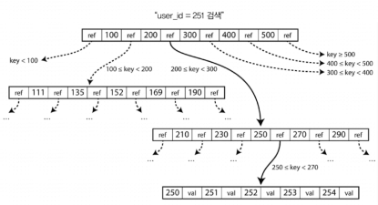
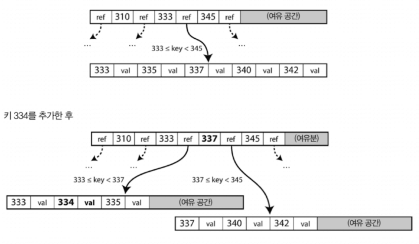
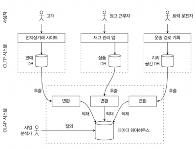
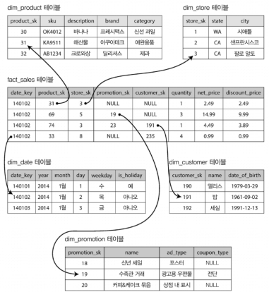
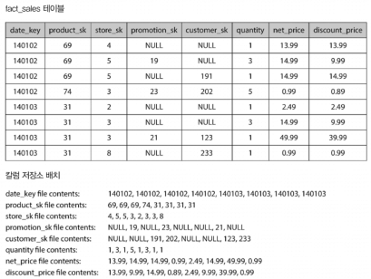
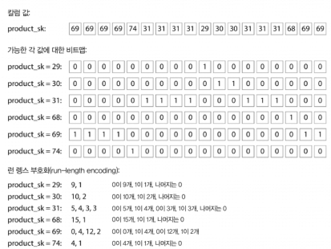
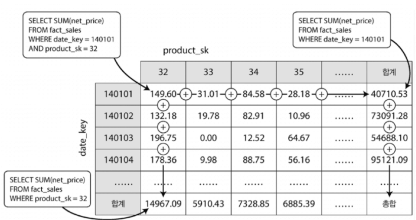

# Week2. 3장 중후반 + 4장 앞부분

> 3장: B 트리 / 클러스터드·비클러스터드·커버링 인덱스 / OLTP vs OLAP / 칼럼 지향 저장소 / 칼럼 압축 / 구체화 뷰
> 4장: 부호화와 발전 — 데이터플로(DB·서비스·메시지), REST vs RPC

---

## 3장: 저장소와 검색 (후반)

### B 트리 (B-tree)

LSM 트리는 최근 많이 쓰이긴 하지만, 여전히 가장 널리 쓰이는 색인 구조는 B 트리다. 1970년대에 등장해서 10년도 안 돼 "보편적인 색인 구조"가 됐고, 거의 모든 관계형 DB(MySQL InnoDB, PostgreSQL, Oracle, SQL Server 등)의 표준 색인이다. 50년 넘게 살아남은 데는 이유가 있다.

#### 로그 구조 색인과 완전히 다른 설계 철학

| | 로그 구조화 색인 (LSM) | B 트리 |
|---|---|---|
| 저장 단위 | 가변 크기 세그먼트(수 MB 이상) | 고정 크기 페이지/블록 (보통 4KB, MySQL은 16KB, Postgres는 8KB) |
| 쓰기 방식 | 파일 끝에 순차 추가 | 한 번에 한 페이지씩 읽기/쓰기 |
| 하드웨어 연관성 | 상대적으로 독립적 | 디스크 블록 단위에 강하게 맞춰짐 |

B 트리는 디스크가 고정 크기 블록으로 배열되는 하드웨어 특성에 근본적으로 맞춰져 있다. 이게 왜 중요하냐면, 디스크 I/O가 어차피 블록 단위로 일어나니까 그 단위로 데이터를 조직하는 게 자연스럽기 때문이다.



#### 동작 방식

1. 하나의 페이지가 루트(root) 로 지정된다.
2. 각 페이지는 여러 키와 하위 페이지 참조를 포함한다.
3. 참조 사이의 키들이 그 범위의 경계 역할을 한다.
4. 리프 페이지(leaf page)에 도달하면 실제 값이나 값의 위치를 얻는다.

예를 들어 `user_id = 251`을 찾는다면:
- 루트에서 "200 ≤ 키 < 300" 범위의 참조를 따라감
- 다음 페이지에서 "250 ≤ 키 < 270" 범위의 참조를 따라감
- 리프 페이지에서 251의 값을 얻음

#### 분기 계수 (Branching Factor)

한 페이지가 참조하는 하위 페이지의 수를 분기 계수라고 한다. 보통 수백 개에 달한다. 이게 왜 중요하냐면:

> 분기 계수가 500이고 페이지 크기가 4KB라면, 4단계 B 트리로 256TB까지 저장 가능하다. (500⁴ × 4KB = 256TB)

즉, 트리 깊이가 3~4단계만 되어도 웬만한 데이터는 다 담을 수 있고, 하나의 키를 찾는 데 페이지 참조를 3~4번만 따라가면 된다는 뜻. 깊이는 항상 O(log n) 이다.

#### 페이지 분리 (Page Split)



새 키를 추가할 때 해당 범위의 페이지에 여유 공간이 없다면, 페이지를 반쯤 채워진 두 페이지로 나누고 상위 페이지를 갱신한다. 이 알고리즘이 트리의 균형(balance) 을 보장한다.

> 재밌는 건, 삽입은 직관적인데 (트리 균형을 유지하면서) 삭제하는 작업은 조금 더 복잡하다. 그래서 많은 DB 엔진은 완전한 재균형 대신 페이지 병합을 지연시키거나 톰스톤 방식을 사용한다.

#### 신뢰할 수 있는 B 트리 만들기 — WAL이 필요한 이유

B 트리의 기본 쓰기 동작은 디스크 상의 페이지를 덮어쓴다. 근데 이게 위험한 상황이 있다:

- 페이지 분리가 일어날 때: 분할된 두 페이지를 기록하고 상위 페이지도 갱신해야 한다. 일부만 기록된 상태에서 DB가 고장 나면? → 색인이 훼손된다. 부모 없는 고아 페이지(orphan page) 가 생기는 끔찍한 상황.

이걸 방지하기 위한 데이터 구조가 쓰기 전 로그(Write-Ahead Log, WAL) 다. 재실행 로그(redo log)라고도 한다.

- 트리 페이지에 변경 사항을 적용하기 전에 모든 변경 사항을 추가 전용 파일에 기록
- DB 고장 후 복구 시 이 로그를 재생해서 일관된 상태로 복원

> 참고로 MySQL의 `innodb_flush_log_at_trx_commit`, PostgreSQL의 `wal_level` 설정이 바로 이 WAL의 동작을 조절하는 옵션이다. 성능과 내구성의 트레이드오프가 여기서 결정된다.

#### 동시성 제어 — 래치(latch)

다중 스레드가 동시에 B 트리에 접근하면 일관성이 깨질 수 있다. 그래서 래치(latch) (가벼운 잠금)로 트리 데이터 구조 자체를 보호한다.

이 지점이 LSM 트리와 크게 다른데, LSM 트리는 백그라운드에서 모든 병합을 수행하고 세그먼트를 원자적으로 교체하기 때문에 구조적 동시성 제어가 훨씬 간단하다.

#### B 트리 최적화 기법

- Copy-on-Write 방식 (LMDB 같은 곳): 변경된 페이지를 다른 위치에 기록하고 상위 페이지의 새 버전을 만든다. WAL 없이도 안전하고 동시성에도 유리하다.
- 키 축약: 페이지 내부(인덱스 노드)에서 키의 경계 역할만 하면 되므로 키를 축약해서 저장. 페이지 하나에 더 많은 키를 넣을 수 있으니 분기 계수가 올라가고 트리 깊이가 낮아진다. 이 변형을 B+ 트리라고도 부르는데, 요즘은 너무 일반화돼서 그냥 B 트리라고 해도 대부분 B+ 트리를 의미한다.
- 리프 페이지 연속 배치: 키 범위의 상당 부분을 스캔할 때 디스크 찾기를 줄이려고 리프 페이지를 디스크 상에 연속된 순서로 배치하려 한다. 근데 트리가 커지면 이 순서를 유지하기 어렵다. (반면 LSM 트리는 병합 과정에서 큰 세그먼트를 한 번에 다시 쓰니까 연속성 유지가 쉽다.)
- 리프 페이지의 형제 포인터: 각 리프 페이지가 양쪽 형제 페이지에 대한 참조를 가지면, 상위 페이지로 되돌아가지 않고도 순서대로 키를 스캔할 수 있다.
- 프랙탈 트리(fractal tree): 디스크 찾기를 줄이기 위해 로그 구조화 개념을 일부 빌려온 B 트리 변형이다.

#### B 트리 vs LSM 트리 — 워크로드별 선택

| 관점 | B 트리 | LSM 트리 |
|---|---|---|
| 쓰기 성능 | 느림 (페이지 두 번 이상 기록 — WAL + 트리 페이지) | 빠름 (순차 쓰기) |
| 읽기 성능 | 빠름 (한 곳에만 키 존재) | 약간 느림 (여러 세그먼트 확인) |
| 쓰기 증폭(Write Amplification) | 상대적으로 낮음 (하드웨어 페이지 수준) | 컴팩션 때문에 높을 수 있음 |
| 압축률 / 디스크 공간 | 단편화로 공간 낭비 | 주기적 재기록으로 단편화 적음, 압축 효과 좋음 |
| 응답 시간 예측성 | 예측 가능함 | 컴팩션이 상위 백분위 지연 시간에 영향 |
| 트랜잭션 격리 | 트리에 직접 잠금 포함 가능 | 키 범위 잠금을 별도 구현해야 함 |
| 키 중복 | 색인 한 곳에만 정확히 존재 | 다른 세그먼트에 다중 복사본 가능 |

> 쓰기 증폭(Write Amplification)이라는 게, 애플리케이션이 데이터를 한 번 쓰면 실제로 디스크에는 여러 번 쓰게 되는 현상이다. SSD는 블록 덮어쓰기 횟수가 제한되기 때문에 쓰기 증폭이 낮은 LSM 트리가 SSD 수명 측면에서 유리하다.

결국 강력한 트랜잭션이 필요하면 B 트리, 쓰기가 많고 대용량이면 LSM 트리를 고려하면 된다. 근데 실무에선 대부분 기본 엔진이 정해져 있으니 너무 고민 말자.

---

### 기타 색인 구조 — 클러스터드 / 비클러스터드 / 커버링

지금까지는 "키-값 색인"을 다뤘는데, 실무에서는 색인의 변형들이 훨씬 다양하다.

#### 기본키 색인 vs 보조 색인

- 기본키 색인 (Primary key index): 관계형 테이블의 로우, 문서 DB의 문서, 그래프 DB의 정점을 고유하게 식별. 키가 유일하다.
- 보조 색인 (Secondary index): `CREATE INDEX`로 추가로 생성. 키가 고유하지 않을 수 있다.

보조 색인은 효율적인 조인에 결정적인 역할을 한다. 예를 들어 `users` 테이블에서 `email`로 검색할 일이 많다면 `email`에 보조 색인을 만든다. 키가 중복될 수 있으니 두 가지 방법으로 처리한다:

1. 색인의 각 값에 일치하는 로우 식별자 목록을 저장 (전문 색인의 포스팅 목록과 같은 방식)
2. 로우 식별자를 추가해 각 키를 고유하게 만듦

#### 색인 안에 값을 어디에 저장하느냐 — 세 가지 전략

이게 이번 섹션의 핵심이다. 색인에서 키는 질의가 검색하는 대상이고, 값은 그 결과인데, 값의 저장 위치에 따라 세 가지로 나뉜다.

##### 1. 힙 파일 (Heap file) 방식 — 비클러스터드 색인

- 색인은 로우의 참조(포인터)만 저장
- 실제 데이터는 힙 파일이라는 별도 저장소에 특정 순서 없이 저장
- 여러 보조 색인이 있을 때 데이터 중복을 피할 수 있음 (모든 색인이 같은 힙을 가리킴)

이게 일반적인 접근 방식이다. PostgreSQL이 바로 이 방식을 사용한다. 모든 색인(기본키 포함)이 힙 파일의 위치를 참조한다.

장점은 값이 갱신될 때 키가 변경되지 않으면 제자리에서 덮어쓸 수 있다는 것. 색인들을 손댈 필요가 없다.

근데 새 값이 공간이 더 필요해서 새 위치로 이동해야 한다면?
- 옵션 A: 모든 색인을 갱신해서 새 힙 위치를 가리키게 한다
- 옵션 B: 이전 힙 위치에 전방향 포인터(forwarding pointer) 를 남긴다

##### 2. 클러스터드 색인 (Clustered index)

- 색인에서 힙 파일로 다시 이동하는 일이 읽기 성능에 너무 불리한 경우
- 색인 안에 로우 데이터를 바로 저장

대표적인 예가 MySQL의 InnoDB다. 테이블의 기본키가 언제나 클러스터드 색인이고, 보조 색인은 힙 파일 위치가 아닌 기본키를 참조한다. SQL Server는 테이블당 하나의 클러스터드 색인을 지정할 수 있다.

> 이게 실무에서 은근히 중요한데, InnoDB에서 보조 색인으로 조회하면 "보조 색인 → 기본키 → 클러스터드 색인 → 로우" 이렇게 두 번의 탐색이 일어난다. 이걸 더블 룩업(double lookup) 이라고 한다. 그래서 InnoDB는 기본키를 짧게(예: BIGINT) 유지하는 게 권장된다. UUID 같은 긴 기본키를 쓰면 모든 보조 색인이 그만큼 커진다.

##### 3. 커버링 색인 (Covering index) — 포괄열이 있는 색인

- 클러스터드 색인(전체 저장)과 비클러스터드 색인(참조만) 사이의 절충안
- 색인 안에 테이블 칼럼의 일부를 저장
- 색인만 사용해 일부 질의에 응답 가능 → 색인이 질의를 "커버" 했다고 표현

예시:
```sql
-- SQL Server
CREATE INDEX idx_orders_customer
  ON orders (customer_id)
  INCLUDE (order_date, total_amount);

-- PostgreSQL 11+
CREATE INDEX idx_orders_customer
  ON orders (customer_id)
  INCLUDE (order_date, total_amount);
```

`SELECT order_date, total_amount FROM orders WHERE customer_id = 123` 이런 질의에서 힙에 접근할 필요 없이 색인만 읽어서 응답할 수 있다.

근데 클러스터드 색인이든 커버링 색인이든 공통된 단점이 있다. 데이터 복제가 발생하므로 추가 저장소가 필요하고 쓰기 과정에 오버헤드가 생긴다. 게다가 트랜잭션 보장을 강화하기 위한 별도 노력도 필요하다. 애플리케이션 단에서 복제로 인한 불일치를 파악할 수 없기 때문.

#### 다중 칼럼 색인 (Multi-column Index)

지금까지 설명한 색인은 하나의 키 값에만 대응한다. `(성, 이름)`같이 여러 칼럼에 동시에 질의하려면 부족하다.

- 결합 색인 (Concatenated index): 여러 필드를 하나의 키에 단순히 결합. 구식 전화번호부처럼 `(성, 이름)`으로 색인하면 특정 성을 가진 모든 사람이나 `(성, 이름 조합)`은 찾을 수 있지만, 특정 이름만으로 찾는 건 쓸모없다.
- 다차원 색인 (Multi-dimensional index): 지리 공간 데이터에 특히 유용. 위도-경도 범위로 동시에 질의하려면 R 트리(PostGIS가 사용) 같은 전문 공간 색인이 필요하다.

---

### OLTP vs OLAP — 완전히 다른 두 세계

여기서부터는 저장소를 보는 관점이 완전히 바뀐다. 지금까지는 "키 하나로 레코드 하나"를 찾는 접근이었지만, 분석 쿼리는 전혀 다르다.

#### 트랜잭션 처리(OLTP) vs 분석 처리(OLAP)

트랜잭션(transaction) 이란 원래 상거래(commercial transaction)를 의미했는데, 지금은 논리 단위로 묶인 읽기와 쓰기 그룹을 가리킨다. (반드시 ACID를 의미하지는 않는다.)

> 용어 주의할 점 하나. "트랜잭션 처리"는 주기적으로 수행되는 일괄 처리(batch processing)와 달리 클라이언트가 지연 시간이 낮은 읽기와 쓰기를 할 수 있게 한다는 의미다. 자바의 트랜잭션 격리성과 다른 개념이니 혼동하지 말자.

두 패턴을 비교하면 이렇다 (표 3-1):

| 특성 | OLTP (온라인 트랜잭션 처리) | OLAP (온라인 분석 처리) |
|---|---|---|
| 주요 읽기 패턴 | 질의당 적은 수의 레코드, 키 기준으로 가져옴 | 많은 레코드에 대한 집계 |
| 주요 쓰기 패턴 | 임의 접근, 사용자 입력을 낮은 지연 시간으로 기록 | 대규모 불러오기(bulk import, ETL) 또는 이벤트 스트림 |
| 주요 사용처 | 웹 애플리케이션을 통한 최종 사용자/소비자 | 의사결정 지원을 위한 내부 분석가 |
| 데이터 표현 | 데이터의 최신 상태 (현재 시점) | 시간이 지나며 일어난 이벤트 이력 |
| 데이터셋 크기 | GB ~ TB | TB ~ PB |

분석 질의의 전형적인 예는 이렇다:
- "1월의 각 매장의 총 수익은 얼마일까?"
- "최근 프로모션 기간 동안 평소보다 얼마나 더 많은 바나나를 판매했는가?"
- "X 브랜드 기저귀와 함께 가장 자주 구매하는 유아식 브랜드는 무엇인가?"

이런 질의는 비즈니스 인텔리전스(BI) 를 위한 것이다.

#### 왜 따로 분리하는가? — 데이터 웨어하우스

초기에는 OLTP와 OLAP를 같은 DB에서 처리했다. 근데 1980년대 후반부터 분석용 데이터를 별도 DB에 두는 경향이 생겼다. 이걸 데이터 웨어하우스(Data Warehouse) 라고 한다.

분리하는 이유는 크게 세 가지다:

1. OLTP는 사업 운영에 중요: 높은 가용성, 낮은 지연 시간이 핵심. 분석 질의가 수백만 로우를 스캔하면 트랜잭션 성능이 저하된다.
2. OLTP 최적화와 OLAP 최적화가 완전히 다름: OLTP는 색인 중심, OLAP는 스캔 중심이니 같은 엔진으로 두 마리 토끼를 잡기 힘들다.
3. 데이터 분석가가 원시 OLTP를 직접 망가뜨릴 위험: 즉석 분석 질의(ad hoc analytic query)는 비싸고 잘못 쓰면 DB를 멈출 수 있다.

#### ETL — Extract, Transform, Load



OLTP DB들에서 데이터를 가져오는 과정이다:
1. 추출(Extract): 주기적인 데이터 덤프 또는 지속적인 갱신 스트림
2. 변환(Transform): 분석 친화적 스키마로 변환, 깨끗하게 정리
3. 적재(Load): 데이터 웨어하우스에 적재

> 요즘 트렌드 한마디 하자면, 변환을 나중에 하는 ELT(Extract, Load, Transform) 방식이 클라우드 데이터 웨어하우스(Snowflake, BigQuery, Redshift)에서 인기다. "일단 다 넣고 분석할 때 변환"하는 방식. dbt 같은 도구가 이 영역에서 폭발적으로 성장 중이다.

#### 데이터 웨어하우스 기술 스택

- 상용: Teradata, Vertica, SAP HANA, ParAccel, Amazon Redshift(ParAccel 운영 버전)
- SQL-on-Hadoop: Apache Hive, Spark SQL, Cloudera Impala, Facebook Presto, Apache Tajo, Apache Drill — 일부는 구글의 Dremel에서 개념을 가져왔다.
- 책에 없지만 지금 뜨는 것들로는 Snowflake(분리된 스토리지/컴퓨트), Google BigQuery(Dremel 후예), ClickHouse(러시아 얀덱스 오픈소스, 엄청나게 빠름), Apache Druid, Apache Pinot(실시간 OLAP) 같은 게 있다.

#### 별 모양 스키마 (Star Schema) — 차원 모델링

OLAP 데이터 모델은 OLTP와 달리 데이터 모델의 다양성이 훨씬 적다. 대부분 별 모양 스키마(차원 모델링, dimensional modeling)라고 불리는 정형화된 방식을 쓴다.



구성은 이렇다:
- 사실 테이블(fact table): 스키마 중심에 있음. 각 로우가 특정 시각에 발생한 이벤트. 소매업이면 "고객의 제품 구매", 웹 사이트면 "페이지 뷰나 클릭".
- 차원 테이블(dimension table): 사실 테이블 주변에 위치. 이벤트의 누가(who), 언제(when), 어디서(where), 무엇을(what), 어떻게(how), 왜(why) 를 나타냄.

사실 테이블의 각 칼럼은 속성(예: net_price, quantity) 이거나, 차원 테이블을 가리키는 외래 키다. 날짜와 시간도 보통 차원 테이블로 표현해서 공휴일 같은 메타데이터를 추가로 질의할 수 있게 한다.

> 왜 "별 모양"이라 부르냐면, 사실 테이블이 중앙에 있고 차원 테이블이 주변에서 광선처럼 뻗어나가는 모습이라서.

규모 감각을 잠깐 짚어보면, 사실 테이블 하나에 100개 이상의 칼럼이 있는 경우가 흔하고 수백 개인 경우도 있다. 애플, 월마트, 이베이 같은 대기업은 수십 PB의 트랜잭션 내역을 가지고 있고 대부분이 사실 테이블이다.

#### 눈꽃송이 모양 스키마 (Snowflake Schema)

별 모양의 변형이다. 차원이 하위 차원으로 더 세분화된다. 예를 들어 `dim_product` 테이블에 브랜드 이름을 문자열로 저장하는 대신, 브랜드를 별도의 `dim_brand` 테이블로 분리하고 외래 키로 참조한다.

눈꽃송이 스키마는 더 정규화돼 있지만, 대부분의 분석가는 별 모양 스키마를 작업하기 더 쉽다는 이유로 선호한다.

---

### 칼럼 지향 저장소 (Column-Oriented Storage)

어떻게 테이블에 수십억 로우, 페타바이트 데이터를 효율적으로 저장하고 질의할 수 있을까? 의 답이 여기 있다.

#### 문제 상황 — 로우 지향의 한계

전형적인 분석 질의 하나를 보자:
```sql
SELECT dim_date.weekday, dim_product.category,
       SUM(fact_sales.quantity) AS quantity_sold
FROM fact_sales
  JOIN dim_date ON fact_sales.date_key = dim_date.date_key
  JOIN dim_product ON fact_sales.product_sk = dim_product.product_sk
WHERE dim_date.year = 2013
  AND dim_product.category IN ('Fresh fruit', 'Candy')
GROUP BY dim_date.weekday, dim_product.category;
```

이 질의는 사실 테이블의 3개 칼럼(date_key, product_sk, quantity) 에만 접근한다. 나머지 100여 개 칼럼은 무시한다.

근데 대부분의 OLTP DB는 로우 지향 저장소다.
- 테이블의 한 로우의 모든 값을 서로 인접하게 저장
- 질의를 처리하려면 디스크에서 모든 칼럼을 포함한 전체 로우를 메모리로 적재한 후 필요 없는 칼럼을 필터링 → 엄청난 낭비다.

#### 칼럼 지향 저장소의 핵심 아이디어

> 모든 값을 하나의 로우에 함께 저장하지 말고, 각 칼럼별로 모든 값을 함께 저장하자!



각 칼럼을 개별 파일에 저장하면, 질의에 사용되는 칼럼만 읽으면 되니 I/O가 대폭 줄어든다.

여기서 중요한 전제는 각 칼럼 파일의 로우가 모두 같은 순서로 저장돼야 한다는 것. 그래야 23번째 로우를 재구성하려면 각 칼럼 파일의 23번째 항목을 가져와서 조립하면 된다.

#### 칼럼 저장소 기술들

- Parquet (아파치): 구글의 Dremel 기반, 문서 데이터 모델도 지원. 현재 데이터 분석의 사실상 표준
- ORC (Optimized Row Columnar): 하이브 중심으로 발전, HDFS 최적화
- C-Store: 학술 프로젝트 → Vertica로 상용화
- Amazon Redshift: ParAccel 기반
- Apache Kudu: HDFS와 HBase 중간 포지션
- ClickHouse, Apache Druid, Pinot: 실시간 분석을 위한 칼럼 저장소

> 근데 주의할 게 하나 있다. Cassandra와 HBase는 칼럼 패밀리 개념이 있지만, 실제로는 대부분 로우 지향이다. "칼럼"이란 이름에 속으면 안 된다. 칼럼 패밀리 안에서는 로우 키에 따라 모든 칼럼을 함께 저장한다.

---

### 칼럼 압축 (Column Compression)

칼럼 데이터는 압축이 엄청나게 잘 된다.

#### 왜 잘 되냐

한 칼럼을 보면 같은 값이 반복해서 나타나는 경향이 강하기 때문이다. 예를 들어:
- `country` 칼럼: 값이 200개 정도 (국가 수)
- `product_sk` 칼럼: 고유 제품 수가 10만 개여도 판매 로그는 수십억 건 → 같은 값 반복

#### 비트맵 부호화 (Bitmap Encoding)



동작 방식은 이렇다:
1. 칼럼의 고유 값 개수 n 을 센다
2. 각 고유 값마다 비트맵 하나 생성
3. 각 로우는 해당 값이면 1, 아니면 0

예를 들어 `product_sk` 칼럼 값이 `[69, 69, 69, 69, 74, 31, 31, 31, 31, ...]`이라면:
- `product_sk = 69` 비트맵: `[1, 1, 1, 1, 0, 0, 0, 0, 0, ...]`
- `product_sk = 74` 비트맵: `[0, 0, 0, 0, 1, 0, 0, 0, 0, ...]`
- `product_sk = 31` 비트맵: `[0, 0, 0, 0, 0, 1, 1, 1, 1, ...]`

#### 런 렝스 부호화 (Run-Length Encoding, RLE)

비트맵을 더 압축한다. 대부분의 비트맵은 0이 훨씬 많다(희소, sparse). 그래서 "0이 몇 개 → 1이 몇 개 → ..." 식으로 표현한다.

예시:
- `product_sk = 31` 비트맵: `[0, 0, 0, 0, 0, 1, 1, 1, 1, 0, 0, 0, 1, 1, 1, 0, 0]`
- 런 렝스 부호화: `5, 4, 3, 3` (0이 5개, 1이 4개, 0이 3개, 1이 3개, 나머지는 0)

#### 비트맵 색인

```sql
WHERE product_sk IN (30, 68, 69)
```
→ 각 값에 대한 비트맵을 꺼내 비트 OR 연산. 매우 빠름.

```sql
WHERE product_sk = 31 AND store_sk = 3
```
→ 두 비트맵을 비트 AND 연산. 각 칼럼이 동일한 순서로 저장돼 있기 때문에 가능.

이 연산들은 CPU가 매우 효율적으로 처리할 수 있다. 한 번에 64비트 또는 128비트를 병렬로 AND/OR 하니까.

#### 메모리 대역폭과 벡터화 처리

분석 질의의 병목은 대부분 디스크 → 메모리 대역폭이지만, 메모리에 올라온 뒤에는 메모리 → CPU 캐시 대역폭도 문제다.

벡터화 처리(Vectorized Processing) 의 핵심은 이렇다:
- 질의 엔진이 압축된 칼럼 데이터를 CPU의 L1 캐시에 딱 맞는 덩어리로 나눠서 가져옴
- 함수 호출이 없는 타이트 루프(tight loop) 에서 반복 처리
- 분기 예측 실패(branch misprediction)와 버블(bubble)을 피함
- SIMD(Single Instruction Multi Data) 명령을 활용해 한 번에 여러 값 처리

> 이거 관련해서 연결지어 말하면, 이런 최적화를 극단까지 밀어붙인 게 MonetDB/X100이고, 이 설계가 현대 OLAP 엔진(ClickHouse, DuckDB 등)의 뿌리다. DuckDB는 최근 "단일 노드 분석용 SQLite"로 엄청나게 인기를 얻는 중이니 기억해두자.

#### 칼럼 저장소의 순서 정렬

각 칼럼을 독립적으로 정렬하면 안 된다. 그러면 칼럼들 사이의 k번째 항목이 같은 로우에 속한다는 보장이 깨진다.

대신 전체 로우 단위로 정렬하되, 정렬 키를 질의 패턴에 맞춰 선택한다:
- 질의가 "지난 달" 같은 시간 범위를 목표로 한다면 → date_key를 1차 정렬 키로
- 같은 날짜에 판매한 같은 제품을 그룹화하려면 → product_sk를 2차 정렬 키로

정렬에는 압축 강화라는 추가 효과도 있다:
- 1차 정렬 칼럼에 고유 값이 많지 않으면 같은 값이 연속해서 길게 반복
- 런 렝스 부호화로 수십억 로우 테이블을 수 KB로 압축 가능하다. 진짜다.

재밌는 아이디어가 하나 있는데, C-Store 논문이 제안하고 Vertica가 채택한 다양한 순서 정렬이다. 어차피 데이터를 복제해 두 복제본을 서로 다른 순서로 정렬해서 저장한다. 질의 패턴에 따라 최적의 버전을 선택할 수 있다.

#### 칼럼 저장소에 쓰기 — 다시 등장한 LSM 트리

칼럼 지향 + 압축 + 정렬은 읽기에는 환상적인데, 쓰기는 매우 어렵다.
- B 트리의 제자리 갱신은 압축된 칼럼에는 불가능
- 정렬된 테이블 중간에 삽입하면 모든 칼럼 파일을 재작성해야 함

해결책은? LSM 트리 방식을 빌린다.
1. 모든 쓰기를 인메모리 저장소(정렬된 구조) 에 추가
2. 충분히 쌓이면 디스크의 칼럼 파일과 병합해서 대량으로 새 파일에 기록

이게 바로 Vertica가 하는 방식이다. 질의는 디스크의 칼럼 데이터와 메모리의 최근 쓰기를 모두 조사해서 결합한다. 질의 최적화기가 이 구별을 사용자에게 숨긴다.

---

### 집계: 데이터 큐브와 구체화 뷰 (Materialized View)

칼럼 저장소로 빠르게 만든 것에 더해, 자주 쓰는 집계를 미리 계산해두면 어떨까?

#### 가상 뷰 vs 구체화 뷰

| 구분 | 가상 뷰 (Virtual View) | 구체화 뷰 (Materialized View) |
|---|---|---|
| 저장 여부 | 질의의 단축키 (저장 X) | 디스크에 기록된 질의 결과의 실제 복사본 |
| 읽기 성능 | 매번 원본 질의 재실행 | 이미 계산된 결과 사용 → 빠름 |
| 갱신 | 자동 | 원본 변경 시 구체화 뷰도 갱신 필요 |
| 사용처 | 어디서든 | 주로 데이터 웨어하우스 |

> OLTP에서는 갱신 비용이 너무 커서 구체화 뷰를 잘 사용하지 않는다. 데이터 웨어하우스는 읽기 비중이 훨씬 크기 때문에 합리적이다.

실무 예시:
- PostgreSQL: `CREATE MATERIALIZED VIEW`, 수동 `REFRESH MATERIALIZED VIEW` 필요
- Oracle: `ON COMMIT` 리프레시 모드로 자동 갱신 가능
- Snowflake: 자동 유지보수되는 Materialized View 제공
- BigQuery: Materialized View가 증분 갱신됨

#### 데이터 큐브 (Data Cube) / OLAP 큐브



구체화 뷰의 특별한 사례. 다양한 차원으로 그룹화한 집계 테이블이다.

2차원 예시를 보자:
- 한 축: 날짜(date)
- 다른 축: 제품(product)
- 각 셀: 그 날짜에 그 제품의 SUM(net_price)

1차원으로 축소하면 요약을 얻는다:
- 날짜와 관계없는 제품별 판매량
- 제품과 관계없는 날짜별 판매량

일반적으로는 2차원 이상 — 하이퍼큐브(hypercube) 다:
- 그림 3-9의 별 모양 스키마는 5차원(날짜, 제품, 매장, 프로모션, 고객)
- 5차원 하이퍼큐브는 시각화가 어렵지만 원리는 동일
- 각 셀이 특정 날짜·제품·매장·프로모션·고객이 결합된 판매량

장점은 분명하다. 특정 질의를 미리 계산해두므로 질의 실행이 매우 빠름. "어제 매장별 총 판매량"을 알고 싶으면 백만 개 로우 스캔 없이 적절한 차원의 합계만 보면 된다.

근데 한계도 뚜렷하다. 원시 데이터에 질의하는 것과 동일한 유연성이 없다. 예를 들어 "가격이 100달러 이상인 항목에서 발생한 판매량 비율"은 가격이 차원이 아니면 계산 불가다. 그래서 대부분의 데이터 웨어하우스는 가능한 한 많은 원시 데이터를 유지하고, 데이터 큐브는 특정 질의의 성능 향상 용도로만 사용한다.

---

### 3장 후반 정리

| 관점 | 핵심 |
|---|---|
| OLTP | 키 기준 적은 수의 레코드, 색인 중심. 디스크 탐색이 병목 → B 트리, LSM 트리 |
| OLAP | 많은 레코드 스캔, 집계 중심. 디스크 대역폭이 병목 → 칼럼 지향 + 압축 + 벡터화 |
| 색인 전략 | 색인의 값을 어디에 둘지에 따라 힙(비클러스터드) / 클러스터드 / 커버링 세 갈래로 나뉨 |
| 미리 계산 | 자주 쓰는 집계는 구체화 뷰 / 데이터 큐브로 미리 계산해서 속도 확보 |

> 실무 감각 하나, 제품 DB로 Postgres/MySQL을 쓰면서 분석 질의는 Redshift/BigQuery/Snowflake로 보내는 현대적인 데이터 스택이 정확히 이 구분을 반영한다. 운영 DB에서 직접 무거운 분석 질의를 날리지 말자. 작게는 Read Replica 분리, 크게는 별도 웨어하우스 구축.

---

## 4장: 부호화와 발전 — 데이터플로 모드

3장까지는 데이터를 어떻게 저장하고 찾느냐를 봤는데, 4장부터는 관점이 바뀐다. 프로세스 A가 만든 데이터를 프로세스 B로 어떻게 흘려 보낼까? 이 얘기다. 이번 정리에서는 4장 중에서도 데이터플로 모드(p131~143) 부분만 다룬다.

메모리를 공유하지 않는 두 프로세스가 통신하려면 결국 데이터를 바이트열로 부호화(encoding) 해야 한다. 누가 부호화하고 누가 복호화하는지에 따라 데이터플로는 크게 세 갈래로 나뉘는데, 이번 장의 모든 논의가 이 세 가지를 중심으로 돌아간다.

- 데이터베이스를 통한 데이터플로 — 쓰는 쪽이 부호화, 읽는 쪽이 복호화
- 서비스를 통한 데이터플로 (REST, RPC) — 요청/응답이 오가는 양방향
- 비동기 메시지 전달 — 브로커에 임시 저장, 단방향 fire-and-forget

그리고 이 전체를 관통하는 핵심 질문은 하나다. "상위 호환성(forward compatibility)과 하위 호환성(backward compatibility)을 어떻게 유지할 것인가?" 왜냐하면 순회식 업그레이드(rolling upgrade) 중에는 예전 코드와 새 코드가 공존하기 때문이다.

| 호환성 | 의미 |
|---|---|
| 하위 호환성 (backward) | 새 코드가 예전 데이터를 읽을 수 있음 |
| 상위 호환성 (forward) | 예전 코드가 새 데이터를 읽을 수 있음 |

> 방향 헷갈리기 쉬운데, 외우는 법은 간단하다. "새 코드가 호환하면 backward, 예전 코드가 호환하면 forward". 보통 backward가 쉽고 forward가 어렵다. 미래에 생길 필드를 지금 알 리가 없으니까.

---

### 데이터베이스를 통한 데이터플로

DB에 쓰는 프로세스는 데이터를 부호화하고, 읽는 프로세스는 복호화한다. 단일 프로세스 하나만 붙어 있다고 해도 과거의 나 → 미래의 나로 메시지를 보내는 구조다. 5밀리초 전에 쓴 걸 읽을 수도 있지만 5년 전에 쓴 걸 읽을 수도 있으니까. 그래서 하위 호환성은 무조건 필요하다. 아니면 과거에 내가 쓴 데이터를 지금의 내가 읽을 수 없다.

근데 실제로는 동시에 여러 프로세스가 DB에 붙는 게 일반적이다. 같은 서비스의 여러 인스턴스일 수도 있고, 다른 앱이나 서비스일 수도 있다. 순회식 업그레이드 중에는 일부 인스턴스는 새 코드, 일부는 예전 코드가 도는 상태가 되니까, 새 버전 코드가 쓴 값을 예전 버전 코드가 읽을 수 있다. 그래서 상위 호환성도 대개 필요하다.

#### 알 수 없는 필드 유실 — 재부호화의 함정

여기서 꽤 까다로운 문제가 하나 있다. 책에 그림 4-7로 나오는 예시인데:

1. 새 코드가 `photoURL` 필드를 포함해서 기록
2. (그 필드 모르는) 예전 코드가 그 레코드를 읽고, 수정 후 다시 기록
3. 이때 예전 코드는 `photoURL`의 존재 자체를 모르므로, 재부호화 과정에서 필드가 유실될 수 있음

재밌는 건, 부호화 형식 자체는 unknown 필드 보존을 지원하는 경우가 많다는 것. 근데 애플리케이션이 DB 값을 모델 객체로 복호화했다가 다시 reencode하는 경우에는 모델 객체에 없는 필드가 날아가 버린다. 해결이 어려운 문제는 아니지만, 이 사실을 알고 있어야 한다.

#### "데이터가 코드보다 더 오래 산다" (data outlives code)

이 말이 이번 섹션의 핵심 인사이트다. 앱 배포는 몇 분이면 끝나지만, DB 안의 5년 전 데이터는 명시적으로 다시 쓰지 않는 한 원래 부호화 상태 그대로 있다.

스키마 마이그레이션(전체 rewrite)은 가능은 한데, 대용량 데이터셋에서는 값비싼 작업이라 대부분의 DB는 가능하면 이걸 피하려 한다. 그래서 대부분의 관계형 DB는 null 기본값으로 새 칼럼 추가하는 식의 간단한 변경만 허용한다. 링크드인의 문서 DB인 Espresso는 아예 Avro 스키마 발전 규칙을 사용해서 문서를 저장한다.

#### 보관 저장소 (Archival Storage)

백업이나 데이터 웨어하우스용 덤프는 조금 다르다. 소스 DB의 원본 부호화에 다양한 시점의 스키마 버전이 섞여 있더라도, 덤프를 만들 때는 보통 최신 스키마로 일관되게 부호화한다. 어차피 복사하는 거니까.

덤프는 한 번 쓰고 안 바뀌니까 Avro 객체 컨테이너 파일이 적합하고, Parquet 같은 분석 친화적 칼럼 지향 형식으로 변환하기 좋은 기회이기도 하다.

---

### 서비스를 통한 데이터플로: REST와 RPC

네트워크를 통해 통신하는 프로세스가 있을 때 가장 일반적인 방법이 클라이언트-서버 모델이다. 서버가 네트워크로 API를 공개하고, 클라이언트가 이 API에 요청을 보낸다. 서버가 공개한 API를 서비스(service) 라고 부른다.

서버 자체가 다른 서비스의 클라이언트가 될 수도 있다. 웹 앱 서버가 DB 클라이언트로 동작하는 것처럼. 이런 식으로 대용량 애플리케이션을 소규모 서비스로 쪼개는 방식을 전통적으로 서비스 지향 설계(SOA, Service-Oriented Architecture) 라 불렀고, 최근엔 이걸 더 개선해서 마이크로서비스 아키텍처란 이름으로 재탄생했다.

서비스는 여러 면에서 DB와 유사하다. 클라이언트가 데이터를 제출하고 질의할 수 있게 해준다는 점에서. 근데 차이도 분명한데, DB는 SQL 같은 임의 질의 언어를 허용하는 반면 서비스는 비즈니스 로직으로 미리 정해진 입력과 출력만 허용하는 애플리케이션 특화 API를 공개한다. 약간의 캡슐화가 들어간 셈이다.

이런 아키텍처의 핵심 설계 목표는 서비스를 배포와 변경에 독립적으로 만드는 거다. 각 서비스는 한 팀이 소유해야 하고, 다른 팀과 조정 없이 자주 새 버전을 출시할 수 있어야 한다. 다시 말해 예전 버전과 새 버전의 서버·클라이언트가 동시에 실행되기를 기대한다는 뜻. 따라서 데이터 부호화는 서비스 API의 버전 간 호환이 가능해야 한다. 이 점이 이 장의 핵심이다.

#### 웹 서비스 (Web Services)

HTTP를 기본 프로토콜로 사용하는 서비스를 웹 서비스라고 한다. 근데 이 이름은 약간 오해의 소지가 있는데, 웹뿐만 아니라 다양한 상황에서 쓰이기 때문이다. 예를 들면:

1. 사용자 디바이스의 클라이언트 앱이 공공 인터넷을 통해 서비스에 요청 (모바일 기본 앱, Ajax 쓰는 JS 웹 앱)
2. 같은 조직의 서비스 간 요청 — 같은 데이터센터에 위치한 경우가 많다. 이걸 지원하는 SW를 미들웨어라고 부른다.
3. 조직 간 서비스 — 신용카드 처리 시스템이나 OAuth처럼 다른 조직의 백엔드와 데이터 교환할 때

웹 서비스에는 대표적으로 REST와 SOAP 두 가지가 있는데, 이 둘은 철학적으로 거의 정반대 입장이고 지지자들 사이에서 격렬한 논쟁 대상이 되기도 한다.

#### REST vs SOAP — 두 진영의 비교

| 구분 | REST | SOAP |
|---|---|---|
| 본질 | 프로토콜 X, HTTP 원칙 기반 설계 철학 | XML 기반 프로토콜 |
| HTTP 기능 | URL로 리소스 식별, 캐시 제어, 인증, 콘텐츠 협상 등 HTTP 기능 적극 사용 | HTTP와 독립적, HTTP 기능 거의 안 씀 |
| 데이터 타입 | 간단한 데이터 타입 강조 (JSON 많이 씀) | XML |
| API 기술 | OpenAPI/Swagger (선택) | WSDL (XML 기반, 거의 필수) |
| 코드 생성 | 자동화 도구 없이 접근 가능 (curl 등) | WSDL로 클래스·메서드 호출 코드 생성 |
| 도구 의존도 | 낮음 — 사람이 수동으로도 가능 | 매우 높음 — WSDL은 사람이 읽기 어려워 IDE/벤더 지원 필수 |
| 관련 표준 | 단순 | WS-* 라는 방대한 프레임워크 |
| 상호운용성 | 좋음 | 벤더 구현 간 문제 종종 발생 |
| 인기 | 조직 간 통합과 마이크로서비스에서 선호 | 많은 대기업에서 여전히 사용, 작은 기업엔 비선호 |

REST는 프로토콜이 아니라는 점이 헷갈리기 쉬운데, HTTP의 원칙을 토대로 한 설계 철학이다. 간단한 데이터 타입을 강조하고 URL로 리소스를 식별하며 HTTP의 캐시 제어, 인증, 콘텐츠 유형 협상 같은 기능을 적극 사용한다. REST 원칙에 따라 설계된 API를 RESTful API라고 한다.

반면 SOAP는 진짜 프로토콜이다. XML 기반이고, HTTP 위에서 가장 일반적으로 사용되지만 HTTP와 독립적이며 대부분의 HTTP 기능을 안 쓴다. 대신 WS-*라고 알려진 방대한 웹 서비스 프레임워크를 제공한다. API 기술에는 WSDL(Web Services Description Language) 이라는 XML 기반 언어를 써서 클라이언트 코드를 자동 생성할 수 있다. 이게 정적 타입 언어에는 유용한데 동적 타입에는 별로고, WSDL 자체가 사람이 읽기 어렵게 설계돼서 도구 지원에 크게 의존한다.

결과적으로 REST가 RESTful 스타일의 간단함 때문에 공개 API의 주요 방식처럼 보이고, SOAP는 기업용 시스템에서 여전히 쓰이지만 작은 기업에서는 선호되지 않는다.

#### 원격 프로시저 호출(RPC)의 근본적 문제

웹 서비스는 사실 1970년대부터 있던 원격 프로시저 호출(RPC) 아이디어의 최신 형상이다. 과거 RPC 구현들은 모두 제약이 많았다:

- EJB, Java RMI: 자바 제한
- DCOM: 마이크로소프트 플랫폼 제한
- CORBA: 지나치게 복잡하고 상/하위 호환성 제공 안 함

RPC 모델의 핵심 아이디어는 위치 투명성(location transparency) 이다. 원격 네트워크 서비스 요청을 같은 프로세스 안에서 로컬 함수·메서드 호출하는 것처럼 사용 가능하게 해준다는 거. 근데 처음에는 편리해 보이지만 RPC 접근 방식은 근본적으로 결함이 있다. 네트워크 요청은 로컬 함수 호출과 매우 다르기 때문이다.

| 특성 | 로컬 함수 호출 | 네트워크 요청 (RPC) |
|---|---|---|
| 예측 가능성 | 제어 가능한 매개변수로 성공/실패 | 네트워크 문제로 요청/응답 유실, 원격 장비가 느려질 수 있음 |
| 반환 | 결과 반환 또는 예외 | 타임아웃으로 결과 없이 반환 가능. 응답 못 받으면 요청이 전달됐는지조차 모름 |
| 재시도 | 문제없음 | 요청이 실제로 처리되고 응답만 유실됐을 수 있음 → 멱등성(idempotence) 없으면 중복 수행 |
| 실행 시간 | 거의 일정 | 1ms ~ 수 초, 지연 시간 매우 다양 |
| 매개변수 전달 | 참조(포인터) 효율적 전달 | 바이트열로 부호화 필요. 큰 객체는 즉시 문제됨 |
| 언어 | 단일 언어 | 서로 다를 수 있음 → 데이터타입 변환 필요 (예: JS의 2⁵³ 이상 숫자 문제) |

> REST의 장점 중 하나가 여기서 드러나는데, REST는 자신이 네트워크 프로토콜이라는 사실을 숨기려 하지 않는다. RPC처럼 "로컬 호출인 척"을 안 한다는 뜻. 그래서 오히려 덜 위험하다.

#### 현대 RPC의 방향

이런 문제에도 RPC는 사라지지 않았다. 이 장에서 언급한 모든 부호화 위에는 다양한 RPC 프레임워크가 개발됐다.

| 프레임워크 | 특징 |
|---|---|
| gRPC | Protocol Buffers 사용, 하나의 요청/응답뿐 아니라 시간에 따른 일련의 요청·응답 스트림 지원 |
| Thrift, Avro | 각각의 부호화와 함께 RPC 지원 기능 내장 |
| Finagle | Thrift 사용, 퓨처(future)/프라미스(promise) 로 비동기 작업 캡슐화 |
| Rest.li | HTTP 위에 JSON 사용, 퓨처 사용 |

차세대 RPC 프레임워크는 원격 요청이 로컬 함수 호출과 다르다는 사실을 더 분명히 한다. 예를 들어 퓨처/프라미스로 실패할지 모르는 비동기 작업을 캡슐화하고, 여러 서비스에 병렬로 요청 보내고 결과를 취합하는 상황을 간소화한다. 일부 프레임워크는 서비스 찾기(service discovery) 도 제공한다. 클라이언트가 특정 서비스의 IP 주소와 포트 번호를 찾을 수 있도록.

REST 상에서 JSON 같은 부류의 프로토콜보다 이진 부호화 형식을 사용하는 사용자 정의 RPC 프로토콜이 성능은 더 나을 수 있다. 근데 RESTful API는 다른 중요한 이점이 있다. 실험과 디버깅에 적합(브라우저나 curl로 간단히 요청 가능)하고, 모든 주요 프로그래밍 언어와 플랫폼이 지원하며, 도구 생태계(서버, 캐시, 로드 밸런서, 프락시, 방화벽, 모니터링, 디버깅, 테스팅 도구)가 풍부하다.

이런 이유로 REST는 공개 API의 주요 방식처럼 보이고, RPC 프레임워크의 주요 초점은 보통 같은 데이터센터 내의 같은 조직이 소유한 서비스 간 요청에 있다.

#### 데이터 부호화와 RPC의 발전

발전성이 있으려면 RPC 클라이언트와 서버를 독립적으로 변경·배포할 수 있어야 한다. DB 데이터플로에 비해 서비스 데이터플로는 가정을 단순화할 수 있는데, 모든 서버를 먼저 갱신하고 나서 모든 클라이언트를 갱신해도 문제가 없다고 가정한다. 그러면 요청은 하위 호환성만 필요하고, 응답은 상위 호환성만 필요하다.

부호화별로 보면 Thrift·gRPC(Protocol Buffers)·Avro RPC는 각 부호화 형식의 호환성 규칙에 따라 발전할 수 있다. RESTful API는 응답에 JSON(공식적으로 지정된 스키마는 없음)을 가장 일반적으로 사용하고, 요청에는 JSON이나 URI 부호화/폼 부호화(form-encoded) 요청 매개변수를 사용한다. 선택적 요청 매개변수를 추가하거나 응답 객체에 새로운 필드를 추가하는 건 대개 호환성을 유지하는 변경으로 간주된다.

근데 RPC가 조직 경계를 넘나드는 통신에 사용된다는 사실은 서비스 호환성 유지를 더 어렵게 만든다. 서비스 제공자는 보통 클라이언트를 제어할 수 없고 강제로 업그레이드도 할 수 없기 때문에, 호환성은 오랜 시간(아마도 무한정) 유지돼야 한다. 호환성을 깨는 변경이 필요하면 서비스 제공자는 보통 여러 버전의 서비스 API를 함께 유지한다.

API 버전 관리가 반드시 어떤 방식으로 동작해야 한다는 합의는 없다. RESTful API는 URL이나 HTTP Accept 헤더에 버전 번호를 사용하는 방식이 일반적이다. API 키로 특정 클라이언트를 식별하는 서비스는 클라이언트의 요청 API 버전을 서버에 저장해두고 관리 인터페이스로 갱신하게 하는 방법도 있다.

---

### 메시지 전달 데이터플로

지금까지 본 걸 정리하면, REST와 RPC는 하나의 프로세스가 네트워크를 통해 다른 프로세스로 요청을 전송하고 가능한 빠른 응답을 기대하는 방식이고, 데이터베이스는 한 프로세스가 부호화한 데이터를 기록하면 다른 프로세스가 언젠가 그 데이터를 다시 읽는 방식이다.

마지막 절에서 다루는 비동기 메시지 전달 시스템(asynchronous message-passing system) 은 이 둘의 중간쯤 위치한다. 클라이언트 요청(보통 메시지라고 함)을 낮은 지연 시간으로 다른 프로세스에 전달한다는 점에서는 RPC와 비슷하다. 근데 메시지를 직접 네트워크 연결로 전송하지 않고, 임시로 메시지를 저장하는 메시지 브로커(message broker) (메시지 큐나 메시지 지향 미들웨어라고도 부름)라는 중간 단계를 거쳐 전송한다는 점은 DB와 비슷하다.

메시지 브로커를 사용하는 방식은 직접 RPC를 사용하는 방식과 비교해서 여러 장점이 있다:

- 수신자(recipient)가 사용 불가능하거나 과부하 상태라면 메시지 브로커가 버퍼처럼 동작할 수 있어 시스템 안정성이 향상된다.
- 죽었던 프로세스에 메시지를 다시 전달할 수 있기 때문에 메시지 유실을 방지할 수 있다.
- 송신자(sender)가 수신자의 IP 주소나 포트 번호를 알 필요가 없다. 주로 가상 장비를 사용하는 클라우드 배포 시스템에서 특히 유용.
- 하나의 메시지를 여러 수신자로 전송할 수 있다.
- 논리적으로 송신자는 수신자와 분리된다. 송신자는 메시지를 게시(publish)할 뿐이고 누가 소비(consume)하는지 상관하지 않는다.

그리고 메시지 전달 통신은 일반적으로 단방향이라는 점이 RPC와 다르다. 송신 프로세스는 대개 메시지에 대한 응답을 기대하지 않는다. 응답을 전송하는 것 자체는 가능하지만 보통 별도 채널에서 수행한다. 이런 통신 패턴이 비동기다. 송신 프로세스는 메시지가 전달될 때까지 기다리지 않고 단순히 메시지를 보낸 다음 잊는다(fire-and-forget).

#### 메시지 브로커 구현

과거에는 티브코(TIBCO), IBM 웹스피어(WebSphere), 웹메소즈(webMethods)처럼 상용 기업 소프트웨어가 우위를 차지했다. 최근에는 래빗MQ(RabbitMQ), 액티브MQ(ActiveMQ), 호닛Q(HornetQ), 나츠(NATS), 아파치 카프카(Apache Kafka) 같은 오픈소스 구현이 대중화됐다. 카프카는 11장에서 더 자세히 비교한다.

세부적인 전달 시맨틱은 구현과 설정에 따라 다르다. 하지만 일반적으로 이렇게 쓴다: 프로세스 하나가 메시지를 이름이 지정된 큐(queue) 나 토픽(topic) 으로 전송하고, 브로커는 해당 큐나 토픽 하나 이상의 소비자(consumer) 또는 구독자(subscriber) 에게 메시지를 전달한다. 동일한 토픽에 여러 생산자(producer)와 소비자가 있을 수 있다.

토픽은 단방향 데이터플로만 제공하는데, 소비자 스스로 메시지를 다른 토픽으로 게시하거나(11장에서 볼 수 있는 것처럼 서로 연결할 수 있음) 원본 메시지의 송신자가 소비하는 응답 큐로 게시(RPC와 유사하게 요청과 응답 데이터플로를 허용)할 수 있다.

메시지 브로커는 보통 특정 데이터 모델을 강요하지 않는다. 메시지는 일부 메타데이터를 가진 바이트열이므로 모든 부호화 형식을 사용할 수 있다. 부호화가 상/하위 호환성을 모두 가진다면 메시지 브로커에서 게시자(publisher)와 소비자를 독립적으로 변경해 임의 순서로 배포할 수 있는 유연성을 얻게 된다.

다만 소비자가 다른 토픽으로 메시지를 다시 게시한다면 DB 맥락에서 봤던 알 수 없는 필드 보존 문제(그림 4-7) 를 방지할 목적으로 주의가 필요하다.

#### 분산 액터 프레임워크

액터 모델(actor model) 은 단일 프로세스 안에서 동시성을 위한 프로그래밍 모델이다. 스레드(경쟁 조건, 잠금, 교착 상태와 연관된 문제들)를 직접 처리하는 대신 로직을 액터에 캡슐화한다. 보통 각 액터는 하나의 클라이언트나 엔티티를 나타낸다. 액터는 (다른 액터와 공유되지 않는) 로컬 상태를 가질 수 있고 비동기 메시지의 송수신으로 다른 액터와 통신한다. 메시지 전달을 보장하지는 않는다. 어떤 에러 상황에서는 메시지가 유실될 수도 있다. 각 액터 프로세스는 한 번에 하나의 메시지만 처리하기 때문에 스레드에 대해 걱정할 필요가 없고 각 액터는 프레임워크와 독립적으로 실행할 수 있다.

분산 액터 프레임워크에서 이 프로그래밍 모델은 여러 노드 간의 애플리케이션 확장에 사용된다. 송신자와 수신자가 같은 노드에 있든 다른 노드에 있든 관계없이 동일한 메시지 전달 구조를 사용한다. 다른 노드에 있는 경우 메시지는 명백하게 바이트열로 부호화되고 네트워크를 통해 전송되며 다른 쪽에서 복호화한다.

재밌는 건, 액터 모델은 단일 프로세스 안에서도 메시지가 유실될 수 있다고 이미 가정하기 때문에 위치 투명성이 RPC보다 액터 모델에서 더 잘 동작한다는 것. 비록 네트워크를 통한 지연 시간이 동일 프로세스 안에서보다 더 높을 수 있지만, 액터 모델을 사용한 경우 로컬과 원격 통신 간 근본적인 불일치가 적다.

분산 액터 프레임워크는 기본적으로 메시지 브로커와 액터 프로그래밍 모델을 단일 프레임워크에 통합한다. 하지만 액터 기반 애플리케이션의 순회식 업그레이드를 수행하길 원한다면 메시지가 새로운 버전을 수행하는 노드에서 예전 버전을 수행하는 노드로 전송되거나 그 반대의 경우도 있을 수 있으므로 여전히 상/하위 호환성에 주의해야 한다.

인기 있는 분산 액터 프레임워크 세 가지는 메시지 부호화를 이렇게 처리한다:

- 아카(Akka): 기본적으로 자바의 내장 직렬화를 사용한다. 이는 상/하위 호환성을 제공하지 않는다. 하지만 Protocol Buffers 같은 부호화 형식으로 대체할 수 있으므로 순회식 업그레이드를 수행할 수 있다.
- 올리언스(Orleans): 기본적으로 사용자 정의 데이터 부호화 형식을 사용한다. 이 부호화 형식은 순회식 업그레이드 배포를 지원하지 않는다. 애플리케이션의 새 버전을 배포하려면 새 클러스터를 설정하고 나서 이전 클러스터의 트래픽을 새 클러스터로 이전한 뒤 이전 클러스터를 종료해야 한다. 아카와 마찬가지로 사용자 정의 직렬화 플러그인을 사용할 수 있다.
- 얼랭(Erlang) OTP: (시스템이 고가용성을 위해 설계된 많은 기능이 있음에도) 레코드 스키마를 변경하는 일은 의외로 어렵다. 순회식 업그레이드는 가능하지만 신중하게 계획해야 한다. 실험적인 새 `maps` 데이터타입(2014년 얼랭 R17에서 도입됐으며 JSON과 같은 구조임)은 향후에 순회식 업그레이드를 더 쉽게 할 수 있게 만들 것이다.

---

### 4장 앞부분 정리

이번 장에서는 데이터 구조를 네트워크나 디스크 상의 바이트열로 변환하는 다양한 방법을 살펴봤다. 부호화의 세부 사항은 효율성뿐만 아니라 애플리케이션의 아키텍처와 배포 선택에도 영향을 미친다.

특히 많은 서비스가 새로운 버전을 동시에 모든 노드에 배포하는 방식보다 한 번에 일부 노드에만 서서히 배포하는 순회식 업그레이드가 필요하다. 순회식 업그레이드 중에는 다양한 노드에서 다른 버전의 애플리케이션 코드가 수행되니까, 시스템을 흐르는 모든 데이터는 하위 호환성(새 코드가 예전 데이터를 읽을 수 있음)과 상위 호환성(예전 코드가 새 데이터를 읽을 수 있음) 을 제공하는 방식으로 부호화해야 한다.

그리고 세 가지 데이터플로 모드를 봤다:

| 모드 | 부호화 주체 | 복호화 주체 |
|---|---|---|
| 데이터베이스 | 쓰는 프로세스 | 읽는 프로세스 |
| RPC/REST API | 클라이언트가 요청 부호화 → 서버가 복호화 → 서버가 응답 부호화 → 클라이언트가 복호화 | (양방향) |
| 비동기 메시지 전달 | 송신자 부호화 | 수신자 복호화 (메시지 브로커·액터 경유) |

약간의 주의만 기울이면 상/하위 호환성과 순회식 업그레이드가 가능하다는 결론에 도달한다. 애플리케이션의 발전은 더 빨라지고 배포 빈도도 높아진다.