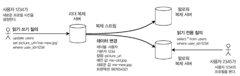
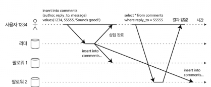
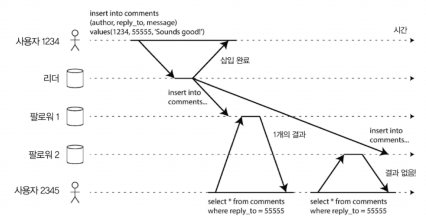
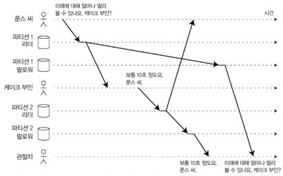
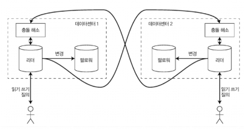
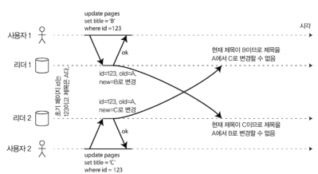
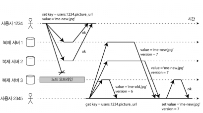
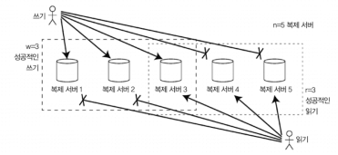
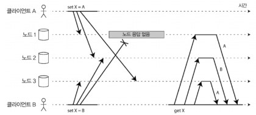
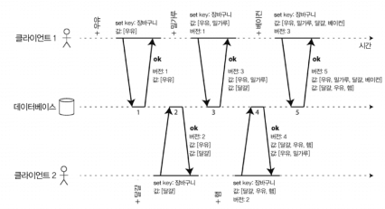

# Week3. 5장 복제

> 5장: 단일 리더 복제, 동기/비동기/반동기, 노드 장애 복구, 복제 로그 구현, 복제 지연 문제(쓰기 후 읽기·단조 읽기·일관된 순서로 읽기), 다중 리더 복제와 충돌 해소, 리더 없는 복제(Dynamo 스타일)와 정족수, 동시 쓰기 감지(이전 발생 관계, 버전 벡터)

---

## 5장 들어가기 전에 — 왜 복제를 하나?

복제(replication)는 네트워크로 연결된 여러 장비에 같은 데이터의 복사본을 유지하는 거다. 이걸 왜 하냐면:

- 지연 시간 줄이기 — 사용자랑 가까운 곳에 데이터를 두면 빠르다
- 가용성 높이기 — 한 노드가 죽어도 다른 노드가 받쳐준다
- 읽기 처리량 늘리기 — 여러 노드가 분담해서 읽기 요청을 받으면 처리량이 늘어난다

이번 장에서는 데이터셋이 작아서 모든 노드에 전체 데이터를 보유할 수 있다고 가정한다. 데이터가 너무 커서 쪼개야 하는 경우는 6장(파티셔닝)에서 다룬다. 그러니까 5장은 "같은 데이터를 여러 군데에 어떻게 잘 똑같이 유지하느냐"가 핵심 주제다.

복제 알고리즘은 크게 세 가지다:

| 종류 | 핵심 아이디어 |
|---|---|
| 단일 리더(single-leader) | 한 노드가 모든 쓰기를 받고 다른 노드들은 따라간다 |
| 다중 리더(multi-leader) | 여러 노드가 동시에 쓰기를 받을 수 있다 |
| 리더 없는(leaderless) | 모든 노드가 쓰기를 받을 수 있다 (Dynamo 스타일) |

---

## 리더와 팔로워 (Leader and Follower)

리더 기반 복제(leader-based replication) — 책에서 가장 먼저 다루고 가장 단순한 방식이다. 마스터/슬레이브(master/slave) 또는 능동/수동(active/passive) 라고도 한다.

동작 흐름은 단순하다:

1. 복제 서버(replica) 중 하나를 리더로 지정한다
2. 클라이언트가 쓰기를 보낼 때는 무조건 리더에게만 보낸다
3. 리더가 새 데이터를 자기 로컬 저장소에 기록하고, 복제 로그(replication log) 또는 변경 스트림(change stream) 으로 다른 팔로워(follower) 들에게 전송한다
4. 팔로워들은 받은 로그를 리더와 동일한 순서로 자기 로컬에 적용한다
5. 클라이언트가 읽을 때는 리더든 팔로워든 누구한테나 질의 가능 (단, 쓰기는 리더만)

이 방식은 PostgreSQL, MySQL, 오라클 데이터 가드, SQL Server의 AlwaysOn 같은 관계형 DB에 기본 내장되어 있고, MongoDB, RethinkDB 같은 NoSQL DB도 사용한다. DB뿐만 아니라 카프카나 래빗MQ의 고가용성 큐 같은 분산 메시지 브로커, DRBD 같은 복제 블록 디바이스도 비슷한 방식이다.

### 동기식 vs 비동기식 복제 — 핵심 트레이드오프

리더 복제에서 제일 중요한 설정이 이거다: 리더가 팔로워의 응답을 기다리느냐, 안 기다리느냐?

| 구분 | 동기식 (synchronous) | 비동기식 (asynchronous) |
|---|---|---|
| 리더 동작 | 팔로워가 받았다고 확인할 때까지 기다림 | 팔로워한테 보내고 바로 응답 |
| 데이터 일관성 | 팔로워가 항상 최신 | 팔로워가 뒤처질 수 있음 |
| 쓰기 성능 | 느림 (팔로워가 죽으면 멈춤) | 빠름 |
| 데이터 유실 | 거의 없음 | 리더가 죽으면 안 보낸 쓰기 유실 |

근데 모든 팔로워를 동기식으로 두는 건 비현실적이다. 어느 한 노드라도 느려지면 전체가 느려진다. 그래서 실무에서는:

- 반동기식(semi-synchronous) — 팔로워 하나만 동기식, 나머지는 비동기식. 동기식 팔로워가 느려지면 다른 비동기식 팔로워 중 하나를 동기식으로 승격
- 완전 비동기식 — 가장 흔한 설정. 내구성은 약하지만 처리량이 좋음. 팔로워가 죽거나 떨어져도 리더는 계속 동작

> 재밌는 점: 비동기식이 위험해 보여도 실무에서 널리 쓰이는 이유는, 팔로워가 많거나 지리적으로 분산되어 있을 때 동기식이 성립이 안 되기 때문이다. 트레이드오프를 이해하고 받아들이는 거지.

#### 새로운 팔로워 설정하기

복제 서버를 늘리거나 죽은 노드를 대체할 때 어떻게 할까? 단순히 파일을 복사하면 안 된다. 리더는 계속 쓰기를 받기 때문에 복사하는 동안에도 데이터가 바뀐다. 잠그면 가용성이 깨진다.

그래서 일반적인 절차는 이렇다:

1. 리더의 일관된 스냅샷을 시점 X로 가져온다 (대부분 DB는 잠금 없이 가능)
2. 스냅샷을 새 팔로워 노드에 복사한다
3. 팔로워가 리더에게 연결해서 스냅샷 시점 X 이후의 모든 변경을 요청한다 (이걸 위해 스냅샷은 정확한 로그 위치와 연결되어 있어야 함 — PostgreSQL은 `로그 일련번호`, MySQL은 `이진로그 좌표(binlog coordinate)`라 부른다)
4. 팔로워가 백로그(밀린 로그)를 다 따라잡으면 따라잡혔다고 본다

---

### 노드 장애 처리

리더 기반 복제에서 고가용성을 어떻게 달성하나? 케이스를 둘로 나눠서 본다.

#### 팔로워 장애: 따라잡기 복구 (catch-up recovery)

팔로워는 처리한 로그를 로컬 디스크에 보관한다. 그래서 죽었다 살아나면 마지막으로 처리한 트랜잭션이 뭔지 알고, 리더에게 그 이후 변경분만 요청해서 따라잡으면 된다. 쉬운 편이다.

#### 리더 장애: 장애 복구 (failover) — 까다롭다

이게 진짜 어렵다. 다음을 해야 한다:

1. 리더가 죽었다고 판단 — 보통 타임아웃 (30초 응답 없으면 죽었다고 간주)
2. 새 리더 선출 — 합의 과정으로. 보통 가장 최신 데이터를 가진 팔로워가 후보
3. 시스템 재설정 — 클라이언트가 새 리더에게 쓰기를 보내도록, 다른 팔로워들이 새 리더를 따르도록

장애 복구 과정에서 잘못될 수 있는 게 한둘이 아니다:

| 문제 | 설명 |
|------|------|
| 비동기식 복제로 인한 손실 | 죽은 옛 리더가 새 리더로 보내지 못한 쓰기는 영구 유실. 옛 리더가 살아 돌아와도 새 리더와 충돌해서 보통 폐기됨 |
| 데이터베이스 외부 시스템 충돌 | 깃허브 사고처럼, 폐기된 MySQL 기본 키를 다른 시스템(레디스)이 이미 재사용 → 개인정보 공개 |
| 스플릿 브레인(split brain) | 두 노드가 동시에 자기가 리더라고 믿는 상황. 둘 다 쓰기 받으면 충돌·데이터 유실 |
| 타임아웃 설정 | 너무 길면 복구 지연, 너무 짧으면 일시적 부하만으로 불필요한 장애 복구 발생 |

> 그래서: 일부 운영팀은 자동 장애 복구를 비활성화하고 수동 복구를 선호하기도 한다. 자동화의 위험이 결코 작지 않다.

---

### 복제 로그 구현 — 어떻게 변경을 전달하나?

리더 기반 복제는 내부적으로 어떻게 동작할까? 방식이 여러 가지다.

#### 1. 구문 기반 복제 (statement-based replication)

리더가 받은 SQL 구문(INSERT, UPDATE, DELETE)을 그대로 팔로워에 전달한다. 단순하지만 함정이 많다:

- `NOW()`, `RAND()` 같은 비결정적 함수 → 복제본마다 다른 값
- 자동증가 칼럼 사용 시 정확히 같은 순서로 실행돼야 함 → 동시성 제약
- 트리거, 스토어드 프로시저 같은 부수 효과는 결정적이지 않을 수 있음

MySQL 5.1 이전에는 이걸 썼는데, 지금은 기본적으로 행 기반으로 바뀌었다. 볼트DB는 트랜잭션이 결정적이기 때문에 구문 기반을 사용한다.

#### 2. 쓰기 전 로그(WAL) 배송

3장에서 본 그 WAL을 팔로워에게 그대로 보낸다. 데이터가 어떤 바이트를 변경했는지 저수준 정보까지 다 들어있다.

큰 단점: 로그가 저장소 엔진과 너무 밀접해서, 리더와 팔로워의 DB 버전이 달라지면 작동 안 한다. 무중단 업그레이드가 어려워진다. PostgreSQL, 오라클이 이 방식.

#### 3. 논리적(로우 기반) 로그 복제

저장소 엔진의 물리 표현이랑 분리된 논리 로그(logical log)를 사용한다. 보통 로우 단위로 어떻게 변경됐는지 기술:

- 삽입: 모든 칼럼의 새 값
- 삭제: 로우를 고유하게 식별할 정보 (보통 기본키)
- 갱신: 식별 정보 + 새 값

장점: 저장소 엔진과 분리돼서 다른 버전끼리도 동작 가능. 외부 시스템에 데이터를 전송하기도 쉬워서 변경 데이터 캡처(CDC, change data capture) 라는 기술의 기반이 된다 (11장에서 자세히).

#### 4. 트리거 기반 복제

DB에 트리거를 등록해서 변경이 일어나면 별도 테이블에 로그를 쌓고 외부 프로세스가 읽어가는 방식. 오라클의 골든게이트, 부카르도 같은 도구. 오버헤드는 크지만 유연성이 매우 뛰어나다.

---

## 복제 지연 문제 — 비동기식의 그늘

비동기식 복제에서 클라이언트는 종종 이상한 현상을 본다. 책에서는 이걸 "복제 지연(replication lag)" 문제라고 부르고, 세 가지 시나리오로 정리한다.

복제 지연이 수 초 정도면 보통 괜찮은데, 시스템이 부하 받거나 네트워크 문제 생기면 수 분 이상까지 갈 수 있다. 그러면 일관성이 깨진 게 사용자 눈에 보인다.

비동기식 시스템이 결과적으로 도달하는 일관성을 최종적 일관성(eventual consistency) 이라 한다. "결국엔 같아진다"는 뜻인데, 언제까지 같아지는지에 대한 보장은 없다.

### 문제 1: 자신이 쓴 내용 읽기 (Read-Your-Writes)

사용자가 댓글을 달았는데, 새로고침했더니 댓글이 안 보인다. 왜? 새로고침이 다른 팔로워(아직 복제 안 된)로 갔기 때문이다.

해결책: "쓰기 후 읽기 일관성(read-after-write consistency)" 또는 "자신의 쓰기 읽기 일관성" 보장.

구현 방법 몇 가지:
- 사용자가 수정 가능한 자신의 데이터를 읽을 때는 항상 리더에서 읽기 (남의 데이터는 팔로워에서)
- 마지막 갱신 후 1분 동안만 리더에서 읽기
- 클라이언트가 자신의 마지막 쓰기 타임스탬프를 기억하고, 그 시점 이후로 갱신된 복제본에서만 읽기

디바이스 간(cross-device) 일관성은 더 어렵다. 데스크톱에서 수정한 게 모바일에서 안 보일 수 있다. 클라이언트 메타데이터를 중앙집중식으로 관리해야 하고, 디바이스가 같은 데이터센터로 라우팅된다는 보장도 없다.

### 문제 2: 단조 읽기 (Monotonic Read)

사용자가 같은 질의를 여러 번 했을 때 시간이 거꾸로 흐르는 현상. 첫 번째 읽기는 최신 팔로워에서, 두 번째 읽기는 뒤처진 팔로워에서 받으면 데이터가 사라진 것처럼 보인다.

해결책: 단조 읽기(monotonic read) 보장. 강한 일관성보다는 약한 보장이지만, 최종적 일관성보다는 강하다. 이전에 새로운 데이터를 읽은 후에는 예전 데이터를 절대 읽지 않는다는 보장.

구현법: 사용자 ID 기반 해시로 항상 같은 복제 서버에서 읽도록 한다.

### 문제 3: 일관된 순서로 읽기 (Consistent Prefix Read)

인과성(causality) 위반 문제. 푼스 씨와 케이크 부인의 대화에서:

> 푼스 씨: "미래에 대해 얼마나 멀리 볼 수 있나요, 케이크 부인?"
> 케이크 부인: "보통 10초 정도요, 푼스 씨"

근데 제3자 관찰자가 케이크 부인의 답을 먼저 보고 푼스 씨의 질문을 나중에 보면? "케이크 부인 진짜 미래를 보네?!" 라고 오해한다. 파티션이 다르고 복제 속도가 달라서 생기는 문제다.

해결책: 인과적으로 관련된 쓰기를 같은 파티션에 두기. 또는 명시적으로 인과성을 추적하는 알고리즘(나중에 "이전 발생" 관계와 동시성에서 다룸).

### 복제 지연을 위한 해결책: 트랜잭션

위 문제들을 애플리케이션 코드에서 일일이 처리하면 너무 복잡하다. 그래서 등장하는 게 트랜잭션이다. DB가 더 강력한 보장을 제공해서 애플리케이션을 단순화하는 게 트랜잭션의 존재 이유 중 하나다.

근데 분산 DB로 옮겨가면서 많은 시스템이 트랜잭션을 포기했다. 너무 비싸고 확장이 어렵다고 주장한다. 7장과 9장에서 다시 다룬다.

---

## 다중 리더 복제 (Multi-Leader Replication)

리더 기반 복제의 큰 단점 하나: 리더 하나에만 쓰기 가능. 리더와 클라이언트 간 네트워크 끊기면 끝.

다중 리더(multi-leader / master-master / active-active) 는 쓰기를 받는 노드를 둘 이상 두는 거다. 각 노드는 자기가 받은 변경을 다른 모든 노드에 전달해야 한다. 이때 리더 노드는 다른 리더의 팔로워 역할도 한다.

### 다중 리더의 사용 사례

#### 사용 사례 1: 다중 데이터센터 운영

각 데이터센터에 리더를 하나씩 두고, 데이터센터 내부는 리더-팔로워, 데이터센터 간은 리더끼리 비동기 복제로 동기화.

| 항목 | 단일 리더 | 다중 리더 |
|------|----------|----------|
| 성능 | 모든 쓰기가 리더 데이터센터까지 가야 함 → 지연 큼 | 로컬 데이터센터에서 처리 → 지연 사용자가 인지 못함 |
| 데이터센터 중단 내성 | 한 DC 죽으면 다른 DC에서 리더 승격 필요 | 각 DC가 독립적으로 동작, 죽은 DC 복구 시 따라잡기 |
| 네트워크 문제 내성 | DC 간 일시적 네트워크 끊기면 쓰기 처리 못함 | 비동기라 네트워크 문제에 강함 |

문제: 다른 DC에서 동시에 같은 데이터 수정하면? 충돌이 발생한다. 이걸 해결해야 한다.

#### 사용 사례 2: 오프라인 작업 클라이언트

캘린더 앱을 생각해보자. 비행기에서도 일정 추가/수정이 가능해야 한다. 디바이스가 로컬 DB(리더 역할) 를 가지고, 인터넷 연결되면 다른 디바이스의 캘린더와 비동기 복제한다. 이게 사실상 다중 리더 복제다. 디바이스 하나하나가 데이터센터인 셈.

#### 사용 사례 3: 협업 편집 (Real-time collaborative editing)

이더패드, 구글 닥스 같은 거. 한 사용자가 편집할 때 변경을 즉시 로컬 복제본에 적용하고 다른 사용자/서버에 비동기 복제. 충돌 해소 필요. 매우 작은 단위(키 입력 1개)로 잠금을 잘게 해야 빠른 협업 가능.

### 쓰기 충돌 다루기 — 다중 리더의 가장 큰 문제

위키 페이지를 두 사용자가 동시에 다른 제목으로 변경하면? 단일 리더에서는 일어나지 않는 일이다. 다중 리더에서는 양쪽 모두 로컬 리더에 성공으로 적용되고, 나중에 비동기로 복제되면서 충돌이 감지된다.

동기식으로 충돌 감지하면 다중 리더의 핵심 장점(독립적으로 쓰기 허용)을 잃는다. 그러니까 보통은 비동기 + 사후 충돌 해소.

#### 충돌 회피 (가장 단순한 전략)

특정 레코드의 모든 쓰기가 같은 리더로 가도록 라우팅한다. 사용자별로 "홈" 데이터센터를 정해두고 거기서만 처리. 충돌이 아예 안 생긴다. 근데 한 DC 장애나면? 사용자 위치 바뀌면? 결국 충돌 처리 필요.

#### 일관된 상태 수렴 — 모든 복제본이 같은 최종 값을 가져야 함

다중 리더에서는 쓰기 순서가 정해지지 않으니까 수렴(convergent) 방식으로 충돌 해소해야 한다. 방법들:

- 최종 쓰기 승리(LWW, Last Write Wins) — 각 쓰기에 타임스탬프 부여, 가장 큰 것만 남기고 나머지 버림. 데이터 유실 가능.
- 고유 ID 부여 — 복제 서버에 ID 매겨서 높은 ID가 우선. 이것도 데이터 유실.
- 값 병합 — 사전 순으로 합치기 ("B/C")
- 명시적 데이터 구조에 충돌 기록 — 나중에 사용자에게 보여줘서 해소시킴

#### 사용자 정의 충돌 해소 로직

대부분 다중 리더 도구는 애플리케이션 코드에서 충돌 해소 로직을 작성하게 한다. 쓰기 수행 중 (충돌 감지되면 핸들러 호출) 또는 읽기 수행 중 (충돌 형제 값들을 다 저장하고 읽을 때 해소).

#### 자동 충돌 해소 — 흥미로운 연구 영역

| 기법 | 설명 |
|------|------|
| CRDT | 충돌 없는 복제 데이터타입. 셋, 맵, 카운터 등. 동시 편집을 합리적으로 자동 해소 (리악 2.0이 일부 구현) |
| 병합 가능한 영속 데이터 구조 | 깃처럼 명시적으로 히스토리 추적, 삼중 병합 함수 (CRDT는 이중 병합) |
| 운영 변환(Operational Transformation, OT) | 이더패드, 구글 독스가 사용. 텍스트 같은 정렬된 항목 목록의 동시 편집에 특화 |

### 다중 리더 복제 토폴로지

리더가 둘 이상이면 누가 누구한테 쓰기를 전달하느냐라는 통신 경로 문제가 생긴다.

| 토폴로지 | 동작 | 단점 |
|---------|------|------|
| 원형(circular) | 각 노드가 다음 노드로 전달 | 노드 하나 죽으면 경로 끊김 |
| 별 모양(star) | 루트 노드 하나가 모든 다른 노드로 전달 | 루트 죽으면 끝 |
| 전체 연결(all-to-all) | 모든 리더가 모든 다른 리더에 직접 전달 (가장 일반적) | 일부 메시지가 다른 메시지를 "추월" 가능 → 인과성 문제 |

전체 연결의 인과성 문제는 버전 벡터(version vector) 라는 기법으로 해결할 수 있는데, 많은 다중 리더 시스템이 제대로 구현되어 있지 않다. 다중 리더 시스템 쓸 때는 충돌 감지 기법을 반드시 직접 테스트해보는 게 좋다.

---

## 리더 없는 복제 (Leaderless Replication)

지금까지는 "리더가 쓰기 순서를 정한다" 였는데, 리더 없는 복제는 리더 개념 자체를 버린다. 모든 복제 서버가 클라이언트로부터 직접 쓰기를 받는다.

이 아이디어는 한동안 묻혀있다가 아마존 다이나모(Dynamo) 시스템에서 다시 유행했다. 그래서 리악(Riak), 카산드라, 볼드모트 같은 다이나모 영향 받은 DB들을 다이나모 스타일 이라 부른다. (DynamoDB는 다른 거니까 헷갈리지 말 것.)

### 노드 다운: 정족수 쓰기/읽기

복제 서버 3개 짜리 DB라고 해보자. 그 중 하나가 죽었어. 리더 기반이라면 장애 복구가 필요했지. 리더 없는 설정에서는?

- 쓰기: 클라이언트가 모든 복제 서버 3개에 동시에 보낸다. 2개에서 ok 응답 받으면 성공으로 간주. 죽은 노드는 무시.
- 읽기: 클라이언트가 모든 복제 서버 3개에 동시에 보낸다. 응답 중에 버전 번호로 최신 값을 결정. 한 노드는 "오래된" 값일 수 있음.

#### 죽었다 살아난 노드는 어떻게 따라잡나?

다이나모 스타일은 두 메커니즘을 사용한다:

| 메커니즘 | 설명 |
|---------|------|
| 읽기 복구(read repair) | 클라이언트가 여러 노드에서 읽기를 수행할 때 오래된 응답을 감지하면, 새 값을 그 노드에 다시 써준다. 자주 읽히는 값에 적합 |
| 안티 엔트로피 처리 | 백그라운드 프로세스가 복제 서버 간 데이터 차이를 지속적으로 찾아서 누락된 데이터 복사. 리더 기반 로그와 달리 순서 보장 안 됨, 지연 클 수 있음 |

볼드모트는 안티 엔트로피 처리를 안 한다. 읽기 복구만 하면 자주 안 읽히는 값은 내구성 떨어진다.

### 읽기와 쓰기를 위한 정족수 (Quorum)

위 예제에서 3개 중 2개에서 성공해야 했는데, 일반화하면:

> n개의 복제 서버가 있을 때 쓰기는 w개 노드, 읽기는 r개 노드에서 성공해야 함.
> w + r > n 이면 읽기와 쓰기에서 반드시 최신 값 한 개 이상 존재한다.

이걸 정족수 읽기와 쓰기(quorum reads and writes) 라고 부른다. 다이나모 스타일은 보통 `n=홀수(3 또는 5)`, `w = r = (n+1)/2(반올림)` 로 설정.

조건별 동작:

| 조건 | 동작 |
|------|------|
| `w < n` | 노드 하나 사용 불가능해도 쓰기 가능 |
| `r < n` | 노드 하나 사용 불가능해도 읽기 가능 |
| `n=3, w=2, r=2` | 사용 불가능한 노드 1개 용인 |
| `n=5, w=3, r=3` | 사용 불가능한 노드 2개 용인 |
| `w + r > n` | 정상 동작 시 항상 최신 값 읽음 |

### 정족수 일관성의 한계

`w + r > n` 이라도 엣지 케이스에서는 오래된 값을 반환할 수 있다:

- 느슨한 정족수 사용 시: 새로운 노드에 임시로 쓰여 r개 노드에 안 겹칠 수 있음
- 두 쓰기가 동시 발생: 누가 먼저인지 불명확, 충돌 해소 필요 (LWW면 시계 스큐로 쓰기 유실 가능)
- 쓰기와 읽기 동시 발생: 쓰기가 일부에만 반영된 상태에서 읽기 → 결과 불확실
- 쓰기가 일부 노드에만 성공: 일부에 성공, 전체로는 실패한 쓰기를 새 값으로 보거나 무시할 수도 있음
- 새 값 가진 노드가 죽고 예전 값이 복원되면 → 정족수 깨짐
- 운 나쁘게 타이밍이 꼬이면 보장이 안 될 수도

> 결론: 정족수가 가장 최근 값을 반환하게 보장하지 실제로는 그렇게 간단하지 않다. 다이나모 스타일은 최종적 일관성 워크로드에 최적화. 강한 보장이 필요하면 트랜잭션이나 합의 필요 (7장, 9장).

### 최신성 모니터링

리더 기반은 복제 지연을 쉽게 측정할 수 있다(쓰기는 정해진 순서, 각 노드의 위치를 알 수 있음). 리더 없는 시스템은 더 어렵다. 쓰기 순서가 고정되지 않고, 안티 엔트로피만 사용하면 오래된 값이 얼마나 오래된 건지 제한이 없다. 측정 지표 자체가 일반적이지 않다.

### 느슨한 정족수와 암시된 핸드오프 (Sloppy Quorum and Hinted Handoff)

네트워크 장애로 클라이언트가 정족수 노드에 연결 못하면? 두 가지 선택:

1. `w` 또는 `r` 노드를 만족 못하니까 모든 요청에 에러 반환
2. 일단 연결 가능한 다른 노드에 기록해뒀다가 나중에 원래 노드에 전달

후자가 느슨한 정족수(sloppy quorum) 다. 비유하자면: 내 집 열쇠를 잃어버려서 이웃집에 잠시 머무는 것 처럼, 정상 노드에 못 가니까 임시 "홈"이 아닌 노드에 일단 기록.

네트워크 복구되면 임시로 받아준 노드가 진짜 홈 노드에 전송 → 암시된 핸드오프(hinted handoff).

주의: 느슨한 정족수는 쓰기 가용성을 높여주지만 `w + r > n` 이어도 최신 값 읽기 보장이 안 된다. 진짜 홈 노드에 도달 전까지는. 지속성에 대한 보장일 뿐. 리악은 기본 활성화, 카산드라/볼드모트는 비활성화.

### 동시 쓰기 감지 — 리더 없는 복제의 핵심 어려움

다이나모 스타일은 여러 클라이언트가 동시에 같은 키에 쓰기 가능. 다중 리더보다 충돌이 더 자주 발생.

문제는 다양한 네트워크 지연/부분 장애 때문에 이벤트가 노드마다 다른 순서로 도착할 수 있다는 거다. 그러면 노드들이 같은 키에 다른 값을 가진 채로 끝날 수 있다.

#### 최종 쓰기 승리(LWW) — 데이터 손실 위험

각 쓰기에 타임스탬프 붙여서 가장 큰 것만 남김. 단순하지만 동시 쓰기 시 일부가 그냥 날아감. 카산드라가 유일한 충돌 해소 방법이고, 리악에서는 선택. 데이터 손실 못 받아주는 상황엔 부적합. 안전한 사용법은 키를 한 번만 쓰고 이후로는 불변 — 카산드라에서 각 작업에 UUID 부여하는 식.

#### "이전 발생(happens-before)" 관계와 동시성

두 작업의 관계는 셋 중 하나:

| 관계 | 설명 |
|------|------|
| A가 B 이전 발생 | B가 A를 알고 의존, A에 기반. 인과 의존 |
| B가 A 이전 발생 | 반대 |
| 동시(concurrent) | 서로 모름, 인과 없음 |

> 두 작업이 물리적으로 동시 발생한 게 아니라 서로 모르는 게 동시성의 정의. 상대성이론에서 빛 속도 너머 정보가 못 가는 것과 비슷한 개념. 사실은 시간이 미세하게 다를 수 있어도, 서로 알 수 없으면 동시라고 본다.

#### 이전 발생 관계 파악하기 — 단일 복제본 알고리즘

장바구니 예제로 이해하자 (5-13). 두 클라이언트가 같은 장바구니에 동시에 상품 추가:

1. 클라이언트 1이 우유 추가 → 서버 버전 1, 값 [우유]
2. 클라이언트 2가 달걀 추가 (우유 모름) → 서버 버전 2, 값 [우유, 달걀] 그리고 [달걀] 두 개 반환 (형제 sibling)
3. 클라이언트 1이 밀가루 추가 (이전엔 [우유]만 알고있었음) → [우유, 밀가루] + 서버 보낸 [달걀] = 버전 3 = [우유, 밀가루, 달걀]
4. 클라이언트 2가 햄 추가 → [달걀, 우유, 햄] + 자기 이전 + 새거 = 버전 4
5. 마지막 베이컨 추가 → 버전 5, [우유, 밀가루, 달걀, 베이컨, 햄]

알고리즘 핵심:

- 서버는 모든 키에 버전 번호 유지, 키에 쓰기 발생할 때마다 증가
- 클라이언트가 키 읽으면 서버는 최신 버전 + 안 덮어쓴 모든 값 반환
- 클라이언트가 쓰기를 하려면 이전 읽기에서 받은 버전 번호 포함, 읽기에서 받은 모든 값을 합쳐야 함
- 서버가 더 큰 버전 번호 쓰기를 받으면 이하의 모든 값은 덮어쓸 수 있음, 더 큰 건 동시이니 형제로 유지

#### 동시에 쓴 값 병합 (sibling merging)

이전 단순 LWW는 데이터 손실. 합집합 같은 합리적인 병합이 필요하다. 장바구니에선 union 병합이 직관적. 근데 삭제는 어떻게? 단순 union이면 삭제한 게 살아 돌아옴. 그래서 톰스톤(tombstone) 으로 표시 (3장 컴팩션에서 나왔던 것과 비슷한 개념).

자동 병합은 복잡하고 오류 잘 남. CRDT가 이걸 자동화하는 데이터 구조군 (리악이 지원).

#### 버전 벡터 (Version Vector)

위 예제는 단일 복제본. 다중 복제본 + 리더 없음은? 버전 번호 하나로는 안 된다.

> 버전 벡터: 각 복제본별로 버전 번호를 유지한다. 모든 복제본의 버전 번호 모음.

- 어떤 복제본이 다른 복제본을 덮어쓰거나 형제로 유지할지 결정 가능
- 클라이언트가 읽을 때 받아서 쓸 때 다시 보낸다 → 인과성 컨텍스트(causal context)
- 리악 2.0이 사용하는 점선 버전 벡터(dotted version vector) 가 대표적

> 버전 벡터 vs 벡터 시계: 비슷하지만 미묘하게 다른 알고리즘. 책에서는 복제본 상태 비교에는 버전 벡터가 옳다고 함.

---

## 5장 마무리 — 핵심 정리

복제는 동기/비동기로 이뤄진다. 비동기는 빠르지만 지연 + 장애 시 유실 위험.

복제는 세 가지 방식으로 나뉜다:

| 방식 | 장점 | 단점 |
|------|------|------|
| 단일 리더 | 이해하기 쉬움, 충돌 해소 걱정 없음, 가장 흔함 | 리더 단일 실패점, 지리적 분산에 약함 |
| 다중 리더 | 다중 DC, 오프라인 지원, 협업 편집 | 충돌 해소 어려움, 인과성 보장 어려움 |
| 리더 없는 | 결함·지연·네트워크 중단에 견고 | 일관성 약함, 모니터링 어려움 |

복제 지연으로 발생하는 일관성 문제와 그 보장 모델:

| 보장 모델 | 의미 |
|----------|------|
| 쓰기 후 읽기 일관성 | 사용자는 자신이 제출한 데이터를 항상 볼 수 있어야 함 |
| 단조 읽기 | 새 데이터를 본 후에 예전 데이터를 다시는 보지 않음 |
| 일관된 순서로 읽기 | 인과적 순서대로 사용자에게 보임 |

다중 리더와 리더 없는 복제는 동시성 문제가 본질. 이전 발생 관계, 버전 벡터, 형제 병합 같은 도구로 충돌을 풀어낸다.

다음 장(6장)은 파티셔닝 — 큰 데이터셋을 어떻게 노드별로 쪼개느냐. 복제(같은 데이터를 여러 곳에)와 파티셔닝(다른 데이터를 다른 곳에)은 분산 DB의 두 축이다.
