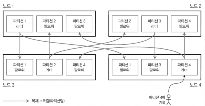
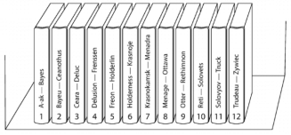
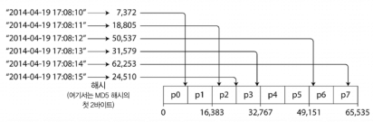
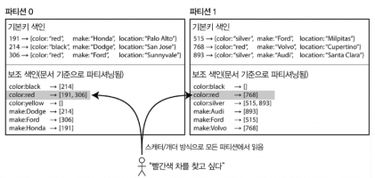
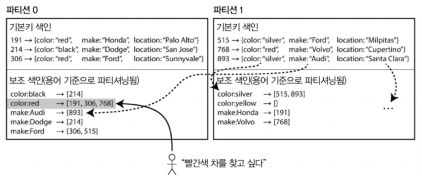
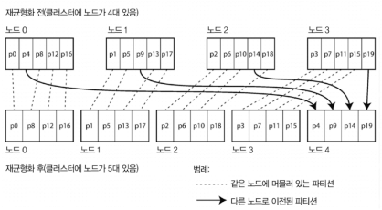
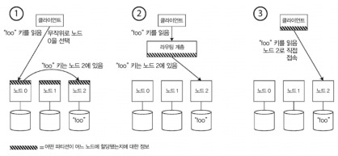
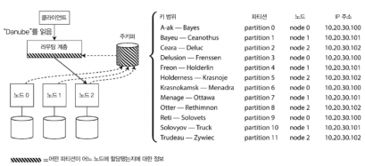

# Week4. 6장 파티셔닝

> 6장: 파티셔닝(샤딩)과 복제의 조합, 키-값 파티셔닝(키 범위 vs 해시), 쏠림과 핫스팟 완화, 보조 색인 파티셔닝(문서 기반·지역 색인 / 용어 기반·전역 색인), 파티션 재균형화 전략(mod N의 함정, 파티션 개수 고정, 동적 파티셔닝, 노드 비례), 요청 라우팅과 서비스 디스커버리

---

## 6장 들어가기 전에 — 왜 파티셔닝을 하나?

5장이 "같은 데이터를 여러 군데에 복사"하는 복제였다면, 6장은 "큰 데이터를 여러 군데에 쪼개서 저장"하는 파티셔닝이다. 데이터셋이 너무 크거나 질의 처리량이 너무 높아지면 복제만으로는 부족하고, 데이터 자체를 파티션(partition) 으로 쪼갤 필요가 있다. 이걸 샤딩(sharding) 이라고도 한다.

> 용어 혼동 — 시스템마다 부르는 이름이 다 다르다
>
> | 시스템 | 부르는 이름 |
> |---|---|
> | MongoDB, Elasticsearch, SolrCloud | 샤드(shard) |
> | HBase | 리전(region) |
> | Bigtable | 태블릿(tablet) |
> | Cassandra, Riak | 브이노드(vnode) |
> | Couchbase | 브이버켓(vBucket) |
>
> 책에서는 그냥 파티션이라고 통일해서 부른다. 이름은 다 다른데 개념은 같다.

파티셔닝의 주된 이유는 확장성(scalability). 비공유 클러스터(shared-nothing cluster)에서 파티션을 다른 노드에 분산시킬 수 있고, 따라서 대용량 데이터를 여러 디스크/프로세서에 분산할 수 있다.

> 재밌는 역사: 파티셔닝 자체는 1980년대 Teradata, Tandem NonStop SQL부터 있었다. 새로운 개념은 아닌데 NoSQL DB와 하둡 기반 데이터 웨어하우스에서 다시 발견된 거다.

### 파티셔닝과 복제 — 보통 같이 쓴다

파티셔닝이랑 복제는 보통 함께 적용된다. 한 레코드는 정확히 한 파티션에 속하더라도, 그 파티션 자체를 여러 노드에 복제해서 내결함성을 보장한다.

각 노드는 어떤 파티션에게는 리더면서 다른 파티션에게는 팔로워가 될 수 있다. 5장에서 다룬 복제 얘기는 그대로 적용되니까 이번 장은 복제 얘기는 빼고 파티셔닝만 본다.

---

## 키-값 데이터 파티셔닝 — 어떻게 쪼갤까?

대량의 데이터를 파티셔닝한다고 할 때, 핵심 질문은 이거다: 어떤 레코드를 어느 노드에 저장할지 어떻게 결정하나?

파티셔닝의 목적은 데이터와 부하를 노드 사이에 고르게 분산시키는 것이다. 모든 노드가 동일한 분량을 담당한다고 가정할 때, 이론상 10배의 노드를 사용하면 10배의 데이터와 처리량을 담당할 수 있다.

근데 파티셔닝이 고르게 안 이뤄지면? 쏠렸다(skewed) 라고 한다. 쏠리면 파티셔닝의 효과가 떨어진다. 극단적인 경우 모든 부하가 한 파티션으로 몰려서 10대 중 9대가 노는 상태가 되고, 한 노드가 병목이 된다. 이렇게 불균형하게 부하가 높은 파티션을 핫스팟(hotspot) 이라 한다.

핫스팟을 회피하는 가장 단순한 방법은 레코드를 무작위로 노드에 할당하는 것이다. 근데 이러면 읽을 때 어디 있는지 몰라서 모든 노드에 병렬 질의해야 한다. 이건 좀 아니지 않나? 그래서 더 좋은 방법이 필요하다.

### 키 범위 기준 파티셔닝 (Key Range Partitioning)

백과사전처럼, 각 파티션에 키의 연속된 범위를 할당하는 것이다. 1권은 A부터 B까지, 2권은 C부터 D까지... 이런 식.

- 범위의 경계는 데이터 분포에 맞춰 설정. 균등하게 안 나눠도 됨 (A로 시작하는 단어가 적으면 A-B를 1권으로 묶고, T-Z를 더 넓게)
- 경계는 관리자가 수동으로 정하거나, DB가 자동으로 선택할 수 있다 (재균형화 절에서 다룸)
- HBase, RethinkDB, MongoDB(2.4 이전 버전) 가 이 방식

장점: 각 파티션 안에서 키를 정렬된 순서로 저장할 수 있다. 범위 스캔이 매우 빠르다. 키를 연쇄된 색인처럼 다중 칼럼으로 보면 관련 레코드를 한꺼번에 읽을 수 있다.

단점: 특정 접근 패턴이 핫스팟을 유발할 수 있다.

> 센서 데이터 예제: 키를 타임스탬프(년-월-일-시-분-초)로 사용하면, 그날치 데이터가 하나의 파티션으로 몰린다. 다른 파티션은 놀고 한 파티션은 과부하. 이걸 회피하려면 키 첫 번째 요소를 타임스탬프 외 다른 것(예: 센서 이름)으로 두고 그 다음에 시간을 사용한다.

### 키의 해시값 기준 파티셔닝 (Hash Partitioning)

쏠림과 핫스팟의 위험 때문에 많은 분산 데이터스토어는 해시 함수로 파티션을 정한다. 좋은 해시 함수는 쏠린 데이터를 입력으로 받아도 균일하게 분산되게 만든다.

- 카산드라, MongoDB: MD5
- 볼드모트: 파울러-놀-보(Fowler-Noll-Vo) 함수
- 키에 해시 함수를 적용해서 각 파티션에 해시값 범위를 할당한다

파티셔닝용 해시 함수는 암호적으로 강력할 필요는 없지만, 자바의 `Object.hashCode()`나 루비의 `Object#hash`처럼 같은 키를 넣어도 다른 해시값 반환하는 건 안 된다 (프로세스마다 다를 수 있음).

> 일관성 해싱(Consistent Hashing): Karger가 정의한 CDN용 부하 분산 방법. 중앙 제어나 분산 합의 없이 파티션 경계를 무작위로 선택. 책에서 말하는 일관성은 ACID나 복제의 일관성과는 무관. 데이터베이스에서는 사실 잘 안 쓰이고(쏠림 잘 안 나서), 해시 파티셔닝으로 그냥 부르는 게 일반적이다.

해시 파티셔닝의 단점: 범위 질의의 효율이 떨어진다. 정렬된 키 순서가 깨졌으니까 범위 질의는 모든 파티션에 흩어져 보내야 한다. MongoDB는 해시 모드면 모든 파티션에 전송해야 한다. 리악, 카우치베이스, 볼드모트는 키에 대한 범위 질의 자체를 안 지원한다.

카산드라의 절충안: 복합 기본키. 첫 번째 칼럼에만 해싱을 적용하고 나머지 칼럼은 SS테이블 정렬에 사용. 첫 칼럼 = 파티션 결정, 나머지 칼럼 = 범위 스캔. 일대다 관계를 우아하게 표현할 수 있다.

| 방식 | 핫스팟 회피 | 범위 질의 | 사용처 |
|------|-----------|---------|-------|
| 키 범위 | 약함 (수동 키 설계 필요) | 빠름 | HBase, RethinkDB, MongoDB(2.4-) |
| 해시 파티셔닝 | 좋음 | 느림 (모든 파티션 스캔) | 카산드라, MongoDB(2.4+), 리악 |
| 복합키 (카산드라) | 좋음 | 일부 범위 질의 가능 | 카산드라 |

### 쏠린 작업부하와 핫스팟 완화

해시 파티셔닝도 핫스팟 100% 막진 못한다. 극단적인 상황 — 모든 요청이 같은 키라면? 모두 같은 파티션으로 쏠린다.

> 소셜 미디어 유명인 문제: 수백만 팔로워를 거느린 유명인이 글을 올리면 폭풍처럼 쏟아지는 액션이 동일한 키(유명인 ID)에 몰린다. 해시도 의미 없다. 동일 ID는 동일 해시.

해결책 (현재는 애플리케이션 책임):
- 쏠리는 키의 시작/끝에 임의의 10진수 두 개 같은 걸 붙임 → 100개의 다른 키로 균등 분산
- 단점: 100개 키에 흩어진 데이터를 다시 합쳐야 함, 어떤 키가 쪼개졌는지 추적 필요
- 소수의 핫키에만 적용해야 타당. 대다수 키에 적용하면 오버헤드만 커짐

미래 데이터 시스템은 자동으로 감지/보정 가능할 수도 있겠지만 아직은 트레이드오프를 따져야 한다.

---

## 파티셔닝과 보조 색인 — 진짜 문제는 여기서

지금까지는 키-값 데이터 모델이었다. 근데 보조 색인(secondary index) 이 들어가면 상황이 복잡해진다. 보조 색인은 특정 값이 발생한 항목을 검색하는 용도다 (예: 사용자 123이 한 액션 모두 찾기, hogwash가 들어간 글 찾기).

> 보조 색인은 카산드라/볼드모트 같은 키-값 저장소에서는 잘 지원 안 했지만, 데이터 모델링에 매우 유용해서 (리악 같은) 일부 저장소에서 추가하기 시작했다. 솔라/엘라스틱서치 같은 검색 서버에서는 존재의 이유 그 자체.

보조 색인은 파티션에 깔끔하게 대응되지 않는 문제가 있다. 두 가지 방법이 있다.

### 1. 문서 기준 보조 색인 파티셔닝 (지역 색인 / Local Index)

각 파티션이 자신의 보조 색인을 따로 유지한다. 문서 ID(또는 기본키)로 파티셔닝되어 있고, 각 파티션은 자기 안의 문서들에 대해서만 색인을 만든다.

| 항목 | 내용 |
|------|------|
| 장점 | 쓰기가 쉽다 — 새 문서 추가/수정/삭제 시 자기 파티션 색인만 갱신하면 됨. 파티션이 독립적으로 동작 |
| 단점 | 읽기가 비싸다 — `color:red` 같은 보조 색인 질의 시 모든 파티션에 질의해야 함. 결과 합치기 필요 |

이런 접근을 스캐터/개더(scatter/gather) 라 부른다. 보조 색인 질의가 꼬리 지연 시간 증폭을 발생시키기 쉬움. 그래도 널리 쓰임 — MongoDB, Riak, Cassandra, Elasticsearch, SolrCloud, VoltDB 모두 이 방식.

> 벤더들은 단일 파티션에서만 실행되도록 설계할 것을 권장하지만, 보조 색인을 여러 개 쓰면 항상 가능하지는 않다.

### 2. 용어 기준 보조 색인 파티셔닝 (전역 색인 / Global Index)

각 파티션이 자기 색인을 갖는 대신, 모든 파티션의 데이터를 담당하는 전역 색인을 만든다. 전역 색인도 파티셔닝하긴 하지만 기본키와는 다른 식으로 한다 (찾고 싶은 용어 자체가 키).

예시: `color:red`로 시작하는 색인은 a-r까지의 글자로 시작하는 색깔은 파티션 0에, s-z까지의 글자는 파티션 1에 저장.

| 항목 | 내용 |
|------|------|
| 장점 | 읽기가 효율적 — 클라이언트는 원하는 용어가 포함된 파티션 하나에만 요청하면 됨. 스캐터/개더 불필요 |
| 단점 | 쓰기가 느리고 복잡 — 단일 문서 쓸 때 보조 색인 여러 개를 갱신해야 하는데, 그게 다른 파티션에 있을 수 있음 |

현실에서: 전역 보조 색인은 보통 비동기로 갱신된다. 쓰기 직후 색인 읽으면 변경이 아직 반영 안 될 수도 있음. DynamoDB는 정상적인 상황에서 1초 안에 갱신되지만 인프라 결함 시 더 길어질 수 있다.

전역 용어 파티셔닝 색인의 다른 사용처: 리악의 검색 기능, 오라클 데이터 웨어하우스 (지역/전역 중 선택).

---

## 파티션 재균형화 (Rebalancing) — 시간 지나면 변한다

DB 운영하다 보면 변화가 생긴다:

- 질의 처리량 증가 → CPU 더 추가 필요
- 데이터셋 크기 증가 → 디스크/RAM 더 추가 필요
- 장비 장애 → 다른 장비가 역할을 떠맡아야 함

이런 변화로 데이터와 요청을 한 노드에서 다른 노드로 옮기는 과정이 재균형화(rebalancing) 다.

재균형화의 최소 요구사항:
- 부하(데이터, 읽기·쓰기)가 클러스터 내 노드들 사이에 균등하게 분배돼야 한다
- 재균형화 도중에도 DB는 읽기·쓰기를 계속 받아야 한다
- 노드 사이에 데이터가 필요 이상으로 옮겨지면 안 된다 (네트워크/디스크 I/O 부하 최소화)

### 재균형화 전략

#### 쓰면 안 되는 방법: 해시값에 모드 N 연산 (mod N)

`hash(key) mod N` 으로 노드 결정? 왜 안 될까?

노드 개수 N이 바뀌면 대부분의 키가 노드 사이에 옮겨져야 한다. 예시:
- `hash(key) = 123456`, 노드 10대면 → 노드 6
- 노드 11대로 늘면 → 노드 3 (`123456 mod 11 = 3`)
- 노드 12대로 늘면 → 노드 0 (`123456 mod 12 = 0`)

이렇게 키가 자주 이동하면 재균형화 비용이 지나치게 커진다. 데이터 이동을 최소화하는 방법이 필요하다.

#### 방법 1: 파티션 개수 고정

정말 단순한 해결책: 파티션을 노드 대수보다 많이 만들고, 각 노드에 여러 파티션을 할당.

> 노드 10대 클러스터에 파티션 1,000개를 만든다. 노드당 파티션 100개.

노드가 추가되면 새 노드는 각 기존 노드에서 파티션 몇 개를 뺏어옴. 클러스터에 균등하게 분배될 때까지. 노드가 제거되면 반대로.

핵심 포인트:
- 파티션 개수는 바뀌지 않는다. 키가 어떤 파티션에 할당됐는지도 안 바뀐다
- 파티션을 노드 사이에서 통째로 이동만 한다
- 데이터 전송이 진행 중일 땐 기존 할당으로 처리

사용처: Riak, Elasticsearch, Couchbase, Voldemort 가 이 방식.

단점:
- 처음 구축할 때 파티션 개수를 결정해두고 이후 변경 안 함
- 너무 크면 재균형화/장애 복구 비용 증가, 너무 작으면 오버헤드 큼
- 데이터셋 크기가 크게 변동하면 적절한 파티션 개수 정하기 어려움

#### 방법 2: 동적 파티셔닝

키 범위 파티셔닝에서 경계를 잘못 지정하면 모든 데이터가 한 파티션에 쏠린다. 그래서 키 범위 DB는 파티션을 동적으로 만든다:

- 파티션이 설정값(HBase: 10GB) 넘어서면 → 두 개로 쪼갠다
- 데이터가 많이 삭제돼서 임곗값 아래로 떨어지면 → 인접 파티션과 합친다

B 트리의 최상위 레벨에서 실행되는 작업과 유사하다.

사용처: HBase(HDFS로 파티션 파일 전송), RethinkDB, MongoDB(2.4+) 는 키 범위와 해시 둘 다.

장점: 데이터 양에 맞춰 자동 조정. 데이터 작으면 파티션 적게, 크면 많이. 오버헤드 절약.

단점: 빈 DB는 처음에 파티션 하나뿐 → 모든 쓰기가 한 노드로. 이걸 완화하려고 사전 분할(pre-splitting) — 빈 DB 초기 파티션 집합 설정 가능 (HBase, MongoDB).

#### 방법 3: 노드 비례 파티셔닝

파티션 개수가 노드 대수에 비례. 노드당 파티션 개수 고정.

- 카산드라, Ketama가 사용. 카산드라는 노드당 256개 기본
- 새 노드 추가되면 기존 노드 파티션 절반을 무작위로 뺏어옴 (해시 기반)
- 카산드라 3.0: 불공평한 분할을 회피하는 새 알고리즘

장점: 노드 대수 변하는 동안 개별 파티션 크기는 데이터셋 크기에 비례. 노드 늘리면 파티션 크기는 다시 작아진다. 일반적으로 노드 대수 변경이 적은 편이라 안정적.

해시 함수를 통해 파티션 경계를 무작위로 선택해야 함. 일관성 해싱의 원래 정의에 가깝다.

| 전략 | 동작 | 사용처 |
|------|------|-------|
| 파티션 개수 고정 | 미리 N개 만들고 노드 사이 분배 | Riak, Elasticsearch, Couchbase, Voldemort |
| 동적 파티셔닝 | 크면 분할, 작으면 병합 (B 트리식) | HBase, RethinkDB, MongoDB |
| 노드 비례 | 노드당 고정 개수, 새 노드는 절반씩 뺏어옴 | 카산드라, Ketama |

### 운영: 자동 재균형화 vs 수동 재균형화

재균형화는 자동? 수동?

완전 자동 재균형화:
- 일상적인 유지보수에 손이 덜 간다
- 근데 예측하기 어렵다. 요청 라우팅 재설정 + 대량 데이터 이동 = 비용 큰 연산
- 주의 깊게 처리하지 않으면 네트워크/노드 과부하, 다른 요청 성능 저하 가능

자동 장애 감지와 조합되면 위험:
- 노드 한 대 과부하 → 응답 느려짐 → 다른 노드들이 죽었다고 간주 → 자동 재균형화 → 부하 더 커짐 → 연쇄 장애

그래서: 카우치베이스, 리악, 볼드모트 — 자동 제안 + 관리자 확정이라는 중간 절충안. 완전 자동보다 느릴 수 있지만 운영상 예상 못한 일을 방지하는 데 도움.

---

## 요청 라우팅 — 어느 노드로 보내야 하나?

이제 데이터셋이 여러 노드에 파티셔닝됐고, 클라이언트가 요청을 보내려고 한다. 누구한테 접속해야 하지? 파티션이 재균형화되면서 노드에 할당되는 파티션이 바뀐다.

이건 더 일반적인 문제인 서비스 디스커버리(service discovery) 의 일종이다. 고가용성을 지향하는 소프트웨어는 다 겪는 문제.

### 3가지 접근 방식

| 방법 | 동작 |
|------|------|
| 1. 클라이언트가 아무 노드에 접속 | 라운드 로빈 로드 밸런서로 보낸다. 그 노드가 처리할 수 있으면 직접 처리, 아니면 적절한 노드로 전달하고 응답 받아 클라이언트에 전달 |
| 2. 라우팅 계층 | 클라이언트는 라우팅 계층으로만 보낸다. 계층은 처리 안 하고 라우팅만. 파티션 인지 로드 밸런서 |
| 3. 클라이언트가 알아서 | 클라이언트가 파티셔닝 방법과 파티션 노드 할당을 알고 있음. 중개자 없이 직접 접속 |

핵심 문제: 라우팅 결정을 내리는 구성요소가 노드에 할당된 파티션 변경 사항을 어떻게 아냐. 정보가 일치 안 하면 잘못된 노드로 갈 수 있다.

### 메타데이터 추적 도구

많은 분산 데이터 시스템이 별도의 코디네이션 서비스를 사용한다.

#### 주키퍼(ZooKeeper)

- 클러스터 메타데이터 추적
- 각 노드는 주키퍼에 자기를 등록
- 주키퍼가 파티션 → 노드 할당 정보 관리
- 라우팅 계층/클라이언트가 주키퍼 정보를 구독
- 소유자 바뀌거나 노드 추가·삭제되면 주키퍼가 알림 → 라우팅 정보 최신 유지
- 사용처: HBase, SolrCloud, Kafka — 주키퍼 의존. MongoDB는 자체적인 설정 서버(config server) + `mongos` 라우팅 계층

#### 가십 프로토콜 (Gossip Protocol)

- 카산드라, 리악이 사용
- 클러스터 상태 변화를 노드 사이에 전파
- 어느 노드나 요청 받을 수 있고, 노드끼리 알아서 처리 가능 노드로 전달
- 외부 코디네이션 서비스 의존성 없음. 데이터베이스 노드 복잡도 ↑

#### 폭시(moxi) — Couchbase

- 재균형화 자동 실행 안 해서 설계 단순
- 변경된 라우팅 정보를 알아내는 라우팅 계층

클라이언트는 라우팅 계층/임의의 노드 IP를 알아내야 한다. IP는 자주 바뀌지 않으므로 DNS로 충분.

### 병렬 질의 실행 (대규모 병렬 처리, MPP)

여기까지는 단일 키 읽기/쓰기 + 보조 색인 스캐터/개더 정도였다. NoSQL 분산 데이터스토어 수준.

근데 분석용으로 자주 쓰이는 대규모 병렬 처리(MPP, massively parallel processing) 관계형 DB 제품은 훨씬 복잡하다:
- 조인, 필터링, 그룹화, 집계 연산을 여러 단계로 포함
- 다수 노드에 병렬적으로 실행
- 데이터 웨어하우스 분석 업무가 비즈니스적으로 중요해지면서 상업적 관심 ↑
- 자세한 건 10장에서 다룬다

---

## 6장 마무리 — 핵심 정리

이번 장에서는 대용량 데이터셋을 더 작은 데이터셋으로 파티셔닝하는 방법을 봤다. 데이터가 너무 많아서 한 장비에서 다 처리 못 하면 파티셔닝이 필수.

파티셔닝의 목적: 핫스팟(불균형) 없이 데이터·질의 부하를 균일 분산.

두 가지 주요 파티셔닝 기법:

| 기법 | 핵심 | 트레이드오프 |
|------|------|-------------|
| 키 범위 파티셔닝 | 키가 정렬됐고 개별 파티션이 어떤 최솟값과 최댓값 사이에 속하는 모든 키를 담당 | 범위 스캔 빠름, 핫스팟 위험 있음 (애플리케이션이 정렬 순서 가깝게 자주 접근하면) |
| 해시 파티셔닝 | 해시 함수 적용 후 해시값 범위를 파티션에 할당 | 부하 균일 분산, 키 순서 보장 안 됨, 범위 질의 비효율 |

두 방법을 섞어 쓸 수도 있다. 카산드라처럼 키 일부 = 파티션 식별, 나머지 = 정렬 순서용 복합키.

### 보조 색인 파티셔닝의 두 가지 방법

| 색인 방식 | 색인 위치 | 쓰기 | 읽기 |
|---------|---------|-----|-----|
| 문서 파티셔닝 색인 (지역 색인) | 보조 색인이 기본키 값과 같이 저장된 파티션에 저장 | 한 파티션만 갱신 → 단순 | 모든 파티션에 스캐터/개더 → 비쌈 |
| 용어 파티셔닝 색인 (전역 색인) | 색인된 값을 사용해 보조 색인을 별도로 파티셔닝 | 여러 파티션 갱신 → 비동기 처리 | 단일 파티션에서 실행 → 효율적 |

### 요청 라우팅 (서비스 디스커버리)

단순한 파티션 인지 로드 밸런서 ~ 복잡한 병렬 질의 처리 엔진까지 다양. 핵심은 변경되는 파티션-노드 매핑을 어떻게 클라이언트한테 전달하느냐.

| 방식 | 도구 |
|------|-----|
| 외부 코디네이션 서비스 | ZooKeeper (HBase, SolrCloud, Kafka), MongoDB의 config server |
| 가십 프로토콜 | 카산드라, 리악 |
| 별도 라우팅 계층 | Couchbase의 moxi |

설계상 모든 파티션은 대부분 독립적으로 동작한다. 그래서 파티셔닝된 DB는 여러 장비로 확장 가능하다. 근데 여러 파티션에 기록해야 하는 연산은 따져 보기 어려울 수 있다. 한 파티션에서 쓰기 성공했는데 다른 파티션에서 실패하면 어떻게 될까?

다음 장(7장)은 트랜잭션 — 이 의문을 다루는 장이다.
