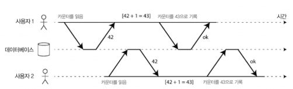
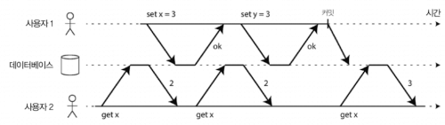
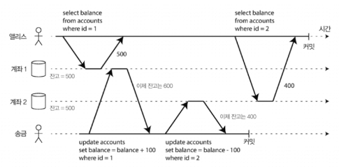
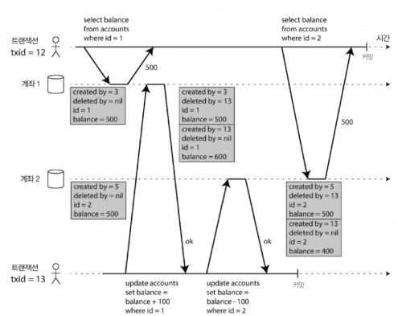

# Week5. 7장 트랜잭션 (전반)

> 7장 전반: 트랜잭션의 개념과 ACID 의미(원자성·일관성·격리성·지속성), 단일 객체 vs 다중 객체 연산, 완화된 격리 수준(커밋 후 읽기·스냅숏 격리 with MVCC), 갱신 손실(lost update) 방지 기법들(원자적 연산, 명시적 잠금, 자동 감지, compare-and-set)

---

## 7장 들어가기 전에 — 왜 트랜잭션이 필요한가?

데이터 시스템은 진짜 별의별 문제가 다 생긴다:

- DB 소프트웨어·하드웨어가 언제든지 실패할 수 있음 (쓰기 중에도)
- 애플리케이션이 연산 도중에 죽을 수 있음
- 네트워크가 끊겨서 앱·DB 연결이나 노드 간 통신이 안 될 수 있음
- 여러 클라이언트가 동시에 쓰기 해서 서로 덮어쓸 수 있음
- 부분적으로만 갱신된 데이터를 다른 클라이언트가 읽을 수 있음
- 클라이언트 사이의 경쟁 조건이 예측 못한 버그를 만들 수 있음

이런 결함을 처리 안 하면 신뢰성 있는 시스템 못 만든다. 근데 모든 결함 케이스를 일일이 다 처리하려면 노력이 어마어마하다. 그래서 등장하는 게 트랜잭션(transaction) 이다.

> 트랜잭션의 정의: 애플리케이션에서 여러 개의 읽기와 쓰기를 하나의 논리적 단위로 묶는 방법. 전체가 성공(커밋, commit) 하거나 실패(어보트, abort / 롤백, rollback) 한다. 부분적인 실패가 없다.

이게 왜 좋냐면, 트랜잭션을 쓰는 애플리케이션은 오류 처리를 훨씬 단순하게 할 수 있다. "어떤 연산은 성공하고 어떤 연산은 실패하는 경우" 같은 부분적 실패를 걱정할 필요가 없으니까.

> 트랜잭션은 자연 법칙이 아니다. 데이터베이스 접근에 관한 프로그래밍 모델을 단순화하려고 만든 것이다. 사용함으로써 어느 정도의 잠재적 오류 시나리오와 동시성 문제를 무시할 수 있다. DB가 대신 처리해주니까. 이걸 안전성 보장(safety guarantee) 이라고 한다.

---

## ACID의 의미

트랜잭션이 제공하는 안전성 보장은 흔히 ACID라는 약어로 알려져 있다 (1983년, 테오 하더 + 안드레아스 로이터가 만든 용어).

| 글자 | 의미 |
|---|---|
| A — 원자성(Atomicity) | 트랜잭션은 전부 실행되거나 전부 안 됨 (어보트 능력) |
| C — 일관성(Consistency) | 불변식(invariant)을 항상 만족 |
| I — 격리성(Isolation) | 동시 실행되는 트랜잭션이 서로 격리됨 |
| D — 지속성(Durability) | 커밋된 데이터는 손실되지 않음 |

근데 현실에서는 DB마다 ACID 구현이 제각각이다. 특히 격리성의 의미가 모호하다. ACID를 준수한다 해도 실제로 뭘 기대할 수 있을지 분명하지 않다. ACID가 마케팅 용어가 돼버렸다.

> ACID 안 따르는 시스템은 BASE라 부른다 — 기본적으로 가용성(Basically Available), 유연한 상태(Soft state), 최종적 일관성(Eventual consistency). ACID보다 더 모호하다. "ACID가 아니다"는 것 외에 의미 없음.

### A — 원자성 (Atomicity)

여러 분야에서 다 쓰는 단어인데, ACID 맥락에서는 동시성과 무관하다. 동시성은 I(격리성)의 영역.

ACID의 원자성은 이거다: 클라이언트가 여러 쓰기 작업을 실행하는 도중에 결함이 생겨도, 트랜잭션을 어보트하고 지금까지 실행한 쓰기를 무시·취소할 수 있다는 거. 결함 시나리오 예:
- 프로세스가 죽거나
- 네트워크 연결이 끊기거나
- 디스크가 가득 차거나
- 정합성 제약 조건을 위반

원자성 없이는? 여러 변경 적용 중 오류 발생 시 어떤 변경이 효과 있고 어떤 게 그렇지 않은지 알기 어렵다. 재시도하면 중복 적용 가능. 한마디로 어보트 능력(abortability) 이 원자성의 결정적 특징이다.

### C — 일관성 (Consistency)

이 단어가 굉장히 여러 의미로 쓰인다 — 한 번 정리해보자:

| 맥락 | 의미 |
|------|------|
| 복제 일관성 (5장) | 비동기 복제 시스템의 최종적 일관성 |
| 일관성 해싱 (6장) | 재균형화용 파티셔닝 방법 |
| CAP 정리 (9장) | 선형성(linearizability) |
| ACID의 C | DB가 "좋은 상태" 라는 애플리케이션 특화 개념 |

ACID의 일관성은 애플리케이션의 불변식(invariant) 개념에 의존한다. 예를 들어 회계 시스템에서 모든 계좌의 대변·차변 합. 이걸 보존하는 건 애플리케이션의 책임이다.

> C는 원래 ACID에 속하지 않는다. 조 헬러슈테인도 "이게 적절한 약어를 만들기 위해 끼워넣어진 거고 당시에는 일관성이 중요하다고 생각되지 않았다고 말함". 알고 있자.

### I — 격리성 (Isolation)

대부분 동시에 여러 클라이언트가 DB에 접근한다. 다른 부분을 읽고 쓰면 문제없지만 동일한 레코드에 접근하면 동시성 문제(경쟁 조건) 가 발생.



전형적인 예: 카운터 42를 동시에 두 클라이언트가 1 증가시키면, 격리 안 됐을 땐 결과가 43 (44가 아니라).

격리성의 가장 강한 형태는 직렬성(serializability) — 트랜잭션들이 순차적으로 하나씩 실행된 것처럼 보이도록 보장. 근데 성능 손해가 커서 현실에서는 거의 안 씀. 오라클 11g 같은 대중적 DB조차 안 함. 대신 스냅숏 격리 같은 더 약한 격리를 구현.

### D — 지속성 (Durability)

트랜잭션이 성공적으로 커밋되면 하드웨어 결함이 발생하거나 DB가 죽더라도 데이터가 손실되지 않는다는 보장.

단일 노드 DB에서는 디스크나 SSD 같은 비휘발성 저장소에 기록. WAL이 보통 동반된다. 복제 기능이 있는 DB에서는 데이터가 다른 노드 몇 개에 복사됐다는 의미.

> 완벽한 지속성은 없다. 모든 하드디스크와 백업이 동시에 파괴되면 당연히 DB가 할 수 있는 건 아무것도 없다. 디스크에 쓰기·원격 백업·복제 등 위험을 줄이는 기법을 함께 사용해야 한다. 항상 이론적인 "보장"은 약간 에누리해서 듣는 게 좋다.

---

## 단일 객체 vs 다중 객체 연산

ACID에서 원자성·격리성은 클라이언트가 한 트랜잭션 내에서 여러 번의 쓰기를 하면 DB가 어떻게 해야 하는지를 정의한다:

- 원자성: 도중에 오류 발생하면 어보트하고 이미 쓴 건 폐기
- 격리성: 동시 트랜잭션은 서로 방해 못함. 다른 트랜잭션은 전부 보거나 아무것도 못 보거나, 둘 중 하나

근데 이 정의는 한 번에 여러 객체(로우·문서·레코드) 를 변경할 수 있다고 가정. 이걸 다중 객체 트랜잭션 이라 한다.

### 단일 객체 쓰기

원자성·격리성은 단일 객체 변경에서도 적용된다. 예를 들어 20KB JSON 문서 쓰는 도중에:
- 첫 10KB 보낸 후에 네트워크가 끊기면? → 파싱 불가능한 조각 저장?
- 디스크의 기존 값에 새 값 덮어쓰는 도중 전원이 나가면? 기존·새 값이 짬뽕된 상태?
- 다른 클라이언트가 쓰는 도중에 읽으면 부분적으로만 갱신된 값을 볼까?

저장소 엔진들은 거의 보편적으로 단일 객체 수준에 원자성과 격리성을 제공한다. 원자성은 WAL로 복구 구현, 격리성은 객체별 잠금으로.

근데 단일 객체 연산은 트랜잭션이 아니다. 진정한 트랜잭션은 다중 객체에 대한 다중 연산을 하나의 실행 단위로 묶는 메커니즘이다.

> 일부 DB는 CAS(compare-and-set) 나 증가 연산 같은 좀 더 복잡한 단일 객체 연산도 제공한다. 이런 걸 "경량 트랜잭션(light-weight transaction)" 또는 마케팅 목적으로 "ACID"라고도 부르는데, 단순히 단일 객체 연산일 뿐 진짜 트랜잭션 아니다.

### 다중 객체 트랜잭션의 필요성

많은 분산 데이터스토어는 다중 객체 트랜잭션을 포기했다. 구현이 어렵고 가용성·성능에 방해되니까. 근데 분산 DB에서도 본질적으로 트랜잭션 막는 건 없다 — 9장에서 분산 트랜잭션 다룬다.

언제 다중 객체 트랜잭션이 필요한가?

- 관계형 DB: 외래 키 참조가 유효하도록 갱신해야 함
- 문서 DB: 비정규화된 정보를 동기화 — 한 번의 갱신으로 모두 갱신해야
- 보조 색인 있는 DB: 값을 변경하면 색인도 같이 갱신해야 함

트랜잭션 없이 구현할 순 있다. 근데 원자성 없으면 오류 처리가 복잡하고, 격리성 없으면 동시성 문제가 생긴다.

### 오류와 어보트 처리

트랜잭션의 핵심 기능은 오류 생기면 어보트하고 안전하게 재시도 가능하다는 것. 근데 실제로 모든 시스템이 이 철학을 따르지 않는다:

- 리더 없는 복제(다이나모 스타일): 최선을 다하지만 오류 발생 시 이미 한 일은 취소 안 함 → 오류 복구는 애플리케이션 책임
- 레일즈의 액티브레코드, 장고 같은 ORM: 어보트된 트랜잭션을 재시도 안 함. 예외 던지고 끝 → 사용자가 다시 입력해야

어보트된 트랜잭션을 재시도하는 것은 단순·효과적인 오류 처리 메커니즘이지만 완벽하지는 않다:
- 트랜잭션이 성공했는데 서버가 클라이언트 알림 도중 네트워크 끊기면? → 중복 수행 가능 (멱등성 메커니즘 필요)
- 과부하 때문이면 재시도해도 악화시킬 뿐. 지수 백오프 + 별도 처리 필요
- 일시적인 오류(데드락, 격리성 위반)만 재시도 가치. 영구적인 오류(제약 조건 위반)는 무용
- 트랜잭션이 DB 외부에 부수 효과 있으면? 이메일 두 번 발송될 수 있음

---

## 완화된 격리 수준 (Weak Isolation Levels)

직렬성 격리는 이론적으로 깔끔하지만 성능 손해가 너무 크다. 그래서 대부분의 DB는 완화된 격리 수준(약한 격리) 을 제공한다. 그러나 이건 동시성 버그를 유발할 수 있다.

> 완화된 트랜잭션 격리가 유발한 동시성 버그는 단지 이론적 문제만이 아니다. 상당한 금전적 손실을 일으켰고, 재무 감사원의 조사를 받게 만들었으며, 고객 데이터를 오염시켰다.

명목적으로 도구에 의존하기보단, 존재하는 동시성 문제의 종류를 잘 이해하고 방지하는 방법을 배울 필요가 있다.

---

### 격리 수준 1: 커밋 후 읽기 (Read Committed)

가장 기본적인 격리 수준. 두 가지 보장:

1. DB에서 읽을 때 커밋된 데이터만 본다 (더티 읽기 없음)
2. DB에 쓸 때 커밋된 데이터만 덮어쓴다 (더티 쓰기 없음)

#### 더티 읽기 방지

다른 트랜잭션이 썼지만 아직 커밋 안 된 데이터를 보면 → 더티 읽기(dirty read).



사용자 1이 `x = 3`을 set했지만 사용자 2의 `get x`는 아직 커밋 전이라 기존값 2를 본다.

더티 읽기 막는 이유:
- 부분적으로 갱신된 상태의 DB → 다른 트랜잭션을 혼란스럽게
- 어보트되면 그 내용을 봤던 트랜잭션이 잘못된 결정 내림. 어보트면 봤던 것조차 거짓이 됨

#### 더티 쓰기 방지

먼저 쓴 내용이 아직 커밋 안 된 트랜잭션의 데이터인데 그 위에 두 번째 쓰기로 덮어쓰면? → 더티 쓰기(dirty write).

커밋 후 읽기는 더티 쓰기를 지연시키는 방법으로 막는다. 그림 7-5의 중고차 판매 예제: 차 등록은 앨리스가 했는데 청구서는 밥에게 가는 경우 방지.

> 근데 갱신 손실 문제는 못 막음 (242쪽 "갱신 손실 방지" 참고).

#### 구현

오라클 11g, PostgreSQL, SQL Server 2012, MemSQL 등이 기본값. 

- 더티 쓰기 방지: 로우 수준 잠금(row-level lock). 트랜잭션이 객체 변경 원하면 잠금 획득, 커밋·어보트까지 보유. 딱 한 트랜잭션만 해당 객체에 잠금.
- 더티 읽기 방지: 잠금 방식은 응답 시간이 너무 김 → 다른 방식 사용. 각 객체의 옛 커밋된 값과 새 값을 둘 다 기억 → 트랜잭션 진행 중이면 다른 읽는 트랜잭션에 옛 값 반환. 커밋되면 새 값 반환.

---

### 격리 수준 2: 스냅숏 격리 (Snapshot Isolation)와 반복 읽기

커밋 후 읽기로도 못 막는 동시성 버그가 있다.



시나리오: 앨리스가 1000달러 저축. 두 계좌에 500달러씩. 한 계좌에서 다른 계좌로 100달러 송금 트랜잭션 실행. 앨리스가 운 나쁘게 송금 중간에 잔고 조회.

- 계좌 1 (송금 전): 500달러
- 계좌 2 (송금 후): 600달러 ← 100 받음

→ 앨리스는 총 1100달러로 보이거나 900달러로 보일 수 있음. 100달러가 사라진 것처럼 보임.

이런 이상 현상을 비반복 읽기(nonrepeatable read) 또는 읽기 스큐(read skew) 라고 한다.

> 스큐(skew) 라는 용어가 헷갈리는데, 이전 6장 "쏠린 작업부하와 핫스팟 완화"에서 핫스팟 의미였다. 여기선 타이밍 이상 현상(timing anomaly) 의미. 같은 단어 다른 뜻.

#### 읽기 스큐가 진짜 문제인 경우

- 백업: 시간이 오래 걸려서 도중에 트랜잭션 실행. 백업에 옛 부분 + 새 부분 섞이면 → 비일관성이 영속화
- 분석 질의와 무결성 확인: 대규모 분석 작업, 무결성 일관성 모니터링

#### 해결책: 스냅숏 격리

각 트랜잭션은 DB의 일관된 스냅숏으로부터 읽는다. 트랜잭션 시작 시점에 커밋된 모든 데이터를 본다. 다른 트랜잭션이 나중에 데이터 바꿔도 영향 없음.

> 스냅숏 격리는 백업, 분석, 무결성 확인 같은 오래 걸리는 읽기 질의에 매우 유용하다. PostgreSQL, MySQL InnoDB, 오라클, SQL Server 모두 지원.

#### 스냅숏 격리 구현 — MVCC

핵심 원리는 읽는 쪽에서 쓰는 쪽을 결코 차단하지 않고 쓰는 쪽에서 읽는 쪽을 결코 차단하지 않는 것.

스냅숏 격리 구현 위해 각 객체의 여러 커밋된 버전을 유지 → 다중 버전 동시성 제어(MVCC, Multi-Version Concurrency Control).



작동 방식 (PostgreSQL 기준):
- 트랜잭션은 고유한 트랜잭션 ID(txid) 받음. 증가하는 정수
- 테이블의 각 로우에는 `created_by` 필드 (그 로우를 삽입한 txid)
- 처음엔 비어있는 `deleted_by` 필드 — 트랜잭션이 로우 삭제하면 이 필드에 삭제 요청한 txid 설정
- 나중에 다른 트랜잭션 없으면 가비지 컬렉션
- 갱신은 내부적으로 삭제 + 생성으로 변환

#### 일관된 스냅숏을 보는 가시성 규칙

트랜잭션이 객체 읽을 때 어떤 게 보일지 결정하는 가시성 규칙:

1. 트랜잭션 시작 시점에 진행 중(아직 커밋 또는 어보트 X)인 트랜잭션 목록 → 이들이 쓴 건 무시
2. 어보트된 트랜잭션이 쓴 데이터 → 모두 무시
3. 트랜잭션 ID가 더 큰 (즉 현재 트랜잭션이 시작한 후 시작한) 트랜잭션이 쓴 데이터 → 무시
4. 그 외 모든 데이터는 애플리케이션의 질의에 보임

#### 색인과 스냅숏 격리

다중 버전 DB에서 색인은 어떻게 동작? 단순하게는 색인이 객체의 모든 버전을 가리킴.

- PostgreSQL: 다른 버전들이 같은 페이지에 저장될 수 있다면 색인 갱신 회피 최적화
- CouchDB, Datomic, LMDB: 추가 전용/copy-on-write B 트리 사용. 갱신 시 루트부터 새 버전 생성. 트리 자체가 일관된 스냅숏

#### 반복 읽기와 혼란스러운 이름

> 스냅숏 격리를 부르는 이름이 DB마다 다르다.
>
> - 오라클: 직렬성(serializability)
> - PostgreSQL, MySQL: 반복 읽기(repeatable read)
>
> SQL 표준은 1975년에 만들어져서 그땐 스냅숏 격리가 없었음. 표면적으로 비슷한 "반복 읽기"라는 이름을 가져다 쓴 거. 결과적으로 "반복 읽기"가 무슨 뜻인지 실제로 아는 사람은 없다.

---

## 갱신 손실 방지 (Lost Update Prevention)

지금까지 커밋 후 읽기·스냅숏 격리는 주로 동시 쓰기 작업 있을 때 읽기 전용 트랜잭션이 보이는 것에 관련된 보장이었다. 두 트랜잭션이 동시에 쓰기 실행할 때 충돌은 거의 무시됐다. 단지 발생할 수 있는 쓰기 충돌은 더티 쓰기에 대해서만.

흥미로운 충돌 중 가장 널리 알려진 건 갱신 손실(lost update) 문제.

시나리오: 두 트랜잭션이 read-modify-write를 동시에 실행. 첫 번째 쓰기가 다른 트랜잭션에서 변경한 것 모르고 → 나중 쓰기가 먼저 쓴 것을 때려눕힘(clobber) 한다.

발생할 수 있는 패턴:
- 카운터 증가, 계좌 잔고 갱신 (값 읽고 변경한 새 값 계산하고 새 값 다시 써야)
- 복잡한 값 지역적 변경 (JSON 문서의 리스트에 요소 추가)
- 두 사용자가 동시에 위키 페이지 편집 (서버 전송, 덮어 쓰기 사용)

다양한 해결책이 개발됐다.

### 1. 원자적 쓰기 연산 (Atomic Write Operations)

많은 DB가 원자적 갱신 연산 제공 — read-modify-write 주기 필요 없게.

```sql
UPDATE counters SET value = value + 1 WHERE key = 'foo';
```

- MongoDB: JSON 문서 일부 지역적 변경 원자적 연산
- 레디스: 우선순위 큐 같은 데이터 구조 변경 원자적 연산

원자적 연산은 객체 읽을 때 그 객체에 독점적 잠금을 획득해서 구현 (= 커서 안정성, cursor stability). 또는 모든 원자적 연산을 단일 스레드에서 실행하도록 강제.

> 객체 관계형 매핑 프레임워크 쓰면 무심결에 안정된 원자적 연산 대신 불안정한 read-modify-write 코드를 작성하기 쉽다. 잠재적 버그.

### 2. 명시적인 잠금 (Explicit Locking)

DB 내장 원자적 연산이 부족할 때, 애플리케이션이 명시적으로 객체 잠금.

```sql
BEGIN TRANSACTION;
SELECT * FROM figures
  WHERE name = 'robot' AND game_id = 222
  FOR UPDATE;  -- 잠금 획득

-- 이동이 유효한지 확인 후
UPDATE figures SET position = 'c4' WHERE id = 1234;
COMMIT;
```

`FOR UPDATE`가 이 질의에 의해 반환된 모든 로우에 잠금 획득. 동작은 잘 되지만 올바르게 동작시키려면 신중하게 생각해야 한다. 코드 어딘가에서 잠금을 잊으면 경쟁 조건 유발.

### 3. 갱신 손실 자동 감지 (Automatic Detection)

대안: 원자적 연산과 잠금이 read-modify-write를 강제하는 방식. 대신 트랜잭션 병렬 실행 허용하고 갱신 손실 발견되면 어보트시키고 재시도 강제.

이 방법의 이점은 스냅숏 격리와 결합해 효율적.

- PostgreSQL의 반복 읽기, 오라클의 직렬성, SQL 서버의 스냅숏 격리 → 자동 감지하고 어보트
- MySQL/InnoDB의 반복 읽기: 갱신 손실 감지 X — 일부 저자는 이거면 갱신 손실 방지로 자격 X라 주장

> 애플리케이션이 어떤 특별한 DB 기능도 쓸 필요 없이 도와주므로 매우 좋은 기능. 잠금이나 원자적 연산 사용을 잊어버려도 버그 유발 가능성 있지만 자동으로 갱신 손실 감지돼서 오류 덜 발생.

### 4. Compare-and-set

트랜잭션 제공하지 않는 DB에서 원자적 compare-and-set 연산 제공하는 경우. 값을 마지막으로 읽은 후로 변경되지 않았을 때만 갱신 허용.

```sql
-- 위키 페이지 갱신
UPDATE wiki_pages SET content = 'new content'
  WHERE id = 1234 AND content = 'old content';
```

내용이 바뀌어서 `'old content'`와 일치 안 하면 갱신 적용 안 됨. 갱신이 적용됐는지 확인하고 필요하다면 재시도해야.

> 주의: DB가 WHERE 절에 오래된 스냅숏으로부터 읽는 것 허용한다면 이 구문은 갱신 손실 못 막을 수도. 동시 다른 쓰기 작업과 조건이 참 될 수 있음. DB의 compare-and-set 연산에 의존하기 전 먼저 안전한지 확인 필요.

### 5. 충돌 해소와 복제

복제 시스템(5장)에서 갱신 손실 방지는 다른 차원의 문제. 여러 노드에 데이터 복사본이 있어 다른 노드들에서 동시에 변경 가능 → 추가 단계 필요.

잠금이나 compare-and-set은 최신 복사본이 하나만 있다고 가정. 근데 다중 리더/리더 없는 복제는 여러 쓰기가 동시 실행되고 비동기로 복제되는 것 허용 → 최신 복사본 하나만 있으리라 보장 못함.

(이 절은 다음 장에서 이어진다.)

---

## 5장 7장 전반 마무리 — 핵심 정리

이번 주차는 트랜잭션 전반부 (7장 ~241페이지, 갱신 손실 방지까지).

| 주제 | 핵심 |
|------|------|
| 트랜잭션 정의 | 여러 읽기·쓰기를 하나의 논리적 단위로. 안전성 보장으로 애플리케이션 단순화 |
| ACID 4가지 | 원자성(어보트 가능), 일관성(앱 책임), 격리성(동시성), 지속성(영속) |
| 단일 vs 다중 객체 | 단일 객체 원자성·격리성은 거의 보편적. 다중 객체 트랜잭션이 진짜 트랜잭션 |
| 커밋 후 읽기 | 더티 읽기·더티 쓰기 방지. 가장 기본 격리 수준 |
| 스냅숏 격리 (MVCC) | 트랜잭션이 일관된 스냅숏 보기. 백업·분석·읽기 스큐 방지에 유용 |
| 갱신 손실 | read-modify-write 동시 실행 시 발생. 원자적 연산·명시적 잠금·자동 감지·CAS로 방지 |

### 격리 수준 비교

| 격리 수준 | 방지하는 이상 | 허용되는 이상 |
|----------|-------------|--------------|
| 커밋 후 읽기 (Read Committed) | 더티 읽기, 더티 쓰기 | 읽기 스큐, 갱신 손실, 쓰기 스큐, 팬텀 |
| 스냅숏 격리 (Snapshot Isolation) | + 읽기 스큐, 갱신 손실(일부 DB) | 쓰기 스큐, 팬텀 |
| 직렬성 (Serializable) | 전부 방지 | — |

### 갱신 손실 방지 기법 정리

| 기법 | 설명 | 트레이드오프 |
|------|------|-------------|
| 원자적 연산 | `UPDATE ... SET value = value + 1` 같은 DB 내장 | 모든 케이스 커버 X (ORM에서 무심결에 안 쓰기 쉬움) |
| 명시적 잠금 | `SELECT FOR UPDATE` | 잠금 누락 시 경쟁 조건 |
| 자동 감지 | DB가 알아서 갱신 손실 감지 → 어보트 | 일부 DB만 지원 (MySQL InnoDB 반복 읽기는 X) |
| Compare-and-set | `WHERE content = 'old'` | 오래된 스냅숏 읽기 허용 시 손실 가능 |
| 충돌 해소 (복제) | 다중 리더/리더 없는 환경에서 추가 단계 필요 | 5장 동시 쓰기 감지 참고 |

다음 주차(week6, 7장 후반)는 쓰기 스큐(write skew)와 팬텀, 직렬성 격리 같은 더 어려운 동시성 문제들 + 직렬성 격리 구현 기법(실제 직렬 실행·2PL·SSI). 격리성에 대한 마지막 퍼즐 조각들이다.
