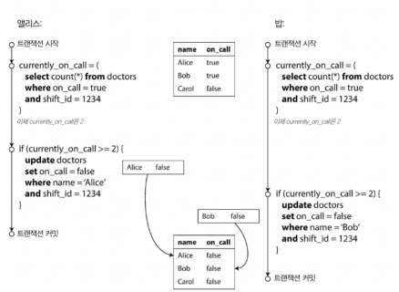
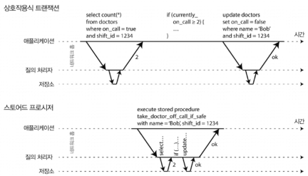
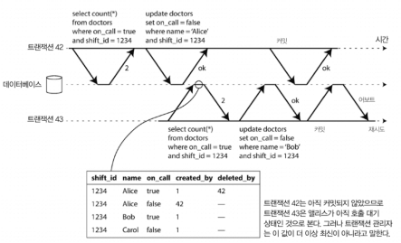
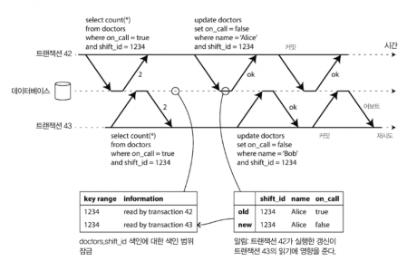

a# Week6. 7장 트랜잭션 (후반)

> 7장 후반: write skew와 phantom, serializable isolation을 구현하는 3가지 방법 — serial execution(stored procedure), 2PL(two-phase locking), SSI(serializable snapshot isolation)

---
[지난주(week5)](../week05/README.md)에서 봤던 격리 수준 정리:

| 격리 수준 | 막아주는 것 | 못 막는 것 |
|---|---|---|
| Read Committed | dirty read / dirty write | read skew, lost update, write skew, phantom |
| Snapshot Isolation (MVCC) | + read skew, lost update(일부) | write skew, phantom |

이번 주는 마지막에 남은 write skew·phantom, 그리고 이 모든 걸 한 방에 막아주는 serializable isolation의 구현 방법 3가지를 본다.

---

## Write Skew (쓰기 스큐)

지금까지 본 동시성 문제는 dirty write, lost update였다. 근데 더 미묘한 게 하나 더 있다.

의사 on-call 예제 — 병원에서 항상 최소 한 명의 의사는 on-call(호출 대기) 상태여야 한다.



앨리스와 밥, 둘 다 on-call 중. 둘 다 몸이 안 좋아서 거의 동시에 "대기 해제" 버튼을 누른다.

1. 앨리스 transaction: "현재 2명 이상 on-call?" → YES (2명) → 앨리스 본인 해제
2. 밥 transaction: "현재 2명 이상 on-call?" → YES (2명, snapshot) → 밥 본인 해제
3. 결과: 0명 on-call → 요구사항 위반!

두 transaction이 서로 다른 객체(앨리스 레코드 / 밥 레코드)를 갱신해서 dirty write도 lost update도 아니다. 이런 이상 현상을 write skew라고 한다.

> write skew = lost update의 일반화. lost update는 두 transaction이 같은 객체를 건드릴 때, write skew는 다른 객체를 읽고 그중 일부를 갱신할 때. 타이밍에 따라 dirty write나 lost update로 보일 수도 있다.

### Write skew를 막는 방법은 제한적이다

| 방법 | 가능 여부 |
|------|----------|
| 원자적 single-object 연산 | ✗ (여러 객체 관련) |
| lost update 자동 감지 | ✗ (PostgreSQL Repeatable Read, MySQL/InnoDB, Oracle Serializable, SQL Server Snapshot Isolation 모두 자동 감지 X) |
| DB constraint | △ (대부분 multi-object constraint 미지원, trigger·materialized view로 우회 가능) |
| Serializable isolation | ✓ (가장 확실) |
| 명시적 lock (`FOR UPDATE`) | ✓ (serializable 못 쓸 때 차선책) |

```sql
BEGIN TRANSACTION;
SELECT * FROM doctors
  WHERE on_call = true AND shift_id = 1234 FOR UPDATE;  -- explicit lock

UPDATE doctors SET on_call = false
  WHERE name = 'Alice' AND shift_id = 1234;
COMMIT;
```

### Write skew의 다양한 사례

| 사례 | 시나리오 |
|------|---------|
| 회의실 중복 예약 | 두 사람이 동시에 같은 회의실·시간대를 예약 |
| 멀티플레이어 게임 | 두 플레이어가 동시에 같은 말을 다른 위치로 이동 |
| username 선점 | 두 사용자가 동시에 같은 username으로 계정 생성 시도 (unique constraint로 막을 수 있음) |
| double-spending(이중 사용) | 사용자가 가진 것 이상으로 지불 — 두 지불 항목이 동시 삽입되어 음수 잔고 |

### Write skew를 유발하는 Phantom

이 모든 예제는 같은 패턴을 따른다:

1. SELECT로 어떤 검색 조건에 부합하는 row 검색 (의사 2명 이상? 회의실 비었나?)
2. 그 결과에 따라 애플리케이션이 동작 결정
3. 애플리케이션이 DB에 write(INSERT/UPDATE/DELETE) → 1단계 결과(전제, premise)를 바꿈

> Phantom: 한 transaction의 write가 다른 transaction의 검색 query 결과를 바꾸는 효과. write skew는 보통 phantom 때문에 발생한다.

문제는 lock 걸 객체가 존재하지 않을 때다. 의사 on-call 예제는 1단계 row를 `FOR UPDATE`로 lock 걸면 되지만, 회의실 예약처럼 "아직 없는" 예약은 lock 걸 게 없다. `SELECT FOR UPDATE`는 아무 row도 반환 안 하면 lock 못 건다.

### Materializing Conflicts (충돌 구체화)

phantom의 문제가 "lock 걸 객체가 없다"는 거라면 → 인위적으로 lock용 객체를 DB에 추가하자.

회의실 예약이면 (회의실, 15분 time slot) 조합마다 미리 row를 다 만들어둔다. 예약 transaction은 그 row를 `FOR UPDATE`로 lock 건다.

> 그러나 권장 안 함. materializing conflicts는 어렵고 오류가 잘 나며, concurrency control 메커니즘이 데이터 모델에 새어 나오는 게 보기 안 좋다. 최후의 수단으로만. 대부분 serializable isolation이 훨씬 낫다.

---

## Serializability (직렬성)

여기까지 보면 격리 수준은 이해하기 어렵고 DB마다 구현 일관성이 없고, level 골라도 동시성 버그를 다 못 막는다. 슬픈 소식이다. 근데 해결책이 있다.

Serializable isolation = 가장 강력한 격리 수준. 여러 transaction이 병렬 실행돼도 최종 결과가 transaction을 하나씩 순차(serial) 실행한 것과 같음을 보장. 모든 race condition을 막아준다.

근데 왜 다들 안 쓰냐? 구현 방법이 3가지인데 각각 trade-off가 있다:

| 방법 | 한 줄 요약 |
|------|-----------|
| Serial Execution | 진짜로 한 번에 transaction 하나씩 |
| 2PL (Two-Phase Locking) | 30년간 표준이었던 lock 방식 |
| SSI (Serializable Snapshot Isolation) | 낙관적 concurrency control, 2008년 등장한 신예 |

---

### 방법 1: Serial Execution (실제적인 직렬 실행)

가장 단순한 방법: 동시성을 아예 제거. single thread에서 transaction 하나씩 순차 실행.

오랫동안 "이건 불가능하다"고 여겨졌는데, 2007년경부터 가능해진 이유:

- RAM이 싸짐 → 많은 경우 active dataset 전체를 메모리에 유지 가능. transaction이 disk 대기 안 하니 빠름
- OLTP transaction은 보통 짧고 read/write 수가 적음 → 분석 query는 snapshot isolation으로 따로

구현 사례: VoltDB/H-Store, Redis, Datomic.

#### Transaction을 Stored Procedure 안에 캡슐화

문제: 사람의 입력을 기다리는 interactive transaction은 network·사람 대기 때문에 single thread에서 너무 느리다.



그래서 serial execution DB는 interactive multi-statement transaction을 금지하고, transaction 코드 전체를 stored procedure 형태로 미리 제출하게 한다. 데이터가 다 메모리에 있으면 network/disk 대기 없이 빠르게 실행.

| Stored procedure 장점 | 단점 |
|---|---|
| network round-trip 제거 → 빠름 | DB 벤더마다 언어가 제각각 (Oracle PL/SQL, T-SQL 등) — 낡고 못생김 |
| 데이터 다 메모리에 있으면 매우 빠름 | 관리 어려움 (디버깅·버전 관리·테스트·모니터링 통합 어려움) |
| | DB가 app server보다 성능 민감 — 잘못 짠 procedure가 큰 문제 |

> 현대 구현은 PL/SQL 버리고 범용 언어 사용. VoltDB는 Java/Groovy, Datomic은 Java/Clojure, Redis는 Lua.

#### Partitioning

serial execution은 single CPU core 속도에 throughput이 제한된다. 각 partition이 독립적인 transaction 처리 thread를 가지면 CPU core 수에 맞춰 linear 확장 가능 (VoltDB).

근데 여러 partition에 걸친 transaction은 추가 coordination overhead가 있어서 single-partition 대비 수십~수백배 느리다. 데이터 구조에 따라 single-partition transaction으로 만들 수 있는지가 갈린다 (secondary index 있으면 여러 partition 걸칠 가능성 ↑).

#### Serial Execution 요약 — 제약 조건

- 모든 transaction이 작고 빨라야 함 (느린 거 하나가 전체 지연)
- active dataset이 메모리에 들어가야 함
- write throughput이 single CPU core 처리 가능 수준이어야
- 여러 partition 걸친 transaction은 가능하지만 엄격한 제한

---

### 방법 2: 2PL (Two-Phase Locking, 2단계 잠금)

약 30년간 DB에서 serializability 구현하는 거의 유일한 알고리즘이었다.

> 2PL ≠ 2PC. 2PL(two-phase locking)과 2PC(two-phase commit)는 이름만 비슷하지 완전히 다르다. 2PC는 9장에서 다룬다.

dirty write 막을 때 본 lock보다 요구사항이 훨씬 강하다:

- writer는 다른 writer뿐 아니라 reader도 막는다. 그 역도 성립.
- snapshot isolation의 원칙("reader는 writer 안 막고, writer는 reader 안 막음")과 정반대
- 모든 race condition(lost update·write skew 포함)으로부터 보호

#### 구현 — Shared mode / Exclusive mode

각 객체에 lock. 두 가지 mode:

| Mode | 동작 |
|------|------|
| Shared lock | read용. 여러 transaction이 동시에 shared lock OK. 단 exclusive lock이 있으면 대기 |
| Exclusive lock | write용. 다른 어떤 lock이라도 있으면 대기 |

- read하다 write하려면 shared → exclusive upgrade
- "two-phase"인 이유: 1단계(transaction 실행 중) lock 획득, 2단계(끝날 때) 전부 해제

#### 2PL의 약점

| 약점 | 설명 |
|------|------|
| Deadlock(교착 상태) | A가 B lock 기다리고, B가 A lock 기다림. DB가 자동 감지해서 한쪽 abort |
| 성능 | lock 획득/해제 overhead + 동시성 감소. 응답 시간이 매우 불안정, 높은 백분위(p99) 매우 느림 |

> 2PL deadlock은 snapshot isolation의 lost update 자동 감지보다 훨씬 자주 발생. deadlock으로 abort되면 작업을 처음부터 다시 해야 한다.

#### Predicate Lock (서술 잠금)

phantom(아직 없는 객체) 막으려면? 검색 조건에 부합하는 모든 객체에 거는 lock.

```sql
SELECT * FROM bookings
  WHERE room_id = 123 AND
    end_time > '2018-01-01 12:00' AND
    start_time < '2018-01-01 13:00';
```

이 조건에 맞는 아직 존재하지 않는 객체(phantom)에도 적용된다. 이게 2PL이 모든 형태의 write skew를 막아 serializable이 되는 핵심.

#### Index-Range Locking (색인 범위 잠금, Next-Key Locking)

predicate lock은 현실에서 성능이 너무 안 좋다 (조건 부합 lock 확인이 오래 걸림). 그래서 대부분의 2PL DB는 index-range locking으로 근사한다.

- predicate 조건을 간략화 (room_id 123이면 123번 방 전체 lock, 또는 정오~1시 전체 시간대 lock)
- 정밀하진 않지만 overhead가 훨씬 낮아 좋은 타협안
- 적당한 index 없으면 table 전체에 shared lock (성능 안 좋지만 안전)

---

### 방법 3: SSI (Serializable Snapshot Isolation)

serializability(성능 ↓)와 snapshot isolation(성능 ↑ 하지만 약함) — 둘 다 가질 순 없을까?

SSI: 완전한 serializability 제공하면서 snapshot isolation 대비 약간의 성능 손해만. 2008년 Michael Cahill 박사 논문에서 처음 등장한 신예. PostgreSQL 9.1+, FoundationDB가 사용.

#### 비관적 vs 낙관적 Concurrency Control

| 구분 | 비관적 (2PL) | 낙관적 (SSI) |
|------|-------------|--------------|
| 철학 | "뭔가 잘못될 수 있으면 안전할 때까지 대기" | "잘 되겠지" 하고 계속 진행, commit 시 검사 |
| 동작 | lock으로 차단 | conflict 감지되면 abort 후 재시도 |
| 좋을 때 | 경쟁(contention) 심할 때 | 경쟁 안 심하고 예비 용량 충분할 때 |

SSI는 snapshot isolation 기반 + serializable conflict를 감지하고 abort시킬 transaction 결정하는 알고리즘 추가.

#### 뒤처진 Premise(전제)에 기반한 결정

write skew 패턴은 결국: transaction이 어떤 데이터를 읽고(premise), 그 결과로 동작 결정, DB에 씀. 근데 snapshot isolation에서는 commit 시점에 그 premise가 더 이상 참이 아닐 수 있다.

DB가 "premise가 바뀌었는지" 알아채는 두 가지 상황:

① stale(오래된) MVCC read 감지



transaction이 read할 때 MVCC가 (아직 commit 안 된) 다른 transaction write를 무시했는데, 그 write가 commit되는 경우. DB는 무시된 write를 추적하다가, transaction commit하려 할 때 무시했던 게 commit됐으면 abort.

> 왜 commit 때까지 기다림? read-only transaction이면 write skew 위험 없으니 abort 불필요. commit 시점엔 stale이 아닐 수도 있음. 불필요한 abort 줄이려는 것.

② 과거의 read에 영향을 미치는 write 감지



2PL의 index-range locking과 비슷하지만 reader를 차단 안 함. transaction이 읽은 데이터에 누가 write하면 "네 읽은 데이터 이제 최신 아냐"라고 tripwire(지뢰선) 처럼 알려줌. commit하려 할 때 conflict하는 write가 이미 commit됐으면 abort.

#### SSI의 성능

- trade-off: read/write 추적을 얼마나 정밀하게 할지. 정밀하면 abort 적지만 기록 overhead ↑
- 2PL 대비 큰 이점: reader가 writer 안 막고, writer가 reader 안 막음 → 응답 시간 예측 쉽고 변동 적음. read-heavy workload일 때 매력적
- serial execution 대비: single CPU core throughput에 안 묶임. FoundationDB는 conflict 감지를 여러 장비로 분산 → 높은 throughput + partition 넘는 serializability
- abort rate가 전체 성능에 큰 영향 → 오래 read/write하는 transaction은 conflict·abort 쉬워서 SSI는 짧은 transaction을 선호

---

## 7장 후반 마무리 — 핵심 정리

### 동시성 이상 현상(anomaly) 총정리

| Anomaly | 한 줄 설명 | 막는 격리 수준 |
|----------|------|--------------|
| Dirty Read | commit 안 된 데이터 읽음 | Read Committed |
| Dirty Write | commit 안 된 데이터 덮어씀 | Read Committed |
| Read Skew (non-repeatable read) | 다른 시점의 데이터 부분을 봄 | Snapshot Isolation (MVCC) |
| Lost Update | 동시 read-modify-write로 한쪽 write 사라짐 | Snapshot Isolation(일부) / 명시 lock |
| Write Skew | premise 읽고 쓰는데, write 시 premise가 거짓이 됨 | Serializable |
| Phantom | 한 transaction write가 다른 transaction 검색 결과를 바꿈 | Serializable |

### Serializable Isolation 구현 3가지 비교

| 방법 | 핵심 | 장점 | 단점 |
|------|------|------|------|
| Serial Execution | single thread 순차 실행 | 단순, 빠름(in-memory) | 작은 transaction·메모리·single-core 제약 |
| 2PL | shared/exclusive lock | 30년 검증된 표준 | deadlock, 성능 변동 큼 |
| SSI | 낙관적 + conflict 감지 | reader/writer 안 막음, 확장성 | abort rate가 성능 좌우 |

완화된(weak) 격리 수준은 anomaly 일부만 막아주고 나머지는 애플리케이션 개발자가 수동으로 처리해야 한다(explicit lock 등). serializable isolation은 이 모든 문제로부터 보호해준다.

> 이번 장은 single-machine 맥락. 분산 DB에서 transaction은 새로운 종류의 어려움(다음 8·9장)에 직면한다. 7장 전반에서 본 ACID·격리 수준 위에, 분산 환경의 fault·consensus 문제가 얹히면 진짜 복잡해진다.
