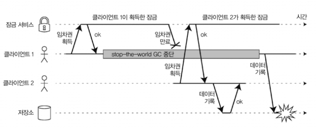
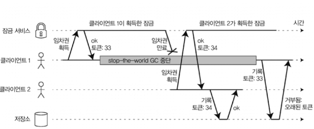

# Week8. 8장 분산 시스템의 골칫거리

> 8장 후반: 프로세스 중단(stop-the-world GC, VM 서스펜드 등)과 임차권의 함정, 응답 시간 보장과 실시간 시스템, GC 영향 줄이기 / 지식, 진실, 거짓말 — 다수결로 정해지는 진실(정족수), 리더와 잠금, 펜싱 토큰 / 비잔틴 결함과 약한 형태의 거짓말 / 시스템 모델(동기, 부분 동기, 비동기 × crash-stop, crash-recovery, 비잔틴), 안전성과 활동성

---

8장 전반에서는 분산 시스템이 단일 컴퓨터와 뭐가 다른지를 신뢰할 수 없는 네트워크(패킷이 유실, 지연됨)와 신뢰할 수 없는 시계(노드마다 시간이 안 맞고 갑자기 튐) 관점에서 봤다. 이번 후반부는 거기에 마지막 골칫거리 하나를 더 얹는다 — 프로세스가 아무 예고 없이 한참 멈출 수 있다는 것. 그리고 이 세 가지(네트워크, 시계, 중단)를 다 합쳐서, "그럼 분산 시스템에서 도대체 뭘 믿을 수 있는가?"라는 질문으로 장을 마무리한다.

---

## 프로세스 중단 (Process Pauses)

분산 시스템에서 시계를 위험하게 쓰는 또 다른 예를 보자. 파티션마다 리더가 하나씩 있는 DB를 생각해보자. 리더만 쓰기를 받아들일 수 있다. 근데 어떤 노드가 자기가 여전히 리더가 맞는지(다른 노드들이 날 죽었다고 선언하지 않았는지), 그래서 안전하게 쓰기를 받아도 되는지 어떻게 알 수 있을까?

한 가지 방법은 리더가 다른 노드들로부터 임차권(lease) 을 얻는 것이다. 타임아웃 있는 잠금이라고 보면 된다. 특정 시점엔 오직 한 노드만 임차권을 가질 수 있다. 임차권을 얻으면 만료될 때까지 자신이 리더라는 걸 알 수 있고, 계속 리더로 남으려면 만료 전에 주기적으로 갱신해야 한다. 노드에 장애가 나면 갱신을 멈추니까 임차권이 만료되고, 그때 다른 노드가 리더를 넘겨받는다.

요청 처리 루프는 대략 이렇게 생겼다:

```java
while (true) {
    request = getIncomingRequest();

    // 항상 임차권이 적어도 10초는 남아 있게 보장한다
    if (lease.expiryTimeMillis - System.currentTimeMillis() < 10000) {
        lease = lease.renew();
    }

    if (lease.isValid()) {
        process(request);
    }
}
```

이 코드, 뭐가 잘못됐을까?

첫째, 동기화된 시계에 의존한다. 임차권 만료 시간은 다른 장비에서 설정됐는데(예: 현재 시간 + 30초), 그걸 로컬 시계(`System.currentTimeMillis()`)랑 비교한다. 두 시계가 몇 초만 어긋나도 이 코드는 이상한 짓을 하기 시작한다.

둘째, 로컬 단조 시계만 쓰도록 고쳐도 또 문제가 있다. 이 코드는 시간을 확인하는 시점(`System.currentTimeMillis()`)과 요청을 실제로 처리하는 시점(`process(request)`) 사이에 아주 짧은 시간만 흐른다고 가정한다. 보통은 이 코드가 워낙 빨리 돌아서 10초 버퍼면 차고 넘친다.

근데 프로그램 실행 중에 예상치 못한 중단이 끼어들면? `lease.isValid()` 줄 근처에서 스레드가 마지막으로 진행하기 직전에 15초 동안 멈췄다고 해보자. 그럼 정작 요청을 처리하는 시점엔 이미 임차권이 만료돼서 다른 노드가 리더를 넘겨받았을 가능성이 높다. 근데 이 스레드한테 "너 너무 오래 멈춰 있었어"라고 아무도 말해주지 않으니까, 이 코드는 다음 루프를 돌기 전까지 임차권이 만료된 줄도 모른다. 알아챘을 땐 이미 요청을 처리해서 뭔가 안전하지 않은 일을 저지른 뒤일 수도 있다.

> 스레드가 그렇게 오래 멈춘다는 게 말이 되냐고? 유감스럽게도 된다. 이런 일이 생기는 이유는 생각보다 많다.

| 중단 원인 | 설명 |
|---|---|
| stop-the-world GC | 자바 JVM 같은 런타임의 가비지 컬렉터는 가끔 모든 스레드를 멈춰야 한다. 때로는 몇 분씩 지속된다. 핫스팟의 CMS처럼 "동시적(concurrent)" GC라도 앱 코드와 완전히 병렬로 못 돈다 — 얘들도 때때로 stop-the-world가 필요하다. 튜닝으로 줄일 순 있어도 견고한 보장을 원하면 최악을 가정해야 한다. |
| VM 서스펜드/라이브 이전 | 가상 환경에서는 가상 장비를 통째로 서스펜드(모든 실행을 멈추고 메모리를 디스크에 저장)했다가 재개할 수 있다. 재부팅 없이 가상 장비를 다른 호스트로 옮기는 라이브 이전(live migration) 에 쓰이는데, 이때 중단 길이는 프로세스가 메모리에 쓰는 속도에 달렸다. |
| 노트북 덮개 | 사용자가 노트북 덮개를 닫으면 그냥 서스펜드됐다가 나중에 재개된다. |
| 컨텍스트 스위치 / steal time | OS가 다른 스레드로 컨텍스트 스위치하거나, 하이퍼바이저가 다른 VM으로 스위치하면 현재 스레드는 코드 임의 지점에서 멈출 수 있다. 다른 VM이 쓴 CPU 시간을 스틸 타임(steal time) 이라 한다. 장비 부하가 높으면 다시 실행되기까지 한참 걸릴 수도. |
| 동기 디스크 I/O | 동기식으로 디스크에 접근하면 느린 I/O가 끝날 때까지 멈춘다. 코드에 디스크 접근이 명시 안 돼 있어도 일어난다 — 예: 자바 클래스로더의 lazy 로딩, (아마존 EBS 같은) 네트워크 블록 장치. |
| 디스크 스왑(페이징) | 메모리가 빡빡하면 단순 메모리 접근만으로도 페이지 폴트가 나서 디스크에서 페이지를 로딩한다. 극단적으론 OS가 페이지를 안팎으로 스와핑하느라 정작 일은 거의 못 하는 스래싱(thrashing) 에 빠진다. |
| SIGSTOP | 유닉스 프로세스는 `SIGSTOP`(셸에서 Ctrl+Z) 신호를 받으면 멈춘다. `SIGCONT`로 재개될 때까지 CPU를 못 받는다. 운영 엔지니어가 실수로 보낼 수도 있다. |

이런 일이 생기면 실행 중인 스레드가 어느 시점에 선점(preempt) 되고 얼마간 시간이 흐른 뒤 재개될 수 있다. 선점된 스레드는 그걸 알아채지 못한다. 사실 이건 단일 장비에서 멀티스레드 코드를 스레드 안전(thread-safe)하게 만드는 문제와 비슷하다. 컨텍스트 스위치는 임의로 일어나고 병렬성도 끼어들 수 있으니, 타이밍에 대해 아무 가정도 할 수 없다.

근데 단일 장비라면 뮤텍스(mutex), 세마포어(semaphore), 원자적 카운터, lock-free 자료구조, 블로킹 큐 같은 좋은 도구들이 있다. 불행히도 이 도구들을 분산 시스템에 바로 가져다 쓸 수 없다. 분산 시스템은 공유 메모리가 없고, 신뢰성 없는 네트워크로 메시지만 주고받을 수 있으니까.

> 결론: 분산 시스템의 노드는 어느 시점에 실행이 상당히 오래 멈출 수 있다고 가정해야 한다. 심지어 함수 중간에서도. 멈춰 있는 동안 바깥세상은 계속 굴러가고, 멈춘 노드는 응답이 없어서 죽었다고 선언될 수도 있다. 결국 다시 깨어나지만, 시계를 확인하기 전까지는 자기가 한동안 잠들었다는 사실조차 모른다.

### 응답 시간 보장 (Response Time Guarantees)

스레드, 프로세스가 기약 없이 멈출 수 있다고 했는데, 사실 충분히 열심히 노력하면 중단의 원인을 제거할 수는 있다.

어떤 소프트웨어는 정해진 시간 안에 응답 못 하면 심각한 손상을 일으키는 환경에서 돈다 — 항공기, 로켓, 로봇, 자동차 같은 물리적 물체를 제어하는 컴퓨터. 이런 시스템엔 소프트웨어가 응답해야 하는 데드라인(deadline) 이 명시되고, 못 지키면 전체 시스템이 고장 날 수 있다. 이걸 엄격한 실시간 시스템(hard real-time) 이라고 한다.

> 실시간은 정말로 실시간인가?
>
> 임베디드에서 "실시간"은 시스템이 명시된 타이밍 보장을 모든 상황에서 만족하도록 신중히 설계, 테스트됐다는 뜻이다. 웹에서 말하는 "실시간"(서버가 클라이언트로 데이터를 푸시하는 스트림 처리, 엄격한 응답 시간 제약은 없는)과는 전혀 다른 의미다. 같은 단어, 다른 뜻.

예를 들어 자동차 센서가 지금 충돌이 날 걸 감지했는데, 하필 안 좋은 타이밍에 GC 중단이 걸려서 에어백이 늦게 터지면 곤란하지 않겠나.

실시간 보장을 제공하려면 소프트웨어 스택 모든 수준의 지원이 필요하다. 프로세스가 정해진 간격의 CPU 시간을 보장받게 스케줄링하는 실시간 운영체제(RTOS), 최악 실행 시간이 문서화된 라이브러리, 제한되거나 아예 금지된 동적 메모리 할당, 그리고 보장을 확신하기 위한 막대한 양의 테스트와 측정. 이게 다 엄청난 부가 작업이라 실시간 시스템 개발은 비용이 매우 크고, 주로 안전이 필수인 임베디드 장치에서 쓰인다.

그리고 "실시간"은 "고성능"이 아니다. 오히려 실시간 시스템은 제때 응답하는 걸 최우선으로 하다 보니 처리량이 더 낮을 수도 있다. 대부분의 서버측 데이터 처리 시스템엔 실시간 보장이 경제적이지도 적절하지도 않아서, 결국 비실시간 환경의 중단과 시계 불안정을 그냥 감수하고 산다.

### 가비지 컬렉션의 영향을 제한하기

실시간 스케줄링 같은 비싼 방법에 기대지 않고도 GC 중단의 부정적 영향을 완화할 순 있다.

최근 아이디어 하나는 GC 중단을 노드가 잠깐 계획적으로 쉬는 것으로 취급하는 것이다. 런타임이 "곧 GC가 필요하다"고 미리 경고할 수 있다면, 애플리케이션은 그 노드로 새 요청 보내기를 멈추고, 처리 중이던 요청만 끝낸 뒤 아무 요청도 안 받는 동안 GC를 돌린다. 이렇게 하면 GC 중단을 클라이언트로부터 감추고 응답 시간의 상위 백분위(p99 같은) 를 줄일 수 있다. 지연에 민감한 금융 거래 시스템에서 실제로 쓰는 방법이다.

변종으로는 수명이 짧은 객체만 GC하고(이건 빠르니까), 수명이 긴 객체로 전체 GC가 필요해지기 전에 프로세스를 주기적으로 재시작하는 방법도 있다. 한 번에 노드 하나씩, 순회식 업그레이드처럼 재시작 전에 트래픽을 다른 노드로 옮기면 된다.

이런 조치가 GC 중단을 완전히 없애주진 못해도, 애플리케이션이 받는 영향은 유용하게 줄일 수 있다.

---

## 지식, 진실, 그리고 거짓말 (Knowledge, Truth, and Lies)

여기까지 분산 시스템이 단일 컴퓨터와 어떻게 다른지를 봤다 — 공유 메모리가 없고, 지연 변동이 큰 신뢰할 수 없는 네트워크로 메시지만 보낼 수 있으며, 부분 장애, 신뢰성 없는 시계, 프로세스 중단에 시달린다.

이게 왜 골치냐면, 네트워크에 있는 노드는 어떤 것도 확실히 알지 못하기 때문이다. 받은(또는 못 받은) 메시지를 기반으로 추측만 할 수 있을 뿐이다. 원격 노드가 응답을 안 하면 그게 어떤 상태인지 알 방법이 없다 — 네트워크 문제인지 노드 자체 문제인지조차 확실히 구별할 수 없으니까.

이쯤 되면 거의 철학이다. "우리 시스템에서 뭐가 진실이고 거짓인가? 인식, 측정 수단을 못 믿는다면 그 지식을 어떻게 확신하나?" 다행히 삶의 의미까지 알아낼 필요는 없다. 분산 시스템에서는 동작에 관한 가정(시스템 모델)을 명시하고, 그 가정을 만족하도록 실제 시스템을 설계하면 된다. 기반 시스템 모델이 아주 적은 보장만 제공하더라도 신뢰성 있는 동작을 달성할 수 있다.

### 진실은 다수결로 결정된다

비대칭적인 결함이 있는 네트워크를 상상해보자. 어떤 노드가 자기에게 들어오는 메시지는 다 받는데, 자기가 내보내는 메시지는 유실되거나 지연된다. 그 노드가 완벽하게 잘 돌아가도, 응답이 다른 노드에 안 닿으니까 타임아웃 후 다른 노드들은 "쟤 죽었다"고 선언해버린다.

> 상황은 악몽처럼 흘러간다. 한쪽 연결이 끊긴 노드는 묘지로 끌려가면서 발버둥 치며 비명을 지른다. "난 안 죽었어!" 그러나 아무도 그 비명을 듣지 못하므로 장례 행렬은 단호하게 계속된다.

조금 덜 악몽 같은 시나리오에서는, 끊긴 노드가 자기 메시지에 확인 응답이 안 온다는 걸 알아채고 "아 네트워크에 결함이 있구나" 깨달을 수도 있다. 그래도 다른 노드들이 자길 죽었다고 잘못 선언해버리면 끊긴 노드는 손쓸 도리가 없다.

세 번째 시나리오: 긴 stop-the-world GC를 겪는 노드를 상상해보자. 모든 스레드가 GC에 선점돼서 1분 동안 멈춘다. 아무 요청도 처리 못 하고 아무 응답도 못 보내니, 다른 노드들은 기다리다 못해 "죽었다" 선언하고 영구차에 실어버린다. 마침내 GC가 끝나고 스레드들이 아무 일 없던 듯 재개되면...

> 다른 노드들은 죽은 줄 알았던 노드가 갑자기 관 밖으로 머리를 내밀고 행인들과 명랑하게 수다를 떨기 시작하자 깜짝 놀란다. 정작 GC가 돌던 노드는 1분이 완전히 지났다는 것도, 자기가 죽은 것으로 선언됐다는 것도 모른다. 그 노드 관점에선 마지막으로 대화한 이후로 시간이 거의 안 흘렀으니까.

이 이야기의 교훈: 노드는 자기 상황에 대한 자기 판단을 반드시 믿을 수 있는 게 아니다. 그래서 분산 시스템은 한 노드에만 의존하지 않는다. 대신 여러 알고리즘은 정족수(quorum), 즉 노드들 사이의 투표에 의존한다. 결정을 내리려면 여러 노드로부터 최소 몇 표 이상을 받아야 한다.

여기엔 "어떤 노드가 죽었다"고 선언하는 결정도 포함된다. 정족수를 이룬 노드들이 "쟤 죽었다"고 선언하면, 그 노드가 아무리 자긴 멀쩡하다고 느껴도 죽은 것으로 간주돼야 한다. 개별 노드는 정족수의 결정에 따라야 한다.

가장 흔한 건 노드의 과반수(절반 초과) 를 정족수로 삼는 것이다. 과반수를 쓰면 일부 노드에 장애가 나도 시스템이 계속 동작한다(3대면 1대, 5대면 2대까지 장애 OK). 그러면서도 안전한 이유는, 과반수는 시스템에 오직 하나만 존재할 수 있어서 서로 충돌하는 결정을 내리는 두 과반수가 동시에 있을 수 없기 때문이다. (정족수와 합의 알고리즘은 9장에서 자세히.)

### 리더와 잠금 (The Leader and the Lock)

시스템에서 "오직 하나"만 필요한 경우가 자주 있다:

- 스플릿 브레인을 피하려고 오직 한 노드만 파티션의 리더가 될 수 있다.
- 자원/객체를 동시에 오염시키는 걸 막으려고 오직 한 트랜잭션, 클라이언트만 잠금을 쥘 수 있다.
- 사용자를 유일하게 식별하려고 오직 한 사용자만 특정 사용자명을 차지할 수 있다.

분산 환경에서 이걸 구현할 땐 조심해야 한다. 어떤 노드가 스스로를 "선택된 자"(리더, 잠금 소유자, 사용자명 차지)라고 믿더라도, 노드들의 정족수가 반드시 동의한다는 뜻은 아니다! 이전엔 리더였더라도, 시간이 흐르는 사이(네트워크 끊김이나 GC 중단 때문에) 다른 노드들이 "쟤 죽었다"고 선언했다면 그 노드는 강등됐고 이미 다른 리더가 선출됐을 수도 있다.

노드의 과반수가 죽었다고 선언했는데도 그 노드가 계속 "선택된 자"처럼 행동하면, 신중하게 설계되지 않은 시스템에서는 문제가 터진다.



그림 8-4가 그 예다. (이건 이론상의 버그가 아니다 — HBase에 실제로 있었던 문제다.) 저장소의 어떤 파일에 한 번에 클라이언트 하나씩만 접근하게 하려고, 클라이언트가 파일에 접근하기 전에 잠금 서비스로부터 임차권을 얻게 했다. 근데 클라이언트 1이 임차권을 얻은 뒤 stop-the-world GC로 너무 오래 멈춰서 그새 임차권이 만료됐다. 클라이언트 2가 같은 파일의 임차권을 얻어 데이터를 쓰기 시작했는데, 멈췄던 클라이언트 1이 깨어나서는 자기 임차권이 아직 유효한 줄 (잘못) 알고 파일에 쓴다. 결국 두 클라이언트의 쓰기가 충돌하고 파일이 오염된다.

### 펜싱 토큰 (Fencing Tokens)

그림 8-4처럼 잠금, 임차권으로 자원을 보호할 때, 자신을 "선택된 자"라고 잘못 믿는 노드가 나머지 시스템을 망치지 못하게 막아야 한다. 이걸 위한 꽤 단순한 기법이 펜싱(fencing) 이다.



잠금 서버가 잠금, 임차권을 승인할 때마다 펜싱 토큰(fencing token) 도 같이 돌려준다고 하자. 펜싱 토큰은 잠금이 승인될 때마다 증가하는 숫자다. 그러면 클라이언트가 저장소로 쓰기 요청을 보낼 때마다 자신의 현재 펜싱 토큰을 포함하도록 요구할 수 있다.

그림 8-5에서:

1. 클라이언트 1은 33번 토큰으로 임차권을 얻었지만, 오래 멈춰서 임차권이 만료된다.
2. 클라이언트 2가 34번 토큰으로 임차권을 얻은 뒤, 저장소에 34번을 포함한 쓰기를 보낸다.
3. 그 후 클라이언트 1이 되살아나 33번 토큰으로 쓰기를 보낸다.
4. 그러나 저장소는 이미 더 큰 토큰(34)을 처리했음을 기억하므로, 뒤늦게 온 33번 요청을 거부한다.

> 잠금 서비스로 주키퍼를 쓰면 트랜잭션 ID `zxid`나 노드 버전 `cversion`을 펜싱 토큰으로 쓸 수 있다. 단조 증가가 보장되니까 펜싱 토큰에 딱 맞는 성질이다.

여기서 핵심은, 자원(저장소) 쪽이 토큰을 능동적으로 확인하는 역할을 맡아야 한다는 것이다. 클라이언트가 "내 잠금 아직 유효한가?" 스스로 확인하는 것만으로는 부족하다. 자원이 펜싱 토큰을 명시적으로 지원 안 하면 우회할 수도 있다(예: 파일 저장소라면 파일 이름에 토큰을 박아넣기).

> 서버 측에서 토큰을 확인하는 게 결점처럼 보일 수 있지만 거의 틀림없이 좋은 일이다. 서비스의 클라이언트가 항상 잘 동작하리라 가정하는 건 현명하지 못하다 — 클라이언트를 돌리는 사람들의 우선순위는 서비스를 운영하는 사람들과 매우 다른 경우가 흔하니까. (Halo 4 출시 때 클라이언트들이 서비스를 DoS 친 일화가 유명하다.) 그러니 스스로를 폭력적인 클라이언트로부터 보호하려는 서비스는 서버 측에서 토큰을 확인하는 게 좋다.

---

## 비잔틴 결함 (Byzantine Faults)

펜싱 토큰은 부주의에 의한 오류(예: 임차권이 만료된 걸 아직 모르는 노드)를 감지, 차단할 수 있다. 근데 노드가 고의로 시스템 보장을 무너뜨리려 한다면? 그냥 가짜 펜싱 토큰을 넣은 메시지를 보내면 그만이다.

이 책에서는 노드가 신뢰성은 없지만 정직하다고 가정한다. 즉 노드가 (결함 때문에) 느리거나 응답을 못 할 순 있고 상태가 뒤처질 순 있어도, 응답을 한다면 "진실"을 말한다고 본다. 노드는 자기가 아는 한 프로토콜 규칙을 따른다.

근데 노드가 "거짓말"(임의의 결함이 있거나 오염된 응답을 보냄)을 할지도 모른다면 문제는 훨씬 어려워진다. 예를 들어 실제로는 안 받은 메시지를 받았다고 우길 수도 있다. 이런 동작을 비잔틴 결함(Byzantine fault) 이라 하고, 이렇게 신뢰 못 할 환경에서 합의에 도달하는 문제를 비잔틴 장군 문제(Byzantine Generals Problem) 라고 한다.

> 비잔틴 장군 문제
>
> 이른바 두 장군 문제(Two Generals Problem) 를 일반화한 것이다. n명의 장군이 작전에 동의해야 하는데, 다른 장소에 흩어져 있어 전령(=네트워크 패킷, 늦거나 실종될 수 있음)으로만 연락한다. 게다가 그 가운데 배신자가 있어서, 충성스러운 장군들은 진실한 메시지를 보내지만 배신자는 가짜, 허위 메시지를 보내 다른 장군들을 속이거나 혼란시키려 한다. 누가 배신자인지는 미리 알 수 없다.
>
> 참고로 비잔티움(Byzantium)은 콘스탄티노플을 거쳐 지금의 이스탄불이다. 비잔틴 사람들이 특별히 더 음모를 꾸몄다는 역사적 근거는 없고, "심하게 복잡하고 관료주의적이며 정직하지 못하다"는 뜻으로 컴퓨터가 나오기 한참 전부터 정치에서 쓰이던 표현이다. 램포트는 어떤 독자도 불쾌하지 않을 국적을 고르고 싶었고, "알바니아 장군 문제"라고 부르는 건 별로 좋은 생각이 아니라는 조언을 들었다고 한다.

일부 노드가 오작동, 악의적 공격을 하더라도 시스템이 계속 올바르게 동작하면, 그 시스템은 비잔틴 내결함성(Byzantine fault-tolerant) 을 지닌다고 한다. 이게 의미 있는 환경이 있다:

- 항공우주: 방사선이 메모리, CPU 레지스터를 오염시켜 컴퓨터가 예측 불가능하게 반응할 수 있다. 비행 제어 시스템 장애는 너무 치명적이라(탑승자 사망, 로켓 충돌) 비잔틴 결함을 견뎌야 한다.
- 여러 조직이 참여하는 시스템: 어떤 참여자가 남을 속이려 할 수 있다. 서로 신뢰 못 하는 단체들이 중앙 권한 없이 동작하는 예로 비트코인 같은 블록체인 P2P 네트워크가 있다.

> 근데 이 책에서 보는 보통의 시스템은 비잔틴 결함이 없다고 가정해도 된다. 데이터센터에서 한 조직이 모든 노드를 제어하고(그래서 노드를 신뢰할 수 있고), 방사선 수준도 메모리 오염이 문제 될 만큼 높지 않으니까. 비잔틴 내결함성 프로토콜은 매우 복잡하고, 임베디드는 하드웨어 수준 지원에 기대며, 서버측에 배치하기엔 비용이 커서 비실용적이다.

웹 애플리케이션은 좀 다르다. 최종 사용자가 제어하는 브라우저 같은 클라이언트의 행동은 임의적, 악의적이라고 예상해야 한다. 그래서 입력 확인(input validation), 살균(sanitization), 출력 이스케이핑(output escaping) 이 중요하다(SQL 주입, XSS 방어). 다만 여기에 비잔틴 내결함성 프로토콜을 쓰진 않고, 서버가 "이 행동이 허용되는지"를 결정하는 권한을 갖는 식으로 처리한다.

소프트웨어 버그를 비잔틴 결함으로 볼 수도 있지만, 같은 소프트웨어를 모든 노드에 배포하면 비잔틴 알고리즘도 소용없다. 대부분의 비잔틴 알고리즘은 노드의 2/3 이상 압도적 다수가 올바르게 동작해야 하는데, 같은 버그는 모든 노드에서 똑같이 터지니까.

### 약한 형태의 거짓말

완전한 비잔틴 내결함성까진 아니어도, 약한 형태의 "거짓말"(하드웨어 문제, 소프트웨어 버그, 잘못된 설정 탓에 유효하지 않은 메시지)로부터 보호하는 간단한 메커니즘은 가치가 있다. 더 나은 신뢰성으로 가는 실용적인 발걸음이다:

- 네트워크 패킷 오염 — TCP/UDP 내장 체크섬으로 보통 걸러지지만 가끔 빠져나간다. 애플리케이션 수준 프로토콜에 체크섬을 하나 더 두는 것 같은 단순한 수단으로 잡을 수 있다.
- 입력값 정상성 점검 — 값이 합당한 범위인지, 문자열 크기가 너무 크지 않은지(서비스 거부 방지) 확인한다. 방화벽 뒤 내부 서비스라도 기본적인 sanity-checking은 해두는 게 좋다.
- NTP 다중 서버 — 여러 서버에서 시간을 받아 다수가 동의하는 범위를 추정하고, 엉뚱한 시간을 보고하는 잘못된 서버를 이상치(outlier) 로 검출해 제거한다. 서버 한 대만 믿는 것보다 견고하다.

---

## 시스템 모델과 현실 (System Model and Reality)

분산 시스템 문제를 풀려고 많은 알고리즘이 설계됐다(9장의 합의 알고리즘처럼). 이 알고리즘들이 쓸모 있으려면 이번 장에서 본 다양한 결함을 견뎌야 한다. 그러려면 알고리즘이 하드웨어, 소프트웨어 세부에 너무 의존하지 않게 작성해야 하고, 그러려면 발생할 결함의 종류를 정형화해야 한다. 이 정형화가 바로 시스템 모델(system model) — 알고리즘이 무엇을 가정하는지를 기술한 추상화다.

타이밍 가정에 대해 흔히 쓰는 세 가지 모델:

| 모델 | 가정 | 현실성 |
|---|---|---|
| 동기식(synchronous) | 네트워크 지연, 프로세스 중단, 시계 오차에 모두 상한이 있다고 가정 (시계가 완벽 동기화된다는 건 아님) | 현실 대부분에서 비현실적 — 기약 없는 지연, 중단이 실제로 발생하니까 |
| 부분 동기식(partially synchronous) | 대부분의 시간엔 동기식처럼 동작하지만, 때때로 상한을 초과 | 많은 시스템에서 현실적 |
| 비동기식(asynchronous) | 타이밍에 대한 어떤 가정도 못 함. 시계조차 없을 수도(타임아웃 못 씀) | 매우 제한적 |

타이밍 말고 노드 장애에 대해서도 세 가지 모델:

| 모델 | 가정 |
|---|---|
| 죽으면 중단(crash-stop) | 노드는 죽는 방식으로만 장애. 한번 멈추면 영원히 안 돌아온다 |
| 죽으면 복구(crash-recovery) | 노드가 어느 순간 죽지만 시간이 흐른 뒤 다시 응답할 수 있다. 메모리 상태는 잃어도 안정된 저장소(비휘발성 디스크) 의 데이터는 살아남는다고 가정 |
| 비잔틴(임의적) | 노드가 다른 노드를 속이고 기만하는 것까지 포함해 무슨 일이든 할 수 있다 |

> 현실 시스템을 모델링할 땐 죽으면 복구하는(crash-recovery) 결함 + 부분 동기식 모델이 일반적으로 가장 유용하다.

### 알고리즘의 정확성

알고리즘이 정확하다(correct) 는 게 뭔지 정의하려면 알고리즘의 속성(property) 을 기술하면 된다. 예를 들어 펜싱 토큰을 만드는 알고리즘이라면 이런 속성을 지녀야 한다:

- 유일성(uniqueness): 펜싱 토큰 요청이 같은 값을 두 번 반환하지 않는다.
- 단조 일련번호(monotonic sequence): 요청 x가 토큰 t_x를, 요청 y가 토큰 t_y를 반환했고 y가 시작하기 전에 x가 완료됐다면, t_x < t_y를 만족한다.
- 가용성(availability): 펜싱 토큰을 요청하고 죽지 않은 노드는 결국 응답을 받는다.

시스템 모델이 가정한 모든 상황에서 이 속성들을 항상 만족하면 그 알고리즘은 해당 모델에서 정확하다. 물론 모든 노드가 죽거나 모든 네트워크 지연이 무한히 길어진다면 어떤 알고리즘도 아무것도 못 하지만.

### 안전성과 활동성 (Safety and Liveness)

속성을 두 종류로 구별하면 어려운 모델을 다루기 쉬워진다 — 안전성(safety) 과 활동성(liveness). 위의 예에서 유일성, 단조 일련번호는 안전성, 가용성은 활동성 속성이다.

| | 안전성 (safety) | 활동성 (liveness) |
|---|---|---|
| 비공식 정의 | 나쁜 일은 일어나지 않는다 | 좋은 일은 결국 일어난다 |
| 특징 | 위반되면 특정 시점을 짚을 수 있고, 한번 위반되면 취소 불가(이미 손상) | 시점을 못 짚을 수 있지만(아직 응답을 못 받았을 뿐) 미래에 만족될 희망이 있다 |
| 키워드 | — | 정의에 흔히 "결국에는(eventually)" 이 들어감 (최종적 일관성도 활동성!) |
| 예시 | 유일성, 단조 일련번호 | 가용성 |

분산 알고리즘은 보통 시스템 모델의 모든 상황에서 안전성은 항상 만족하도록 요구한다. 모든 노드가 죽거나 네트워크 전체에 장애가 나도 잘못된 결과를 반환하면 안 된다는 것이다. 반면 활동성에는 조건(경고)을 붙이는 게 허용된다 — 예를 들어 "노드의 다수가 죽지 않고, 네트워크가 결국 복구됐을 때만 요청이 응답을 받는다"처럼. (부분 동기식 모델의 정의 자체가, 끊김이 있더라도 시스템이 결국 동기식 상태로 돌아온다는 것이다.)

### 시스템 모델을 현실 세계에 대응시키기

안전성, 활동성과 시스템 모델은 분산 시스템의 정확성을 따지는 데 매우 유용하다. 그러나 현업에서 알고리즘을 실제로 구현할 땐 현실의 지저분한 사실들이 발목을 잡고, 시스템 모델이 결국 단순화된 추상화일 뿐임이 드러난다.

이를테면 crash-recovery 모델은 "안정된 저장소의 데이터는 죽어도 살아남는다"고 가정한다. 근데 디스크 데이터가 오염되거나, 하드웨어 오류, 잘못된 설정 때문에 지워지면? 펌웨어 버그로 재부팅 시 멀쩡히 붙어 있는 디스크를 인식 못 하면? 정족수 알고리즘은 노드가 "저장했다고 선언한 데이터를 기억하고 있다"는 것에 의존하는데, 노드가 기억상실에 걸리면 정족수 조건이 깨지고 알고리즘의 정확성도 깨진다.

> 이론적으로 설명할 땐 "그런 일은 안 일어난다"고 가정할 수 있다. 근데 실제 구현엔 불가능하다고 가정했던 일이 터졌을 때 처리하는 코드가 들어가야 할 수도 있다. 그 처리가 고작 `printf("Sucks to be you")`나 `exit(666)`을 실행해서 인간 운영자에게 "엉망진창이니 알아서 정리해주세요" 떠넘기는 것일지라도 말이다. (단언컨대 이게 컴퓨터 과학과 소프트웨어 공학이 다른 점이다.)

그렇다고 추상 모델이 쓸모없다는 건 아니다 — 정반대다. 추상 모델은 현실의 복잡함에서 관리 가능한 결함 집합을 뽑아내 문제를 체계적으로 이해, 해결하게 해준다. 알고리즘이 올바르다고 증명하는 건 아주 좋은 첫걸음이다. 다만 이론적 분석만으론 부족하다 — 이론과 경험적 실험은 똑같이 중요하다.

---

## 8장 후반 정리

이번 후반부는 결국 "분산 시스템에서는 노드가 멈추고, 시계가 어긋나고, 메시지가 사라지는데 — 그럼에도 뭘 어디까지 믿고 시스템을 설계할 것인가"에 대한 이야기였다.

| 주제 | 핵심 |
|---|---|
| 프로세스 중단 | stop-the-world GC, VM 서스펜드, 디스크 I/O, 스왑, SIGSTOP 등으로 스레드가 기약 없이 멈춘다. 시계, 임차권에 순진하게 의존하면 만료된 줄도 모르고 위험한 일을 한다 |
| 응답 시간 보장 | 데드라인을 보장하는 hard real-time은 RTOS, 막대한 테스트가 필요해 비싸다. "실시간"≠"고성능". 대부분 서버는 그냥 중단을 감수한다 |
| GC 영향 제한 | GC를 계획된 중단으로 보고 요청을 다른 노드로 라우팅, 또는 주기적 재시작으로 영향을 줄인다 |
| 진실은 다수결 | 노드는 자기 판단을 못 믿는다. 정족수(과반수) 투표로 "누가 리더인지", "누가 죽었는지"를 정한다. 과반수는 하나뿐이라 충돌이 없다 |
| 리더와 잠금 | 자기가 "선택된 자"라 믿어도 정족수는 동의 안 할 수 있다(GC, 네트워크로 강등됐을 수도). 그림 8-4의 HBase 파일 오염이 실제 사례 |
| 펜싱 토큰 | 증가하는 토큰을 발급하고, 자원(서버) 쪽에서 오래된 토큰을 거부한다. 주키퍼 zxid/cversion 활용 |
| 비잔틴 결함 | 노드가 고의로 거짓말하는 경우. 항공우주, 블록체인엔 필요하지만, 한 조직이 통제하는 보통의 데이터센터에선 가정 안 한다. 대신 체크섬, 입력 살균 같은 약한 거짓말 방어는 챙긴다 |
| 시스템 모델 | 타이밍(동기/부분 동기/비동기) × 노드(crash-stop/crash-recovery/비잔틴). 현실엔 부분 동기식 + crash-recovery가 최고 |
| 안전성 vs 활동성 | 안전성("나쁜 일 없음")은 항상 보장, 활동성("좋은 일은 결국")은 조건부 보장 |

### 8장 전체를 한 문장으로

> 부분 실패(partial failure) 는 분산 시스템의 뚜렷한 특성이다. 네트워크, 시계, 프로세스 중단 때문에 노드는 서로를 확실히 알 수 없고, 결함을 감지하는 것조차 어렵다(타임아웃으론 느린 노드와 죽은 노드를 구별 못 한다). 그래서 단일 노드가 혼자 중대한 결정을 내릴 수 없고, 정족수를 이루려는 프로토콜이 필요하다.

8장은 처음부터 끝까지 "문제" 에 대한 장이었고 꽤 암울한 관점을 보여줬다. 단일 컴퓨터의 깔끔한 수학적 완전함에 익숙하다면 이 지저분한 물리적 현실이 충격적일 수 있다. 그래도 확장성, 내결함성, 짧은 지연을 위해 분산 시스템을 택할 수밖에 없다면, 이 골칫거리들을 직시해야 한다.

→ 다음 9장에서는 드디어 해결책으로 넘어간다. 이 모든 문제를 견디도록 설계된 알고리즘들 — 선형성(linearizability), 순서화, 그리고 핵심인 합의(consensus) 를 다룬다.
