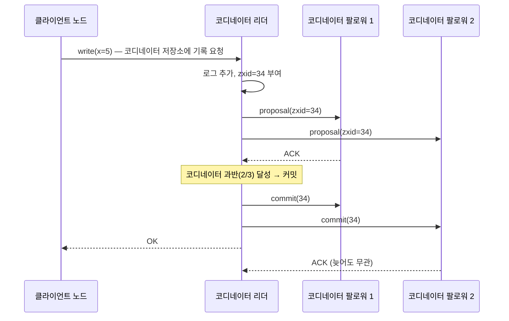
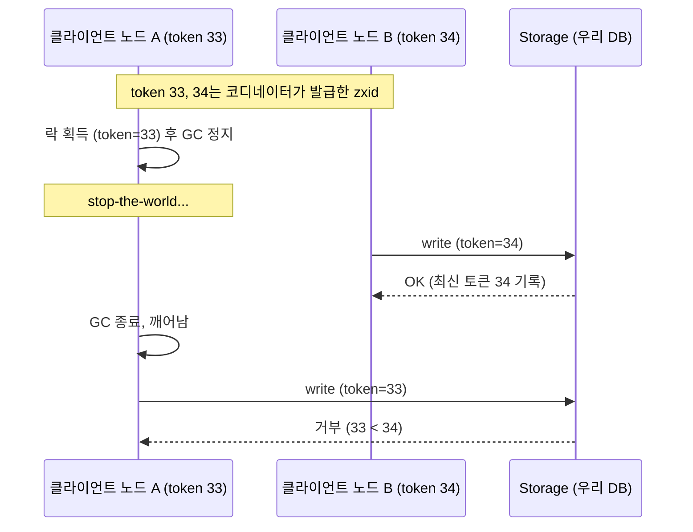

> **용어 정리 — 계층부터 잡고 시작**
> 
> - **클라이언트 노드**: 코디네이션 서비스를 사용하는 쪽. 우리 애플리케이션 서버들.
> - **코디네이터 노드**: 코디네이션 서비스 클러스터를 구성하는 **서버 프로세스**. ZooKeeper/etcd 인스턴스 3대·5대.
> - **코디네이터 리더 / 코디네이터 팔로워**: 코디네이터 노드들 중의 역할 구분. (클라이언트 노드들 사이에서 뽑는 "애플리케이션 리더"와 완전히 별개)
> - **znode**: 코디네이터가 저장하고 있는 **데이터 한 칸**. 서버가 아니라 데이터다. (아래 4장에서 상술)

---

## 1. 왜 필요한가 — 8장의 문제 복습

- 분산 환경의 **클라이언트 노드들**끼리 반복적으로 나오는 질문들
    - 지금 애플리케이션 리더는 누구인가?
    - 이 작업은 누가 수행 중인가? (중복 수행 금지)
    - 클라이언트 노드 3번은 죽은 건가, 느린 건가?
- 문제: 각 클라이언트 노드에 물어보면 **서로 다른 답**이 나옴
    - 네트워크 지연/유실, 시계 오차, 프로세스 멈춤(GC) 때문
    - "느린 클라이언트 노드"와 "죽은 클라이언트 노드"를 구분할 방법이 원리적으로 없음

## 2. 해결 방향 — 합의의 외주화 (9장 연결)

- 9장의 결론: 신뢰할 수 없는 환경에서도 노드들이 **하나의 값에 합의**하는 알고리즘 존재 (Paxos, Raft)
- 단, 클라이언트 노드들이 이걸 직접 구현하는 건 비추천
    - 엣지 케이스가 많아 논문대로 구현해도 버그가 흔함
    - 검증(테스트)도 극히 어려움
- 그래서 나온 발상: **"합의 잘하는 시스템을 한 번만 제대로 만들고, 나머지는 그걸 갖다 쓰자"**
    - = 합의 기능의 외주화. 그 외주 업체가 **코디네이터 노드 클러스터**
    - 대표: ZooKeeper(ZAB), etcd(Raft)

## 3. 내부 동작  → **코디네이터 노드 내부 이야기**

### 3-0. 그 전에: 여기서 말하는 "쓰기"란 무엇인가

- 코디네이터는 결국 **작고 안전한 데이터베이스**다. 클라이언트 노드는 여기에 값을 쓰고 읽는다.
- 즉 "쓰기 요청"은 **클라이언트 노드가 코디네이터의 저장소에 데이터를 기록하는 것**

```
클라이언트 노드 A → 코디네이터: create("/leader", "server-A")   ← 이게 쓰기 요청
코디네이터 → 클라이언트 노드 A: OK (zxid=34)
```

- 이 쓰기가 코디네이터 노드 과반에 복제되기 때문에, 코디네이터 한 대가 죽어도 값이 사라지지 않고 **모든 클라이언트 노드가 같은 값을 보게 된다.** 이게 코디네이터에 데이터를 맡기는 이유.

### 3-1. 합의 기반 복제

- ZAB(ZooKeeper)든 Raft(etcd)든 뼈대는 동일
    - 코디네이터 노드 중 **코디네이터 리더 1명 선출** → 모든 쓰기는 코디네이터 리더를 거침 → 리더가 순서를 정해 코디네이터 팔로워들에 복제를 함
    - 모든 코디네이터 노드가 같은 메시지를 같은 순서로 전달받도록 보장
    - → Raft 방식
- 쓰기 1건의 흐름 (과반수 커밋)
    1. **클라이언트 노드**가 코디네이터 리더에게 쓰기 요청
    2. 코디네이터 리더가 로그에 항목 추가 + 순서 번호 부여
    3. 코디네이터 팔로워들에게 전파(proposal)
    4. **코디네이터 노드 과반수(quorum)가 ACK** → 커밋 확정
    5. 커밋 사실을 팔로워에 알리고 클라이언트 노드에 응답
    - 전체 응답이 아니라 과반만 기다리는 이유: 느린/죽은 소수의 코디네이터 노드가 전체를 막지 못하게 하기 위함



### 3-2. 코디네이터 리더 선출

- 같은 원리로 동작
    - 코디네이터 리더의 하트비트가 끊기면 코디네이터 팔로워가 후보로 전환 → 투표 요청
    - **코디네이터 노드 과반수 득표**한 노드가 새 코디네이터 리더 (과반 조건 덕에 리더가 동시에 2명 나올 수 없음)
        - 투표 어케함?
            
            Raft 기준으로 설명할게 (ZAB도 원리는 같음).
            
            ### 투표의 기본 규칙
            
            **노드 하나당 한 term에 딱 한 표.** 이게 전부야.
            
            ```
            코디네이터 노드 3대: A(리더), B, C
            ```
            
            1. **리더 사망 감지**
                - B가 일정 시간(election timeout, 보통 150~300ms 랜덤) 동안 리더 A의 하트비트를 못 받음
                - B: "리더 죽었나 보다" → **후보(Candidate)로 전환**
            2. **자기 term 올리고 자기 자신에게 투표**
                - B: `term = 5 → 6` 으로 증가
                - B가 자기 자신에게 1표 (= 1표 확보)
            3. **다른 노드들에게 투표 요청 (RequestVote RPC)**
            
            ```
               B → A, C: "나 B다. term=6. 내 마지막 로그는 index=100, term=5. 나한테 투표해줘"
            ```
            
            1. **투표받는 쪽의 판단 — 두 조건 다 만족해야 찬성**
                - **조건 1**: 이 term(6)에 아직 투표한 적이 없어야 함 → **한 term에 한 표만**
                - **조건 2**: 후보의 로그가 나보다 최신이거나 같아야 함 → 낡은 로그 가진 놈은 리더 못 됨 (커밋된 데이터 유실 방지)
                - 둘 다 통과 → `votedFor = B` 기록하고 찬성 응답
            2. **과반 도달**
                - B: 자기 표 1 + C의 표 1 = **2표 / 3대 → 과반(2 이상)** → 리더 확정
                - 즉시 하트비트 전송해서 나머지에게 "내가 새 리더다" 통보
    - epoch/term 번호를 1 증가시켜서 "몇 대 코디네이터 리더인지" 기록 → 구 리더가 살아 돌아와도 낡은 epoch라서 무시됨
    - 단, 가장 최신 로그를 가진 코디네이터 노드만 리더가 될 수 있음 (커밋된 데이터 유실 방지)

## 4. 제공 기능 4가지 → **클라이언트 노드가 갖다 쓰는 API**

### 4-0. 그 전에: znode란 무엇인가

- **znode = 코디네이터 저장소 안의 데이터 한 칸.** 코디네이터 노드(서버)가 아니다. 이름이 비슷해서 헷갈리기 쉬운데 층위가 완전히 다르다.

| 용어 | 정체 |
| --- | --- |
| 코디네이터 노드 | ZooKeeper **서버 프로세스** (3대) |
| znode | 그 서버들이 저장 중인 **데이터 항목** (파일 하나) |
- 저장소는 유닉스 파일시스템처럼 트리 구조:

```
/
├── /leader                ← znode. 값: "server-A"
├── /locks
│   └── /locks/order-123   ← znode. 값: ""
└── /config
    └── /config/db-url     ← znode. 값: "jdbc:..."
```

- 이 **트리 전체가 코디네이터 노드 3대에 똑같이 복제**돼 있다.
- 클라이언트 노드는 `create("/leader", "A")`로 만들고 `get("/leader")`로 읽는다.
- **ephemeral(임시) znode**: 특수한 종류. 만든 클라이언트 노드의 **세션이 끊기면 코디네이터가 알아서 삭제**한다. 락을 잡은 클라이언트가 죽어도 락이 영원히 안 풀리는 사태를 막는 장치.

### 4-1. 네 가지 기능

- **① 원자적 연산 (분산 락)**
    - ZooKeeper의 `create`는 **이미 존재하면 실패**하는 원자적 연산
    - 클라이언트 노드 A와 B가 동시에 `create("/locks/order-123")` 호출 → 내부 합의로 순서가 정해져 **딱 하나만 성공**
    - 성공한 클라이언트 노드가 락 주인. 작업 끝나면 `delete("/locks/order-123")`
    - 즉 "동시 요청 중 누가 먼저인가"를 코디네이터 클러스터 전체가 합의해준다
- **② 순서 번호 → 펜싱 토큰 (zxid)**
    - 모든 연산에 단조 증가 번호가 자동 부여됨
    - zxid 구조 = 상위 32bit(**코디네이터 리더의 epoch**) + 하위 32bit(카운터) → 코디네이터 리더가 바뀌어도 항상 증가 보장
    - 락 발급 시 이 번호를 클라이언트 노드에 같이 주고, 스토리지는 자신이 마지막으로 본 번호보다 **낡은 번호의 요청을 거부**



- **③ 장애 감지 (ephemeral znode)**
    - 클라이언트 노드는 코디네이터와 세션 유지 + 주기적 하트비트
    - 세션 만료 시 그 클라이언트 노드가 만든 ephemeral znode 자동 삭제
    - **애플리케이션 리더인 클라이언트 노드**가 ephemeral znode를 만들어두면 → 그 노드 사망 = znode 삭제로 다른 클라이언트 노드들에 전파
- **④ 변경 알림 (watch)**
    - **방향 주의: 클라이언트 노드가 znode에 구독을 건다.** znode는 데이터일 뿐 능동적 주체가 아니다. 구독 정보를 관리하고 알림을 쏘는 건 코디네이터 노드(서버)다.
    
    | 구분 | 주체 |
    | --- | --- |
    | 구독하는 쪽 | 클라이언트 노드 |
    | 구독 대상 | znode (데이터 한 칸) |
    | 알림 보내는 쪽 | 코디네이터 노드 → 클라이언트 노드 |
    - 클라이언트 리더 선출 전체 시나리오:
        1. 클라이언트 A가 ephemeral znode `/leader` 생성 성공 → **A가 애플리케이션 리더**
        2. 클라이언트 B, C는 `/leader`에 watch 등록 → "이거 바뀌면 알려줘"
        3. A 사망 → 세션 만료 → 코디네이터가 `/leader` 자동 삭제
        4. 삭제 이벤트 → 코디네이터가 B, C에게 **알림 발송**
        5. B, C가 `/leader` 재생성 경쟁 → 한 명이 새 애플리케이션 리더
    - B, C가 "리더 살아있나?"를 계속 물어볼(폴링) 필요가 없어지는 게 watch의 가치
- 이 4가지 조합으로 클라이언트 노드들의 리더 선출, 분산 락,  구현 가능

> ※ **애플리케이션 리더 선출**(클라이언트 노드들 중 1명)과 3장의 **코디네이터 리더 선출**(코디네이터 노드들 중 1명)은 완전히 별개다. 전자는 후자를 도구로 써서 이루어진다.
> 

## 5. 한계 — 대신 포기한 것 → **코디네이터 노드들 내부 이야기**

- **쓰기가 느림**: 모든 쓰기가 코디네이터 노드 과반수 왕복을 거침 → 코디네이터 노드를 늘려도 안 빨라짐 (투표 인원만 증가). 보통 3대/5대 고정 운영
- **과반 상실 시 전체 정지**: 코디네이터 노드 5대 중 3대 사망 → 쓰기 완전 중단. 틀린 답 대신 무응답을 택함
- **용도 제한**: "애플리케이션 리더가 누구", "설정값"처럼 **자주 안 바뀌지만 절대 틀리면 안 되는 데이터** 전용. 고빈도 쓰기를 넣으면 즉시 병목
- **타임아웃 문제 자체는 남음**: 살아있는 클라이언트 노드를 "죽은 걸로 판정"하는 일은 여전히 발생 가능 → 그래서 펜싱 토큰이 반드시 세트로 필요

## 6. 실제 사례

### Kafka — 쓰다가 버린 케이스 (KRaft)

- 기존 구도: **브로커 = 클라이언트 노드, ZooKeeper 앙상블 = 코디네이터 노드**
    - 컨트롤러 선출, 브로커 생존 확인, 토픽 메타데이터를 전부 ZooKeeper에 위임
- 규모가 커지며 발생한 문제
    - 별도 시스템 2개 운영 → 운영 부담 2배
    - 파티션 수십만 개 규모에서 코디네이터 노드가 병목
    - 장애 복구 시 메타데이터 재로딩이 느림
- 결과: **KRaft** — Raft를 Kafka 내부에 직접 구현. **일부 브로커가 코디네이터 노드 역할까지 겸함**(컨트롤러 쿼럼) → 외부 ZooKeeper 완전 제거
- 시사점: "합의는 외주"가 존재 이유였는데 최대 고객이 내재화를 선택 → 외주 vs 자체 구현 논쟁

### Kubernetes — etcd 위에 지어진 케이스

- 구도: **API Server = 클라이언트 노드, etcd 클러스터 = 코디네이터 노드**
- 클러스터의 모든 상태(파드 배치, 설정, 시크릿)가 코디네이터 노드에 저장. `kubectl get pods` = 사실상 etcd 조회
- 코디네이터 노드가 과반을 잃으면?
    - 이미 떠 있는 파드는 계속 동작 (kubelet이 로컬에서 유지)
    - 새 배포, 스케일링, 장애 복구는 전부 정지
    - → "상태 유지"는 되지만 "상태 변경"이 불가능해지는 CP 특성의 전형

### Redis 분산 락과의 비교

- Kleppmann의 Redlock 비판 요지: **펜싱 토큰이 없어서 클라이언트 노드의 GC pause 시나리오에 무너짐**
- ZooKeeper 락은 코디네이터가 발급하는 zxid가 기본 제공되므로 이 문제에 답이 있음
- 선택 기준 = 깨졌을 때의 비용
    - 결제/재고 (깨지면 치명적) → 합의 기반 락 + 펜싱 검증
    - 캐시 갱신 중복 방지 (어긋나도 복구 가능) → 빠른 Redis 락으로 충분

## 7. 토론거리 + 나름의 답

**Q1. 코디네이션을 외주(ZooKeeper/etcd) 줄 것인가, 직접 구현할 것인가?**

- 기본값은 외주가 맞다고 봄. 합의 구현의 난이도·검증 비용이 너무 큼
- Kafka가 내재화(브로커가 코디네이터 역할 겸임)한 건 (1) 수십만 파티션이라는 극단적 규모, (2) 합의를 직접 구현할 수 있는 운영 역량, (3) 외부 의존성 제거의 이득이 컸기 때문
- 우리 규모의 서비스라면 사실 그 전 단계 질문이 먼저: 코디네이터 노드 클러스터 자체가 필요한가? 단일 DB의 유니크 제약이나 `SELECT FOR UPDATE`로 해결되는 규모면 그게 정답

**Q2. Kubernetes에서 코디네이터 노드(etcd)가 죽으면 무슨 일이?**

- 떠 있는 파드: 계속 동작 (kubelet이 로컬 상태로 유지)
- 새 배포/스케일링/자가 복구: 전부 정지 (상태를 기록·합의할 곳이 없으므로)
- 정리하면 "읽기 전용 관성 모드". 코디네이터 클러스터가 단일 장애점(SPOF)이라 프로덕션에서 3대/5대 + 백업이 필수인 이유

**Q3. Redis 락 vs ZooKeeper 락, 실무 판단 기준은?**

- 질문을 바꾸면 명확해짐: "이 락이 뚫렸을 때 얼마짜리 사고인가?"
- 돈·재고가 걸림 → 합의 기반 락, 그리고 가능하면 스토리지 레벨에서 펜싱 토큰 검증까지
- 성능이 중요하고 중복 실행이 멱등하거나 복구 가능 → Redis 락 (대부분의 캐시/스케줄러 중복 방지가 여기 해당)
- 개인적 결론: 애초에 락 없이 설계(멱등성, 유니크 제약, CAS)할 수 있으면 그게 최선

**Q4. 합의가 꼭 필요한 데이터 vs 아닌 데이터, 구분 기준은?**

- 기준: **답이 2개 존재해도 되는가?**
- 애플리케이션 리더가 누구인가 → 2개면 스플릿 브레인, 절대 안 됨 → 합의 필요 (CP)
- 살아있는 클라이언트 노드 목록 → 좀 낡아도 요청 실패 후 재시도하면 됨 → 합의 불필요 (AP로 충분)
- 하나 더: 변경 빈도. 합의는 비싸므로 "중요 + 저빈도" 데이터에만 쓰는 것

## 8. 요약

> 분산 시스템에서 **클라이언트 노드들끼리는 서로를 못 믿는다**(8장). 그래도 합의는 가능하다(9장). 매번 직접 구현하긴 어려우니 별도의 **코디네이터 노드 클러스터**(ZooKeeper/etcd)에 맡긴다 — 이게 코디네이션 서비스.
> 
> 
> 코디네이터는 결국 **작고 안전한 데이터베이스**다. 내부는 "코디네이터 리더 선출 + 코디네이터 과반수 커밋 = 전체 순서 브로드캐스트"로 돌아가고, 클라이언트 노드에게는 **znode라는 데이터 칸** 위에서 락(원자적 create) / 펜싱 토큰(zxid) / 생존 확인(ephemeral) / 변경 알림(watch)을 API로 제공한다.
> 
> 대신 느리고 과반이 죽으면 멈추므로 "중요하지만 가끔 바뀌는 데이터" 전용. Kubernetes는 이 위에 지어졌고, Kafka는 쓰다가 코디네이터 역할을 브로커 안으로 흡수(KRaft)했다.
>